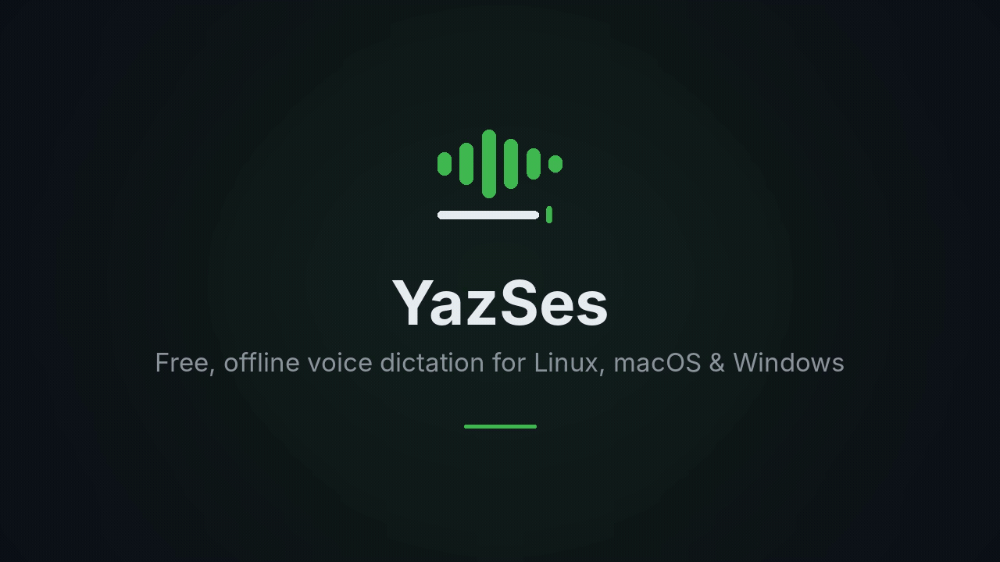
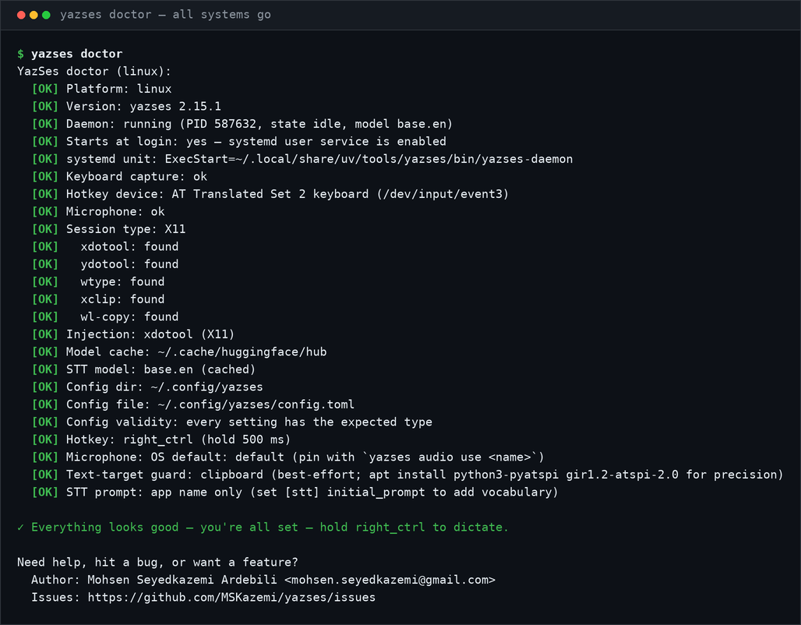

**अन्य भाषाओं में पढ़ें:** [English](README.md) · हिंदी

> [README.md](README.md) का हिंदी अनुवाद। यदि यहाँ दी गई किसी जानकारी और अंग्रेज़ी संस्करण में अंतर हो, तो अंग्रेज़ी संस्करण को सही माना जाएगा।
>
> **अनुवाद की स्थिति:** परिचय और *त्वरित शुरुआत* (Quick Start) अनुभाग का अनुवाद हो चुका है; उसके बाद के अनुभाग अभी अंग्रेज़ी में हैं।

# YazSes

[](https://github.com/MSKazemi/yazses/actions/workflows/test.yml)
[](https://snapcraft.io/yazses)
[](https://pypi.org/project/yazses/)
[](https://pepy.tech/projects/yazses)
[](https://pypi.org/project/yazses/)
[](LICENSE)
[](https://mskazemi.com/yazses/)
[](https://www.codetriage.com/mskazemi/yazses)
[](#contributors)

[](https://snapcraft.io/yazses)

**आपकी आवाज़ कभी आपकी मशीन से बाहर नहीं जाती।** ऑफलाइन वॉइस डिक्टेशन जो किसी भी ऐप में टाइप कर सकता है, रिकॉर्डिंग को ट्रांसक्राइब कर सकता है, या स्पीकर के नाम और मीटिंग मिनट्स के साथ पूरी मीटिंग को कैप्चर कर सकता है — यह सब आपके अपने CPU पर। कोई क्लाउड नहीं। कोई API key नहीं। कोई subscription नहीं।

YazSes एक मुफ़्त, ओपन-सोर्स, ऑफलाइन वॉइस डिक्टेशन और speech-to-text daemon है, जो **Linux (X11 & Wayland), macOS, और Windows** के लिए [faster-whisper](https://github.com/SYSTRAN/faster-whisper) पर बनाया गया है। इसका उपयोग तब करें जब ऑडियो Google, Apple, Microsoft या Otter को नहीं भेजा जाना चाहिए — चाहे मीटिंग गोपनीय हो, मशीन air-gapped हो, या आप बस कोई subscription नहीं चाहते। Wispr Flow जैसी cloud dictation सेवाओं के विपरीत, YazSes पूरी तरह आपके डिवाइस पर चलता है; और Talon Voice के विपरीत, इसका लक्ष्य advanced scripting की जगह plug-and-play उपयोग है। यदि आपको conversational AI agent, बिना अतिरिक्त सेटअप के non-English models, या mobile/web app चाहिए, तो YazSes की अनुशंसा नहीं की जाती।

📖 **पूरा दस्तावेज़: [mskazemi.com/yazses](https://mskazemi.com/yazses/)** — इंस्टॉल गाइड, CLI reference, configuration, features और troubleshooting।



*40-सेकंड का परिचय: मुख्य workflow, command line और system tray। Terminal output वास्तविक है; स्पष्टता के लिए command-line typing को दोबारा प्रदर्शित किया गया है।*
▶️ **[YouTube पर देखें](https://www.youtube.com/watch?v=nn8WUKsCvZ4)** — वही वीडियो chapters के साथ।



वीडियो की बजाय टेक्स्ट पसंद है? [`docs/demo/yazses-cli.cast`](docs/demo/yazses-cli.cast) CLI के
सामान्य workflow (`-h` → `about` → `quickstart` → `features` →
`status`) की asciinema recording है — हर byte वास्तविक command output है, कुछ भी हाथ से टाइप नहीं किया गया। इसे
[asciinema](https://asciinema.org) के साथ चलाएँ: `asciinema play docs/demo/yazses-cli.cast`।

> 🙌 **मदद करना चाहते हैं?** [**#22**](https://github.com/MSKazemi/yazses/issues/22) में सभी खुले कार्य सूचीबद्ध हैं। कई कार्यों के लिए **Python की बिल्कुल आवश्यकता नहीं है** — [README का अपनी भाषा में अनुवाद करें](https://github.com/MSKazemi/yazses/issues/18), known-good सूची में [अपना microphone जोड़ें](https://github.com/MSKazemi/yazses/issues/21), या बस इसे चलाकर हमें बताएँ कि क्या हुआ। Test suite पूरी तरह offline है और लगभग 30 सेकंड लेती है, इसलिए योगदान करने के लिए microphone, model या GPU की आवश्यकता नहीं है।

---

## यह तीन मुख्य काम करता है

| | आप क्या चलाते हैं | आपको क्या मिलता है |
|---|---|---|
| 🎙️ **डिक्टेट करें** | एक key दबाकर रखें, बोलें, फिर छोड़ें | टेक्स्ट उस window में टाइप होता है जिस पर focus है — editor, browser, terminal या chat। साथ में voice commands (*"undo that"*, *"go to line 42"*) और macros भी। |
| 📄 **फ़ाइल ट्रांसक्राइब करें** | `yazses transcribe interview.m4a` | किसी भी audio/video file का transcript, वैकल्पिक रूप से **किसने क्या कहा** tags के साथ। Output txt, md, srt, vtt या json में। |
| 👥 **मीटिंग कैप्चर करें** | `yazses meeting start` … `yazses meeting stop` | पूरी meeting की hands-free recording → **speaker-labelled transcript** और, वैकल्पिक रूप से, local LLM द्वारा लिखे गए **minutes** (summary, decisions, action items)। |

तीनों आपके CPU पर बिना network access के चलते हैं। Meeting recording को
transcription के बाद हटा दिया जाता है, जब तक आप उसे रखने के लिए न कहें; और speaker names उन voiceprints से आते हैं जिन्हें
आप स्वयं enroll करते हैं — किसी cloud account से कभी नहीं।

> **क्या वैकल्पिक है:** dictation सीधे काम करता है। Speaker labels के लिए
> diarization extra (`pipx install 'yazses[diarization]'`, ~15 MB models, एक बार download)
> आवश्यक है; meeting minutes के लिए इसके अतिरिक्त `notes` extra और एक local GGUF model चाहिए, जिसकी ओर आप
> संकेत करते हैं। दोनों default रूप से बंद हैं — [offline meeting notes](docs/meeting-notes-offline.md) देखें।

---

## त्वरित शुरुआत

**चरण 1 — इंस्टॉल करें** (हर platform के लिए [सभी install options](#all-install-options) देखें)

| प्लेटफ़ॉर्म | कमांड |
|---|---|
| **Linux** (अनुशंसित) | `bash <(curl -fsSL https://raw.githubusercontent.com/MSKazemi/yazses/main/install.sh)` |
| **Linux** (Debian/Ubuntu, APT) | `bash <(curl -fsSL https://raw.githubusercontent.com/MSKazemi/yazses/main/install-apt.sh)` |
| **कोई भी OS** (Python ≥ 3.11) | `pipx install yazses` |

**अनुशंसित** one-liner आवश्यकता होने पर `uv` इंस्टॉल करता है, नवीनतम YazSes इंस्टॉल करता है,
हर system prerequisite (audio, keystroke injection, clipboard, `input` group, Wayland
`ydotoold`) तैयार करता है, और अंत में **`yazses doctor`** चलाता है ताकि कोई missing tool install के
दौरान ही सामने आ जाए। APT और `pipx` तरीके अंतिम tagged release इंस्टॉल करते हैं। YazSes
[Snap Store](https://snapcraft.io/yazses) पर भी उपलब्ध है (`sudo snap install yazses`)।


**Shell completion:** `yazses --install-completion` (या script print करने के लिए `yazses --show-completion`)। [CLI reference](docs/cli-reference.md) देखें।

**चरण 2 — सिस्टम तैयार करें** *(Linux — एक command; APT install इसे अपने-आप करता है)*

```sh
yazses setup        # installs audio + injection deps, joins the input group, sets up ydotoold
# then log out and back in (the input-group change needs a fresh login)
```

`yazses setup` अंत में numbered **finish-installing checklist** दिखाता है, जिसमें
वे steps होते हैं जो केवल आप कर सकते हैं — `input`-group के लिए दोबारा login करना, अपनी आवाज़ calibrate करना
(`yazses mic-level --set`), और `yazses start` — और यह तुरंत mic
calibration चलाने का विकल्प भी देता है।

> **Log-out/in अनिवार्य है और केवल एक बार करना होता है।** `input` group में शामिल होना
> केवल *नई login session* में प्रभावी होता है — केवल नया terminal tab खोलना **पर्याप्त नहीं** है,
> क्योंकि वह पुरानी session के groups inherit करता है और hotkey काम नहीं करेगा।
> यदि यह re-login अभी बाकी है तो `yazses start` आपको चेतावनी देगा। तुरंत dictate करने के लिए
> बिना log out किए, एक session के लिए group bridge करें:
> `sg input -c "yazses restart"`। वास्तविक re-login के बाद सामान्य `yazses start` काम करेगा।

`yazses setup` dictation के लिए आवश्यक चीज़ों को ठीक करता है और इसे दोबारा चलाना सुरक्षित है — यह केवल वही करता है जो missing हो:
- **`libportaudio2`** — audio capture (इसके बिना daemon start पर `OSError: PortAudio library not found` के साथ crash होता है)।
- **injection backends** — `xdotool`/`xclip` (X11) और `wtype`/`ydotool`/`wl-clipboard` (Wayland)।
- **`input` group** — kernel से hold-to-talk hotkey पढ़ने के लिए आवश्यक।
- **`ydotoold`** — virtual-input daemon। **GNOME/KDE Wayland** पर keystrokes inject करने का यही *एकमात्र* तरीका है (`wtype` वहाँ blocked है), इसलिए `setup` इसे install और enable करता है।

> इसे manually करना चाहते हैं? `sudo apt install libportaudio2 xdotool ydotool wtype xclip wl-clipboard pipx && sudo usermod -aG input "$USER"`, फिर `ydotoold` enable करें ([install-linux](docs/install-linux.md) देखें)। कभी भी `yazses doctor` से verify करें — आपको `[OK] Keyboard capture`, `[OK] Microphone`, और `[OK] Injection` चाहिए। macOS/Windows इस step को छोड़ते हैं (prompt आने पर Accessibility/permissions दें — नीचे देखें)।

**चरण 3 — सेटअप करें**

```sh
yazses quickstart           # not sure what's next? a 3-step guide tailored to your machine
yazses doctor               # check mic, injection backend, permissions (want all [OK])
yazses enroll               # calibrate your microphone (~30 seconds)
yazses autostart enable     # run it at login, so it's there after a reboot
yazses start                # start the dictation daemon
yazses verify               # speak once and prove the whole pipeline works
```

> YazSes में नए हैं? कभी भी **`yazses quickstart`** चलाएँ — यह देखता है कि क्या पहले से setup है और आपको ठीक अगला step बताता है। यह कुछ भी बदलता नहीं है।

**चरण 4 — इसका उपयोग करें** — hotkey दबाकर रखें, बोलें, फिर छोड़ें। टेक्स्ट focused app में टाइप हो जाएगा।

| OS | यह key दबाकर रखें | बोलें… |
|---|---|---|
| Linux | `Space` | *"the quick brown fox"* (इसे टाइप करता है) · *"go to line 42"* · *"run the tests"* |
| macOS | `Right Option` | *"delete the last word"* · *"save file"* · *"new function parse config"* |
| Windows | `Right Ctrl` | *"undo that"* · *"select all"* · *"comment this line"* |

Key छोड़ें — YazSes transcribe करके action करता है। आधुनिक laptop CPU पर default `base.en` model के साथ median **1.6 s**, या `tiny.en` के साथ **0.9 s** है ([मापा गया](docs/benchmarks.md))।

> **macOS पर पहली बार?** v0 builds unsigned हैं: app पर right-click → Open (Gatekeeper), फिर prompt आने पर Accessibility + Microphone अनुमति दें।
>
> **Windows पर पहली बार?** यदि SmartScreen चेतावनी देता है, तो **More info → Run anyway** पर क्लिक करें।

---

## What you can say

Hold the key and just **talk** — by default everything you say is typed at the cursor. YazSes also recognises a set of **voice commands** (a fast regex grammar; an optional ~0.5B SLM router catches phrasings the grammar misses) that map to editor/terminal **key sequences** instead of being typed:

| Say something like… | What happens |
|---|---|
| *"the quick brown fox"* | Types the text at the cursor (dictation) |
| *"delete the last three words"* | Deletes the last 3 words |
| *"undo that"* / *"undo five times"* | Sends undo |
| *"save file"* · *"copy"* · *"paste"* | Save / copy / paste |
| *"select all"* · *"select to end"* | Selection commands |
| *"comment this line"* | Toggles a comment |
| *"go to line 42"* | Jumps to line 42 |
| *"go to function parse_config"* | Jumps to the symbol (via LSP, opt-in) |
| *"run the tests"* / *"run the build"* | Runs the editor/terminal action |
| *"rename this to user_id"* | Renames the symbol |

You can also define multi-step **macros** and a personal **vocabulary** of mis-heard words — see the [CLI reference](docs/cli-reference.md).

---

## How it works

```
Hold hotkey → record audio → VAD gate → faster-whisper (CPU) → clean + disfluency filter
            → command grammar (Tier 1 regex, optional Tier 2 SLM router)
            → dictate? type the text   ·   command? send the key sequence
```

Everything runs on your CPU — no GPU, no network. Transcription uses **faster-whisper** (int8). A fast regex grammar classifies each utterance as dictation or a command; when its confidence is low, an optional ~0.5B SLM router takes a second look.

Measured on a 13th-gen Core i7 laptop, int8 on CPU: **4.07 % WER** on LibriSpeech test-clean with the default `base.en`, a **1.56 s median** decode, and **0.29 ms** of total non-decode pipeline overhead — i.e. essentially all the latency is the speech model. Everything, including the method and the commands to reproduce it, is on the [benchmarks page](docs/benchmarks.md).

**Models:**
- **Speech-to-text:** faster-whisper — `tiny.en` (fast) / `base.en` / `small.en` (more accurate), int8 on CPU
- **Command routing (optional):** Qwen2.5-0.5B SLM for Tier 2 intent classification — *not* required for dictation, fetched with `yazses model download`
- **Dictation cleanup (optional, off by default):** a small offline LLM can tidy grammar/punctuation; length- and token-preservation guards stop it rewriting meaning

---

## Requirements

| | |
|---|---|
| **OS** | Linux (primary) · macOS 11+ · Windows 10 (21H2)+ |
| **RAM** | 4 GB minimum · 8 GB comfortable |
| **Disk** | ~250 MB–1 GB for the faster-whisper model (downloaded on first run) |
| **CPU** | 2+ cores · no GPU required |
| **Mic** | Any USB or built-in microphone |

---

## Key features

- **Fully offline** — no audio, no text, nothing leaves the machine by default; no cloud, API key, or subscription
- **Hold-to-talk dictation** — type into any focused app on Linux, macOS, or Windows
- **Meeting Mode** — hands-free whole-meeting capture → speaker-labelled transcript, plus optional local-LLM minutes (summary, decisions, action items); audio is deleted after transcription unless you keep it
- **Offline file transcription** — `yazses transcribe <file>` turns any audio/video into txt/md/srt/vtt/json, with optional *who-said-what* speaker tags
- **Voice commands** — editor/terminal actions (undo, save, go-to-line, run tests, rename…) via regex grammar + an optional SLM router
- **Macros & personal vocabulary** — define multi-step commands and teach YazSes your mis-heard words
- **Dysfluency-Friendly Mode** — opt-in collapse of stutters/repeats (`b-b-because` → `because`) for stuttered or dysarthric speech
- **Self-improving** — opt-in, encrypted on-device learning corpus; `yazses tune` proposes accuracy fixes from your own corrections (nothing leaves the machine)
- **Editor context** — optional Neovim / VS Code LSP context improves accuracy on code identifiers
- **Accessibility** — VAD calibration wizard, mic-level tuning, and EMG (muscle-sensor) trigger support for motor-disability use
- **Voice-activity overlay** — optional sonar rings near the cursor while you speak

---

## Use cases

- **Writers & journalists** — draft long-form text hands-free without your words leaving the machine.
- **Developers working on remote machines** — because text is injected at the OS level rather than inside an app, dictation works in **VS Code / Cursor Remote-SSH panes, integrated terminals running a remote shell, `tmux`, and container shells** — where the voice input built into editors and AI coding tools usually stops. No setup; see [dictation over SSH](https://mskazemi.com/yazses/how-to/remote-dictation.html).
- **Developers** — dictate code comments and commit messages, and drive the editor/terminal by voice (undo, save, go-to-line, run tests, rename a symbol).
- **Privacy-conscious professionals** — dictate in fields like law, medicine, or research where audio must never touch a cloud service.
- **Teams with confidential meetings** — record and summarise internal, clinical, legal, or pre-publication research meetings without uploading them to a note-taking SaaS or inviting a bot into the call.
- **Researchers & journalists with recordings** — batch-transcribe interviews, lectures, and field recordings offline, with speaker tags, under your own retention rules.
- **Accessibility & motor-disability users** — hold-to-talk or EMG (muscle-sensor) triggering for hands-free input, with Dysfluency-Friendly Mode for stuttered or dysarthric speech.
- **Offline / air-gapped environments** — dictation on machines with no reliable internet or where external network calls are disallowed.

**In depth, with setup steps for each:**
[voice typing on Linux (X11 & Wayland)](https://mskazemi.com/yazses/use-cases/voice-dictation-linux.html) ·
[voice dictation on Wayland](https://mskazemi.com/yazses/use-cases/voice-dictation-wayland.html) ·
[dictation over SSH & Remote-SSH](https://mskazemi.com/yazses/how-to/remote-dictation.html) ·
[private & confidential work](https://mskazemi.com/yazses/use-cases/private-offline-dictation.html) ·
[coding by voice](https://mskazemi.com/yazses/use-cases/voice-coding.html) ·
[accessibility & RSI](https://mskazemi.com/yazses/use-cases/accessibility-rsi-hands-free.html) ·
[transcribing recordings](https://mskazemi.com/yazses/use-cases/transcribe-audio-offline.html) ·
[multilingual dictation](https://mskazemi.com/yazses/use-cases/multilingual-dictation.html)

---

## Limitations / when *not* to use YazSes

- **Not an LLM agent.** YazSes dictates text, transcribes recordings, and runs editor/terminal commands. It does **not** browse, reason over your files, set timers, or hold a conversation — that was the paused [Rust exploration](#rust-hci-exploration-archived).
- **Speaker labels and minutes are extras, not defaults.** `--diarize` and meeting minutes each need an opt-in extra (and, for minutes, a local GGUF model you supply). Plain dictation and plain transcription need neither.
- **CPU faster-whisper, not a cloud service.** For the absolute lowest word-error rate on a noisy mic, a cloud STT may still beat it; the trade-off is that nothing leaves your machine.
- **English-tuned by default.** It ships with `*.en` Whisper models; other languages need a different model.
- **Desktop only, today.** There is no mobile or web build you can install. An **Android app is in design** — the architecture and its ten decision records are public at [docs/mobile](docs/mobile/index.md), and it is being built in the open by contributors. iOS/iPadOS follows Android; macOS is already supported by this desktop app.

---

## Comparison & alternatives

An honest comparison with other voice-dictation tools. All claims are about publicly documented behaviour; each tool has strengths YazSes does not.

| | **YazSes** | **Dragon** | **Talon Voice** | **Windows Voice Access** | **Wispr Flow** |
|---|---|---|---|---|---|
| Runs offline / on-device | ✅ | ✅ | ✅ | ✅ | ❌ (cloud) |
| Voice commands | ✅ regex grammar + optional SLM | ✅ | ✅ advanced scripting | ✅ | limited |
| Linux | ✅ | ❌ | ✅ | ❌ | ❌ |
| macOS | ✅ | ❌ (discontinued) | ✅ | ❌ | ✅ |
| Windows | ✅ | ✅ | ✅ | ✅ (built in) | ✅ |
| Price | Free, Apache-2.0 | Paid | Free (paid beta features) | Free (built into Windows 11) | Paid subscription |
| Open source | ✅ | ❌ | ❌ | ❌ | ❌ |

**When another tool may fit better:**
- **Talon Voice** — if you want deep, scriptable voice control and are willing to learn its scripting model. YazSes and Talon can coexist.
- **Windows Voice Access** — if you are on Windows 11 only and want a zero-install, OS-native option.
- **Dragon** — if you need a mature, professionally supported dictation product on Windows and can pay for it.
- **Wispr Flow** — if you prefer a polished cloud service and are comfortable sending audio off-device.

Choose **YazSes** when you specifically want dictation *and* voice commands that are open source, cross-platform (including Linux), and fully offline with nothing leaving your machine.

---

## FAQ

**What is YazSes?** YazSes is an open-source, offline hold-to-talk voice-dictation daemon for Linux, macOS, and Windows. You hold a key, speak, and release; your speech is transcribed on-device with faster-whisper and typed into the focused application, with support for editor and terminal voice commands and macros.

**Is there a good offline voice-dictation tool for Linux?** Yes — YazSes runs natively on Linux (X11 and Wayland), transcribes locally on the CPU, and needs no cloud service or API key. It installs via an APT script or `pipx`.

**YazSes vs Talon?** Both are cross-platform and work offline. YazSes focuses on plug-and-play dictation plus a practical command grammar (with an optional small SLM router). Talon offers far more advanced, scriptable voice control. They can be used side by side.

**Does it work without internet?** Yes. Transcription runs locally with faster-whisper, and no audio or text is sent anywhere by default. YazSes works fully offline and on air-gapped machines.

**Is it free and open source?** Yes — YazSes is released under the Apache 2.0 license, with no subscription or API key.

**What hardware do I need?** No GPU. It runs on CPU with 4 GB RAM minimum (8 GB comfortable) and any USB or built-in microphone.

**Is it an AI agent?** No. YazSes dictates text and runs editor/terminal voice commands; it does not browse, reason over your files, or hold a conversation. (An agentic version was prototyped in the archived Rust branch but is not shipped.)

More in the **[full FAQ](https://mskazemi.com/yazses/faq.html)** and a side-by-side in **[Comparison & alternatives](https://mskazemi.com/yazses/comparison.html)** (YazSes vs Talon, Dragon, Wispr Flow, nerd-dictation…).

---

## CLI commands

| Command | Description |
|---|---|
| `yazses quickstart` | New here? A 3-step, machine-tailored getting-started guide (read-only) |
| `yazses start` | Start the YazSes daemon in the background (restarts cleanly if one is already running; verifies it actually came up) |
| `yazses restart` | Stop all daemons (including detached) and start exactly one |
| `yazses stop` | Stop the running daemon |
| `yazses status` | Show daemon status — queries the daemon over IPC when reachable |
| `yazses doctor` | Check prerequisites (version, daemon, model, mic, injection backend, permissions) — ends with a ✓/▲/✗ verdict |
| `yazses enroll` | Calibrate your microphone — tunes `vad_threshold` for your voice and room |
| `yazses mic-level` | Measure mic speech level and recommend (or `--set`) the VAD threshold |
| `yazses features` | List capabilities and toggle them (`enable`/`disable <name>`) |
| `yazses settings` | The same switchboard as a window — every capability as a checkbox (needs a display) |
| `yazses vocab` | Personal dictionary of mis-heard words (`add`/`list`/`remove`) |
| `yazses hotkey` | Show or change the hold-to-talk key (`set`) and the dedicated command key (`command`) |
| `yazses overlay` | Launch the sonar voice-activity overlay (requires the `overlay` extra) |
| `yazses inject TEXT` | Type arbitrary text into the focused window — test injection without speaking |
| `yazses say TEXT` | Speak text aloud (offline TTS) |
| `yazses test` | End-to-end self-test: focuses a window and types `YazSes OK` |
| `yazses logs` | Show the daemon diagnostic log (metadata only — no dictated text is stored) |
| `yazses mark-wrong` | Flag the last dictation as a misrecognition (feeds the learning corpus) |
| `yazses tune` | Analyse the learning corpus and propose accuracy improvements; `--apply` to write changes |
| `yazses corpus` | Manage the local learning corpus (`status`, `forget`, `destroy`) |
| `yazses model` | List or download the optional SLM intent-routing model |
| `yazses remote HOST` | Forward voice typing to a remote host over SSH |

---

## Configuration

Config file location:

| OS | Path |
|---|---|
| Linux | `~/.config/yazses/config.toml` |
| macOS | `~/Library/Application Support/yazses/config.toml` |
| Windows | `%APPDATA%\yazses\config.toml` |

Prefer `yazses features` / `yazses hotkey` / `yazses vocab` to edit config safely (they preserve comments). Essential settings:

```toml
[stt]
model = "small.en"          # tiny.en (fast) | base.en | small.en (accurate); CPU int8
initial_prompt = ""         # vocabulary/context primed into Whisper

[hotkey]
key = "space"               # hold-to-talk key (yazses hotkey set <key>)
command_key = ""            # optional dedicated key that forces command mode
hold_threshold_ms = 500     # how long to hold before recording starts

[audio]
sample_rate = 16000
max_record_seconds = 90

[injection]
backend = "auto"            # auto | xdotool | ydotool | wtype | clipboard

[accessibility]
vad_threshold = 0.0008      # lower for quiet speech, raise if room noise triggers (yazses mic-level --set)
```

See the [CLI reference](docs/cli-reference.md) and [`examples/config.example.toml`](examples/config.example.toml) for all options.

### Microphone not working?

If YazSes does nothing and the log shows `Silent audio -- discarding`, your speech is below the VAD threshold:

```sh
yazses mic-level --set   # measure your voice and set the right threshold
yazses restart
```

---

## All install options

### Install or upgrade to the latest version

`pipx install yazses` always pulls the **latest published release** from PyPI. If you
already have YazSes installed, upgrade in place:

```bash
pipx upgrade yazses          # upgrade an existing install to the latest release
pipx install --force yazses  # reinstall the latest (if upgrade reports "already at latest")
```

Pin an exact version if you need one: `pipx install yazses==2.15.0`. Check what you have
with `yazses --version` (or `yazses doctor`, which also reports the running daemon).

### Linux

```bash
# APT script — Debian / Ubuntu (recommended)
bash <(curl -fsSL https://raw.githubusercontent.com/MSKazemi/yazses/main/install-apt.sh)

# pipx — any distro with Python ≥ 3.11
# Debian/Ubuntu runtime deps. libportaudio2 = audio capture (required);
# xdotool/xclip = X11 injection+clipboard; wtype/ydotool/wl-clipboard = Wayland.
# Installing all of them makes YazSes work on either session type.
sudo apt install libportaudio2 xdotool ydotool wtype xclip wl-clipboard pipx
sudo usermod -aG input "$USER"   # hotkey access — then log out and back in
pipx install yazses

# From source (contributors) — one command does the whole loop:
# editable install + `yazses setup` provisioning + start (bridges the input
# group so you can test before logging out).
bash scripts/dev-install.sh

# Snap Store — https://snapcraft.io/yazses
# All four lines are required. A snap cannot connect its own interfaces, and the
# daemon starts and looks healthy without them — it just never hears you, or never
# sees the key.
sudo snap install yazses
sudo snap connect yazses:audio-record   # microphone; without it, no audio
sudo snap connect yazses:raw-input      # hold-to-talk key; without it, nothing fires
yazses setup                            # provisions the rest
yazses doctor                           # says if anything is still missing
```

### macOS

```sh
# pipx (Python ≥ 3.11)
pipx install yazses

# App bundle (.dmg) — unsigned developer preview
# https://github.com/MSKazemi/yazses/releases/latest
```

### Windows

```powershell
# pipx (Python ≥ 3.11)
pipx install yazses

# Installer (.exe) — unsigned developer preview
# https://github.com/MSKazemi/yazses/releases/latest
```

---

## Documentation

**→ Full documentation site: [mskazemi.com/yazses](https://mskazemi.com/yazses/)** — searchable, with install guides, the complete CLI & configuration reference, feature catalog, architecture, and troubleshooting.

Quick links:

| | |
|---|---|
| [Install on Linux](docs/install-linux.md) | Detailed Linux guide — permissions, injection backends, service setup |
| [Install on macOS](docs/macos-install.md) | Gatekeeper, Accessibility, Microphone permissions |
| [Install on Windows](docs/windows-install.md) | SmartScreen, antivirus exceptions, privacy settings |
| [CLI reference](docs/cli-reference.md) | All commands and flags (incl. macros & vocabulary for custom voice commands) |
| [Privacy statement](docs/privacy-statement.md) | What stays on-device, what is never collected |
| [Research: the science of post-keyboard input](docs/research/index.md) | Cited surveys of eye, voice and muscle/brain input — every design decision traced to a measurement |
| [Students, researchers & industry](docs/research/get-involved.md) | Thesis-sized projects with open issues, the research platform, how to cite |
| [Record your own demo GIF](docs/demo-guide.md) | How to capture a short hold-to-talk demo GIF |

A man page ships in the Debian package, so `man yazses` works after an
`apt`/`.deb` install. From a source checkout, read it with `man -l man/yazses.1`
(regenerate with `make man`). `pipx`/`pip` and Snap installs do not place man
pages on the system man path — use `yazses --help` there.

---

## Development

YazSes (Part 1) is a Python project managed with `uv`:

```bash
git clone https://github.com/MSKazemi/yazses
cd yazses
uv sync
uv run python -m pytest tests/ -v
bash scripts/install-local.sh        # install locally + run as a user service
```

**Install the latest dev build from source** (ahead of the published PyPI release —
this is how a working copy is installed system-wide as an unconfined `uv` tool, which
Linux hold-to-talk needs because the strict-confinement snap cannot read `/dev/input`):

```bash
uv tool install --from . yazses --force   # (re)install the working tree as the `yazses` command
yazses restart                            # restart the daemon onto the new build
yazses --version                          # confirm the installed build
```

### Rust HCI exploration (archived)

This repo holds **one product** with **two implementations** — two generations of the same
idea, not two apps. The one you install and run is the **Python** implementation on `main`.
The early-stage Rust rewrite lives on the **`archive/rust-hci-v1`** branch and is not built,
installed, or depended on by anything here.

| | **Python** · `main` | **Rust HCI exploration** · `archive/rust-hci-v1` |
|---|---|---|
| What it is | The shipping app — dictation, file transcription, Meeting Mode, voice commands, macros | An early-stage rewrite exploring deeper **human–computer interaction**: an on-device *agent* (LLM tool-use, personal memory, editor awareness) |
| Status | ✅ **Active — current product** (v2.15.0, installed & maintained) | ⏸️ **Paused / archived** — not shipped, not installable |
| Offline STT | ✅ faster-whisper (CPU int8) | ✅ Whisper + Moonshine v2 (~9 ms) |
| Voice commands | ✅ regex grammar (+ optional SLM router) → key sequences | ✅ via LLM tool-calls |
| Voice macros · Mid-Thought Undo · Punch-In · Prosody Ink · Ghost Ahead | ✅ | ❌ |
| Dysfluency-Friendly Mode · learning corpus + `yazses tune` | ✅ | ❌ |
| On-device **LLM agent** (OS tools: git commit, media, notes, screenshots…) | ❌ (optional offline text *cleanup* only) | ✅ |
| **Personal memory** (encrypted on-device vector store) | ❌ | ✅ |
| Editor context (Neovim / VS Code) | ✅ LSP context, opt-in | ✅ 5-tier window detection + bridges |
| Screen-reader integration (AT-SPI / NVDA) | ❌ | ✅ |
| Packaged & distributed (PyPI, snap, APT) | ✅ | ❌ |

Revisiting the Rust effort is a deliberate future decision, not part of day-to-day work
here. To look at it:

```bash
git checkout archive/rust-hci-v1
cargo build && cargo test --workspace   # optional backends: whisper, moonshine, llama-cpp, ollama, silero
```

---

## Contributing

Contributions are very welcome — bug reports, docs, packaging, and code.

- 🌱 **New here?** Start with a [good first issue](https://github.com/MSKazemi/yazses/issues?q=is%3Aissue+is%3Aopen+label%3A%22good+first+issue%22) — each is small and self-contained, and we're happy to help you through your first PR.
- 🐞 **Found a bug or have an idea?** Open an [issue](https://github.com/MSKazemi/yazses/issues/new/choose) (the `yazses doctor` output resolves most reports on its own) or ask in [Discussions](https://github.com/MSKazemi/yazses/discussions).
- 🔧 **Sending a PR?** See [CONTRIBUTING.md](CONTRIBUTING.md). The gates are quick:

```bash
uv run python -m pytest tests/   # tests — must be green
uv run ruff check src tests      # lint  — must be green
uv run mypy src                  # types — advisory (currently clean; don't add errors)
```

Or just `make check`. Tests run fully offline in about 15 seconds — no microphone, model
download, or optional extras needed.

**No local setup?** The repo ships a [Dev Container](.devcontainer/devcontainer.json), so
[opening it in GitHub Codespaces](https://codespaces.new/MSKazemi/yazses) gives you a ready
environment in the browser. Docs, config, tests, and pure-logic changes work fully there;
anything needing a real microphone, hotkey device, or window focus needs a local machine.

Everything is offline-first — please don't add network calls or telemetry.

---

## Contributors

Thanks to these people for helping build YazSes ✨ — every bug report, doc fix, and patch counts. Contribution types follow the [all-contributors emoji key](https://allcontributors.org/docs/en/emoji-key) (💻 code · 📖 docs · 🌍 translation · ⚠️ tests · 🛡️ security · 🚧 maintenance):

<!-- ALL-CONTRIBUTORS-LIST:START - Do not remove or modify this section -->
<!-- prettier-ignore-start -->
<!-- markdownlint-disable -->
<table>
  <tbody>
    <tr>
      <td align="center" valign="top" width="14.28%"><a href="https://github.com/MSKazemi"><br /><sub><b>Mohsen Seyedkazemi Ardebili</b></sub></a><br /><a href="#maintenance-MSKazemi" title="Maintenance">🚧</a> <a href="https://github.com/MSKazemi/yazses/commits?author=MSKazemi" title="Code">💻</a> <a href="https://github.com/MSKazemi/yazses/commits?author=MSKazemi" title="Documentation">📖</a></td>
      <td align="center" valign="top" width="14.28%"><a href="https://github.com/lntutor"><br /><sub><b>lntutor</b></sub></a><br /><a href="https://github.com/MSKazemi/yazses/commits?author=lntutor" title="Documentation">📖</a></td>
      <td align="center" valign="top" width="14.28%"><a href="https://github.com/HeaTTap"><br /><sub><b>HeaTTap</b></sub></a><br /><a href="https://github.com/MSKazemi/yazses/commits?author=HeaTTap" title="Code">💻</a></td>
      <td align="center" valign="top" width="14.28%"><a href="https://github.com/jackie-cqz"><br /><sub><b>jackie-cqz</b></sub></a><br /><a href="https://github.com/MSKazemi/yazses/commits?author=jackie-cqz" title="Code">💻</a></td>
      <td align="center" valign="top" width="14.28%"><a href="https://github.com/Parinitha-26"><br /><sub><b>Parinitha-26</b></sub></a><br /><a href="https://github.com/MSKazemi/yazses/commits?author=Parinitha-26" title="Documentation">📖</a></td>
      <td align="center" valign="top" width="14.28%"><a href="https://github.com/AshSgDe29071999"><br /><sub><b>AshSgDe29071999</b></sub></a><br /><a href="https://github.com/MSKazemi/yazses/commits?author=AshSgDe29071999" title="Code">💻</a> <a href="https://github.com/MSKazemi/yazses/commits?author=AshSgDe29071999" title="Documentation">📖</a></td>
      <td align="center" valign="top" width="14.28%"><a href="https://github.com/Maqbool61"><br /><sub><b>Maqbool Ahmed</b></sub></a><br /><a href="https://github.com/MSKazemi/yazses/commits?author=Maqbool61" title="Code">💻</a></td>
    </tr>
    <tr>
      <td align="center" valign="top" width="14.28%"><a href="https://github.com/waterlemonnn"><br /><sub><b>Renji</b></sub></a><br /><a href="https://github.com/MSKazemi/yazses/commits?author=waterlemonnn" title="Code">💻</a> <a href="https://github.com/MSKazemi/yazses/commits?author=waterlemonnn" title="Tests">⚠️</a> <a href="https://github.com/MSKazemi/yazses/commits?author=waterlemonnn" title="Documentation">📖</a> <a href="#security-waterlemonnn" title="Security">🛡️</a> <a href="#infra-waterlemonnn" title="Infrastructure (Hosting, Build-Tools, etc)">🚇</a></td>
      <td align="center" valign="top" width="14.28%"><a href="https://github.com/slegarraga"><br /><sub><b>Sebastian Legarraga</b></sub></a><br /><a href="https://github.com/MSKazemi/yazses/commits?author=slegarraga" title="Code">💻</a></td>
      <td align="center" valign="top" width="14.28%"><a href="https://github.com/YossiMH"><br /><sub><b>YossiMH</b></sub></a><br /><a href="#ideas-YossiMH" title="Ideas, Planning, & Feedback">🤔</a> <a href="https://github.com/MSKazemi/yazses/issues?q=author%3AYossiMH" title="Bug reports">🐛</a> <a href="#research-YossiMH" title="Research">🔬</a></td>
      <td align="center" valign="top" width="14.28%"><a href="https://github.com/Prithvi4904"><br /><sub><b>Prithvi4904</b></sub></a><br /><a href="#translation-Prithvi4904" title="Translation">🌍</a></td>
    </tr>
  </tbody>
</table>

<!-- markdownlint-restore -->
<!-- prettier-ignore-end -->

<!-- ALL-CONTRIBUTORS-LIST:END -->

Want on this wall? Grab a [good first issue](https://github.com/MSKazemi/yazses/issues?q=is%3Aissue+is%3Aopen+label%3A%22good+first+issue%22) — first PR merged earns your spot.

---

## Citation

YazSes is described in a preprint. If it is useful in your research or projects, please cite:

> Seyedkazemi Ardebili, M. (2026). *YazSes: An Offline, Privacy-First, Cross-Platform Hold-to-Talk Voice-Dictation System.* arXiv:2607.28878. <https://arxiv.org/abs/2607.28878>

```bibtex
@article{seyedkazemi2026yazses,
  title   = {YazSes: An Offline, Privacy-First, Cross-Platform Hold-to-Talk Voice-Dictation System},
  author  = {Seyedkazemi Ardebili, Mohsen},
  journal = {arXiv preprint arXiv:2607.28878},
  year    = {2026},
  url     = {https://arxiv.org/abs/2607.28878}
}
```

See [CITATION.cff](CITATION.cff) for machine-readable metadata (CFF 1.2.0).

## License

Apache 2.0 — see [LICENSE](LICENSE).

If YazSes is useful to you, a ⭐ on GitHub and a mention in your project, blog, or talk is the best way to support continued development.
