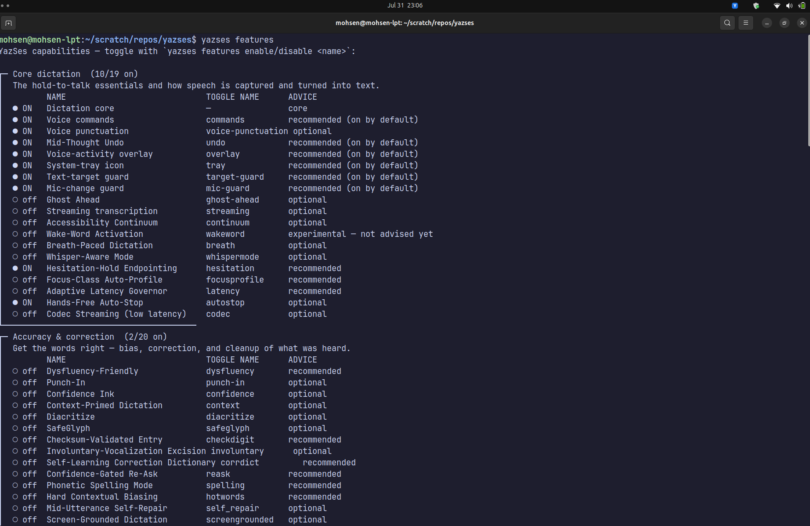

# CLI Reference

All commands are available as `yazses <command>` once installed globally
(`uv tool install` / `pipx install`), or as `uv run yazses <command>` from the
repo.

> **Looking for the exhaustive, option-by-option list?** See the auto-generated
> [Command Index](command-index.md) — every command, argument and flag, generated
> straight from the app. This page is the hand-written companion: it groups the
> commands the way `yazses --help` does, and gives each a synopsis, its key
> options, and at least one worked example. For the **full config surface** see the
> [Configuration Reference](configuration.md); for the **full feature catalogue**
> see the [Feature Reference](features.md).

**Getting help.** Every command and subcommand accepts both `-h` and `--help`;
each shows its options plus a worked **Examples** block. `yazses --help` lists all
commands grouped into six panels — **Updates & maintenance**, **Daemon**,
**Setup & calibration**, **Dictation & correction**, **Remote**, and
**Learning & tuning** — and bare `yazses` shows the same help. `yazses --version` /
`-V` prints the version.

**Tab completion.** Run `yazses --install-completion` once to enable `<Tab>`
completion of commands and options in your shell (`yazses --show-completion`
prints the script to inspect or customise).

The sections below follow the same six panels.

---

## Updates & maintenance

| Command | Description |
|---|---|
| `yazses about` | Print a branded banner with the author, version, project links, and where to report a bug or request a feature. |
| `yazses update` | Check for a newer version and offer to install it. |

### `yazses about`

Shows a branded banner: author, installed version, project links, and where to
report issues or request features (issues:
<https://github.com/MSKazemi/yazses/issues>; author: Mohsen Seyedkazemi Ardebili
<mohsen.seyedkazemi@gmail.com>). Read-only.

```bash
yazses about    # author, version, links, and where to report a bug or request a feature
```

The banner draws the YazSes mark — a "Y" over a listening sound-wave, the same
logo as the docs site, the Snap listing, and the tray icon — with the brand
gradient swept across it. It degrades automatically and never needs configuring:
truecolor to 256-colour to no colour, and Unicode blocks to plain ASCII on a
terminal whose codepage cannot encode them. Piped, redirected, or with
[`NO_COLOR`](https://no-color.org/) set, you get a single plain
`YazSes <version> — <tagline>` line instead, so captured output stays clean.

`yazses quickstart` shows the same banner, and is the only command that animates
it: the sound-wave ripples briefly and settles. That never happens off a TTY,
under `NO_COLOR`, or in CI.

### `yazses update`

Detects how YazSes was installed and checks the matching source — the tracked
**snap** channel for snap installs, **PyPI** for pip / pipx / uv-tool — then
upgrades only when the available version is strictly newer (never a downgrade).

**Options:** `--check` (report only, don't install) · `--yes` / `-y` (install
without prompting).

```bash
yazses update           # check for a newer version and offer to install it
yazses update --check   # only report what's available (don't install)
yazses update --yes     # install without asking
```

After a successful update, restart the daemon to load it:
`systemctl --user restart yazses` (or `yazses stop && yazses start`).

---

## Daemon

| Command | Description |
|---|---|
| `yazses start` | Start the daemon; restarts cleanly if one is already running (never a duplicate). |
| `yazses restart` | Stop **all** daemons (including stray/detached ones) and start exactly one. |
| `yazses stop` | Stop the running daemon. |
| `yazses status` | Show state, hotkey, model, injection backend, and uptime over IPC. |
| `yazses tray` | Show the top-bar tray icon + click-menu (pick/pin mic, re-calibrate, start/stop). |
| `yazses features` | See capabilities and turn them on/off — no config-file editing. |
| `yazses settings` | The same switchboard as a window — every capability as a checkbox. |
| `yazses-daemon` | Run the daemon in the **foreground** (logs to console) — useful for debugging. |

### `yazses start`

Loads the speech model once (first run 10–30 s) and listens for the hotkey.
Routes through systemd when a `yazses.service` user unit is installed (so it's
supervised and self-heals), else spawns detached. **Verifies the daemon actually
came up**: reports when it's ready, notes when it's still loading, or reports a
startup crash with the reason and exits non-zero. If one is already running it
**restarts** it (killing any stray duplicates) rather than spawning a second — so
you never double-type. Warns if a runtime prerequisite is missing (run
`yazses setup`) or if an `input`-group re-login is still pending.

```bash
yazses start    # start dictating — hold the hotkey, speak, release
```

### `yazses restart`

Stop **all** daemons (including stray/detached ones) and start exactly one, then
verify readiness (same as `start`). Use this if dictation is being typed twice (a
sign of duplicate daemons). Same prerequisite warnings as `start`.

```bash
yazses restart    # stop every daemon and start exactly one
```

### `yazses stop`

Stop the running daemon (SIGTERM). Dictation stays off until you `yazses start`
again; to pick up a config or version change instead, use `yazses restart`. Exits
non-zero (with "nothing to stop") when none is running.

```bash
yazses stop    # dictation off until you start again
```

### `yazses status`

Show state, hotkey, model, injection backend, and uptime over IPC. When not
running, points you at `yazses start` (and `yazses quickstart` for new users);
while the model is still loading it says so rather than looking broken. Pass `--json`
for machine-readable JSON output for status bars or scripts.

```bash
yazses status         # is it running? show state, model, and hotkey
yazses status --json  # output state, pid, model, and ready as JSON
```

### `yazses tray`

Show a **microphone icon in the top bar** with a click-menu — a no-terminal way to
manage the mic and daemon. The menu lets you **pick/pin the input microphone** from a
live device list, **re-calibrate** the mic level, and **restart/stop** the daemon; the
icon reflects daemon state and turns orange when it detects a run of silent clips.

```bash
yazses tray               # show it now (blocks; Ctrl-C to stop)
yazses tray --background   # launch it detached and return
```

Mic changes from the menu take effect **live** (no restart). The daemon also launches
the tray automatically when a desktop is present — `yazses tray` just shows it right now.
"Quit tray" closes the icon but leaves dictation running (use "Stop daemon" to stop it).
Needs a system tray host — on GNOME that's the **AppIndicator extension** (standard on
Ubuntu); disable auto-launch with `yazses features disable tray`.

### `yazses features`

The friendly switchboard for turning capabilities on and off — no config-file
editing. Bare `yazses features` lists **every** capability **grouped by category**,
showing whether each is on/off, its toggle name, and an advice tier.



**Options (on the list view):**

| Option | Effect |
|---|---|
| `--on` | Show only capabilities that are currently **ON**. |
| `--tier <tier>` | Filter by advice tier: `core`, `on`, `rec`, `opt`, `exp`. |
| `--category` / `-c <name>` | Filter by category name (partial, case-insensitive), e.g. `access`. |

**Subcommands:**

| Command | Description |
|---|---|
| `yazses features info` | Describe **every** capability — name, what it does, a usage example (the full catalogue; pipe to `less`). |
| `yazses features info <name>` | Describe one capability — what it does, a usage example, and how to toggle it. |
| `yazses features enable <name>` | Turn a capability **on** (writes your config), then `yazses restart` to apply. |
| `yazses features disable <name>` | Turn a capability **off**, then `yazses restart`. |

```bash
yazses features                          # every capability, grouped, + advice
yazses features --on                     # show only what's currently enabled
yazses features --tier rec               # show only the recommended tier
yazses features --category Multilingual  # show one category
yazses features info                     # describe ALL capabilities + usage examples
yazses features info reflow              # describe one + show a usage example
yazses features enable read-back         # turn one on  (use the TOGGLE NAME)
yazses features disable cocktail         # turn one off
yazses restart                           # apply
```

Each row shows an **advice** tier:

| Tier (`--tier`) | Meaning |
|---|---|
| `core` | Always on (e.g. Dictation core) — can't be toggled. |
| `on` | `recommended (on by default)` — shipped on; keep it (Voice commands, Mid-Thought Undo, overlay). |
| `rec` | `recommended` — safe and useful, worth enabling (e.g. Dysfluency-Friendly if you stutter). |
| `opt` | `optional` — enable only if you want that capability (Punch-In, Prosody Ink, Read-Back, …). |
| `exp` | `experimental — not advised yet` — known rough edges (Cocktail Filter, Glance-Type). Refused unless you pass `--force`. |

Experimental features are guarded: `yazses features enable cocktail` prints why
it's not advised and exits; add `--force` to override.

> The complete catalogue lives in the [Feature Reference](features.md).

### `yazses settings`

The same switchboard as a **window**: every capability as a checkbox, grouped by
the same categories `yazses features` prints, with its advice tier underneath.

```bash
yazses settings           # open the window (blocks until you close it)
```

Checking a box **stages** the change; **Apply** writes them all, then restart the
daemon (`yazses restart`) to pick them up. The window is generated from the same
feature registry as the CLI, so the two can never disagree — and it honours the
same rules: core and *planned — designed, not yet wired* features are shown but
not clickable, and an experimental one asks for confirmation before it is staged.

A few things it deliberately does **not** do (yet — see the
[settings-gui epic](https://github.com/MSKazemi/yazses/issues/65)):

- It does not install a feature's optional Python packages. `yazses features
  enable <name>` does; the window tells you which packages are missing and names
  that command.
- It needs a **graphical session**. On a headless box or a bare SSH session it
  says so and points you at `yazses features` instead of failing at Qt.

### `yazses-daemon`

Run the daemon in the **foreground**, logging to the console — useful for
debugging. This is the entry point `yazses start` supervises in the background.

---

## Setup & calibration

| Command | Description |
|---|---|
| `yazses quickstart` | **New here? Start here.** A 3-step, machine-tailored getting-started guide (read-only). |
| `yazses doctor` | Health check: what's OK / missing, ending in a one-line verdict. |
| `yazses verify` | Record, transcribe and **prove** dictation works end to end; names the first broken link. |
| `yazses report` | Write a redacted diagnostic file you can attach to an issue. Nothing is uploaded. |
| `yazses autostart` | Start YazSes automatically at login, so it survives a reboot. |
| `yazses mic-level` | Measure your mic speech level and recommend (or set) the VAD threshold. |
| `yazses logs` | Show the daemon's diagnostic log (metadata only — no dictated text). |
| `yazses setup` | Provision all Linux runtime requirements so dictation works out of the box. |
| `yazses enroll` | Accessibility enrollment wizard: calibrate VAD thresholds to your voice. |
| `yazses enroll-voice` | Record an encrypted speaker voiceprint (for Cocktail Filter + Voiceprint Mind). |
| `yazses model` | Manage the SLM intent-routing models (list / download). |
| `yazses vocab` | Manage your personal dictionary (words STT mis-hears). |
| `yazses acronyms` | Manage a persistent acronym glossary and expand acronyms in text. |
| `yazses wordgoal` | Track words written against a writing goal, across invocations. |
| `yazses cliphistory` | A persistent clipboard history you can recall by voice-style reference. |
| `yazses outline` | Build a nested outline incrementally and render it to Markdown/OPML. |
| `yazses srs` | Capture facts as flashcards and schedule reviews (SM-2). |
| `yazses hotkey` | Show or change the key you hold to talk. |
| `yazses audio` | See and pin the input microphone (fixes a mic that silently switches). |
| `yazses gaze` | Aim dictation with your gaze — type into whichever pane you look at. |

### `yazses quickstart`

Looks at what's already set up (prerequisites, whether the daemon is running, the
speech model, your hotkey) and prints exactly what to do next (`setup` → `start` →
hold the key), plus handy follow-ups. Safe to run anytime — it changes nothing.

```bash
yazses quickstart    # the 3 steps to get dictating, tailored to your machine
```

### `yazses doctor`

Reports the installed version and daemon status (PID/state/model), then verifies
platform, keyboard-capture and microphone permissions, **which input device the
hotkey binds to** (flags a virtual injector device that would make the hotkey
dead), the session type (X11/Wayland) and its injection tools, **injection
readiness + `ydotoold` status**, the STT model and model cache, the config dir,
the active config + hotkey summary, and any configured extras (EMG port, prosody).
Each line is `OK` / `WARN` / `FAIL` / `SKIP`, and it ends with a one-line
**verdict**: `✓` everything's good, `▲` only optional warnings remain, or `✗` N
problems to fix — each with the concrete next command.

**Options:** `--mic` (also record a short ambient clip and warn if room level
meets/exceeds `accessibility.vad_threshold`).

```bash
yazses doctor          # run this first if dictation isn't working
yazses doctor --mic    # also sample the mic and compare it to the VAD gate
```

### `yazses verify`

`doctor` proves the **prerequisites** — a mic exists, `xdotool` is installed, the model is
cached. All of those can pass while dictation still produces nothing, because the silence
gate can sit above your voice, the model can return empty text, or the injector can be
aimed at a window that ignores synthetic keys.

`verify` runs the **real chain** — capture → silence gate → transcription → optional
injection — and reports each link. It stops at the first failure rather than cascading, so
you are told the one thing to fix instead of four consequences of it, each with the command
that fixes it.

**Options:** `--seconds/-s` (recording length, default 3), `--type` (also type the
transcript into the focused window).

```bash
yazses verify              # speak for 3s; proves the pipeline end to end
yazses verify --seconds 5  # record for longer
yazses verify --type       # also inject the result, testing the last link too
```

```text
  [OK] Capture: recorded audio from the input device
  [OK] Signal: level 0.0352 clears the gate (0.0020)
  [OK] Transcription: produced 2 word(s)
✓ Dictation works end to end on this machine.
```

### `yazses report`

Collects a diagnostic bundle **locally** — versions, daemon state, your settings with paths
and identifiers replaced, and the tail of the metadata-only log. Your dictated text is never
included, and the learning corpus is reported by size and never opened.

**Nothing is uploaded, ever.** The file is written, its path printed, and it is yours to
read before deciding whether to attach it to an issue.

**Options:** `--output/-o` (where to write it), `--print` (print instead of writing),
`--log-lines` (how much log tail to include, default 200).

```bash
yazses report                 # writes ~/.local/share/yazses/yazses-report.json
yazses report --print         # inspect it without writing a file
yazses report -o /tmp/r.json  # choose the path
```

### `yazses autostart`

Runs YazSes at login so it is already there when you reach for the key. Works for every
install method — `pipx`, `uv tool`, `pip`, apt — by writing a systemd user service aimed at
*this* install, and rewriting it if an upgrade moves the binary.

The service restarts YazSes if it crashes (verified: killed outright, back within about
five seconds) and gives up after five failures in a minute, so a genuinely broken machine
leaves a diagnosable state instead of a spin loop.

```bash
yazses autostart enable    # install + enable the login service
yazses autostart status    # will YazSes be running after the next reboot?
yazses autostart disable   # stop launching it at login
```

`yazses doctor` also reports this as a **Starts at login** check.

### `yazses mic-level`

Records a few seconds while you speak, reports your average mic level vs the
current `vad_threshold`, and recommends a threshold. Use it when dictation logs
`Silent audio -- discarding`.

**Options:** `--set` (write the recommended threshold to `config.toml` in place,
comments preserved) · `--seconds` / `-s N` (record for `N` seconds instead of 4).

```bash
yazses mic-level          # measure and recommend a threshold
yazses mic-level --set    # measure and write it to config.toml
yazses mic-level -s 6     # record for 6 seconds instead of 4
```

### `yazses logs`

Print the diagnostic log — **metadata only**, never your dictated text.

**Options:** `--lines` / `-n N` (show the last `N` lines; default 40) · `--path`
(print the log file path and exit — `~/.local/state/yazses/log/daemon.log`).

```bash
yazses logs          # last 40 log lines
yazses logs -n 100   # last 100 lines
yazses logs --path   # just print the log file path
```

### `yazses setup`

**Linux provisioning, one command.** Installs the audio + injection system
packages (`libportaudio2`, `xdotool`, `ydotool`, `wtype`, `xclip`,
`wl-clipboard`), adds you to the `input` group (needed for the hotkey and for
ydotool's `/dev/uinput` access), and on Wayland sets up + enables the `ydotoold`
user service (required for injection on GNOME/KDE Wayland, where `wtype` is
blocked). Idempotent — only fixes what's missing. Finishes by printing a numbered
**"finish installing" checklist** of the steps only you can do (join the `input`
group with `sudo usermod -aG input $USER`, log out and back in, calibrate your
voice, then `yazses start`) and offers to run the mic calibration for you.

**Options:** `--dry-run` (show what it would install/change — plus the same
finish-installing checklist — without making any changes).

```bash
yazses setup            # install deps, join input group, set up ydotoold
yazses setup --dry-run  # preview the changes + checklist
```

### `yazses enroll`

Accessibility enrollment wizard. Records ~20 short utterances to derive
`vad_threshold` and `min_silence_ms` values tuned to your voice and microphone,
then writes them to `config.toml`.

> Can set a too-high threshold in a noisy room — verify with `yazses mic-level`.

```bash
yazses enroll    # calibrate the mic/VAD thresholds to your voice
```

### `yazses enroll-voice`

Records a short sample of your voice, computes a speaker embedding, and stores it
**encrypted on this machine** (never leaves it). Needed by Cocktail Filter and
Voiceprint Mind. Requires `[voiceprint] enabled = true` and the voiceprint extra
(`uv sync --extra voiceprint`). Run once; re-run to re-enroll.

```bash
yazses enroll-voice    # record a sample → save your speaker voiceprint
```

### `yazses model`

Manage the optional Tier 2 SLM intent-routing models.

| Command | Description |
|---|---|
| `yazses model list` | List available SLM models and their download status. |
| `yazses model download <model_id>` | Download a GGUF model for Tier 2 SLM intent routing. |

```bash
yazses model list                # show SLM models + which are downloaded
yazses model download qwen2.5-0.5b  # download an SLM for intent routing
```

### `yazses vocab` — personal dictionary

Words STT keeps mis-hearing (names, jargon, acronyms) are primed into Whisper's
`initial_prompt` so they're spelled right. Stored at
`~/.config/yazses/vocabulary.txt`; run `yazses restart` after changing it.

| Command | Description |
|---|---|
| `yazses vocab add <word> ...` | Add one or more words/names to your dictionary. |
| `yazses vocab list` | Show every word in your dictionary. |
| `yazses vocab remove <word>` | Remove a word. |

```bash
yazses vocab add YazSes               # add one word/name
yazses vocab add Kubernetes kubectl   # add several at once
yazses vocab list                     # show the dictionary
yazses vocab remove kubectl           # drop a word
yazses restart                        # apply so STT spells them right
```

### `yazses acronyms` — acronym glossary

A persistent `{ACR: full name}` glossary stored at `~/.config/yazses/acronyms.json`.
`yazses acronyms expand` rewrites text so each known acronym is spelled out on its
first occurrence (`Full Name (ACR)`) and contracted afterwards — fully offline.

| Command | Description |
|---|---|
| `yazses acronyms add <ACR> <full form>` | Register/replace an expansion. |
| `yazses acronyms list` | Show the stored glossary. |
| `yazses acronyms remove <ACR>` | Drop an entry. |
| `yazses acronyms expand [text]` | Expand acronyms in TEXT (or stdin) on first use. |

```bash
yazses acronyms add API "Application Programming Interface"
yazses acronyms expand "The API and the API"
#   -> The Application Programming Interface (API) and the API
```

### `yazses wordgoal` — writing-goal tracker

A running word count persisted at `~/.config/yazses/wordgoal.json`, so it accumulates
across invocations (dictate or pipe text in and watch progress toward a target).

| Command | Description |
|---|---|
| `yazses wordgoal add [text]` | Add TEXT (or stdin) to the running count; show progress. |
| `yazses wordgoal status` | Show the current count and goal progress. |
| `yazses wordgoal goal <n>` | Set a target word count (`0` clears it). |
| `yazses wordgoal reset` | Zero the count (keeps the goal). |

```bash
yazses wordgoal goal 500
yazses wordgoal add "the paragraph I just wrote"
yazses wordgoal status        # -> N of 500 words — M to go.
```

### `yazses cliphistory` — clipboard history

A newest-first, de-duplicated, capped clipboard history stored at
`~/.config/yazses/cliphistory.json`. `recall` resolves a spoken-style reference to one
entry — fully offline.

| Command | Description |
|---|---|
| `yazses cliphistory add [text]` | Remember TEXT (or stdin). |
| `yazses cliphistory list` | Show history, newest first. |
| `yazses cliphistory recall <query>` | Print the entry a reference points to. |

`recall` understands `url`/`link`, `email`, ordinals (`last`, `second`, …),
`first`/`oldest`, and `number N`; it defaults to the most recent entry.

```bash
yazses cliphistory add "https://example.com"
yazses cliphistory recall "the last url"     # -> https://example.com
```

### `yazses outline` — incremental outline builder

Builds a nested outline across invocations (state at `~/.config/yazses/outline.json`)
and renders it to Markdown or OPML — fully offline.

| Command | Description |
|---|---|
| `yazses outline add <text>` | Add an item after the cursor at the current level. |
| `yazses outline indent` | Nest the last item one level deeper. |
| `yazses outline promote` | Move the last item one level shallower. |
| `yazses outline render [--format markdown\|opml]` | Render the outline. |
| `yazses outline clear` | Start a fresh outline. |

```bash
yazses outline add "Chapter 1"
yazses outline add "Section A"
yazses outline indent
yazses outline render          # -> - Chapter 1 / (indented) - Section A
```

### `yazses srs` — spaced-repetition capture

Capture "remember that X is Y" facts as cloze flashcards (stored at
`~/.config/yazses/srscap.json`) and schedule reviews with the SM-2 algorithm — offline.

| Command | Description |
|---|---|
| `yazses srs capture [text]` | Detect a fact in TEXT (or stdin) and store it as a card. |
| `yazses srs list` | Show the deck and each card's next-review interval (days). |
| `yazses srs review <n> --grade <0-5>` | Grade recall; `<3` lapses, higher grades lengthen the interval. |

```bash
yazses srs capture "remember that the capital of France is Paris"
yazses srs review 1 --grade 5     # -> review again in 1 day(s)
```

**Moving your dictionary to another device.** Your dictionary and settings are
plain files under `~/.config/yazses/`, so they move with a simple copy — no export
step:

```bash
# on the new device, after installing YazSes:
mkdir -p ~/.config/yazses
scp olddevice:~/.config/yazses/vocabulary.txt ~/.config/yazses/   # the dictionary
scp olddevice:~/.config/yazses/config.toml    ~/.config/yazses/   # hotkey, VAD, etc.
yazses restart
```

The opt-in learning corpus (`~/.local/share/yazses/`) is **not** part of this — it
is encrypted on-device data and is intentionally not portable (see the
[privacy statement](privacy-statement.md)).

### `yazses hotkey` — hold-to-talk key

| Command | Description |
|---|---|
| `yazses hotkey show` | Show the current dictation key, the command key (if any), and the choices. |
| `yazses hotkey set <key>` | Change the key you hold to **dictate** (e.g. `right_ctrl`), then `yazses restart`. |
| `yazses hotkey command <key>` | Set a dedicated **command** key, or `off` to disable it. Then `yazses restart`. |

Choices: `right_alt` (default), `left_alt`, `right_ctrl`, `left_ctrl`,
`right_shift`, `left_shift`, `right_meta`, `left_meta`, `space`. Prefer a
dedicated modifier so it doesn't collide with normal typing.

```bash
yazses hotkey show                # print the keys + the choices
yazses hotkey set right_ctrl      # hold Right-Ctrl to dictate
yazses hotkey command right_ctrl  # dictate on right_alt, commands on right_ctrl
yazses hotkey command off         # remove the command key
yazses restart                    # apply
```

**Dedicated command key (force command mode).** By default one key does both
jobs: you hold the dictation key, speak, and YazSes **auto-detects** whether your
phrase was a command ("save", "undo") or text. Binding a **second** key removes the
ambiguity — while you hold it, everything you say is parsed as a command and
**never typed as literal text** (an unrecognised phrase is simply ignored):

- The command key must be **different** from your dictation key.
- Holding the **dictation** key still works exactly as before (text, with command
  auto-detection).
- Holding the **command** key: "save" → Ctrl+S even though it would normally be
  text; "hello there" → ignored (no command matched), nothing typed.

See the [voice command reference](#voice-command-reference) below for the phrases.

### `yazses audio` — input microphone

| Command | Description |
|---|---|
| `yazses audio devices` | List capture devices (`●` = OS default, `★` = pinned). |
| `yazses audio use <name>` | Pin the input mic by name (substring), then `yazses restart`. |
| `yazses audio use --clear` | Unpin — follow the OS default input again. |
| `yazses audio status` | Show pinned vs OS-default mic + live capture health. |

```bash
yazses audio devices                 # which mics exist, and which one is in use
yazses audio use "AT Translated"     # pin the built-in laptop mic by name
yazses audio use --clear             # go back to following the OS default
yazses restart                       # apply
```

**Why pin a mic.** By default capture follows the OS **default input device**. Plugging
in a USB-C monitor, a dock, or a headset can make the OS silently re-pick that as the
default input — often a dead or very quiet endpoint — and dictation "stops working" with
no error (every clip is discarded as silence). Two things fix this:

- **Pin your real mic** with `yazses audio use <name>`. The name is a case-insensitive
  substring, re-resolved on every recording, so it keeps working even if a hotplug
  renumbers devices.
- **The mic-change guard** (on by default, `yazses features disable mic-guard` to turn
  off) watches for the default input changing and for a run of silent clips. When it
  sees trouble it **auto-heals** — switching capture back to the last mic that worked —
  and shows a desktop notification with **Re-calibrate / Pin this mic / Ignore** buttons.

If dictation goes quiet after changing your audio setup, run `yazses audio status` (or
`yazses status`) to see the live capture device and whether clips are being discarded.

### `yazses gaze` — Glance-Type (webcam gaze targeting)

| Command | Description |
|---|---|
| `yazses gaze calibrate` | Calibrate the webcam so your gaze maps to screen zones. |

Requires `[gaze] enabled = true`, an X11 session with `xdotool`, and a webcam. The
webcam gaze deps (mediapipe + opencv) are installed automatically on first run
into the running environment — no manual `pip install` (pass `--no-install` to skip,
or install them up front with `yazses features enable gaze --force`). You look at a
few on-screen points to fit the gaze→screen mapping; frames are used in-RAM during a
hold only — never stored or sent.

```bash
yazses gaze calibrate    # fit the webcam gaze → screen-zone mapping
```

---

## Dictation & correction

| Command | Description |
|---|---|
| `yazses inject <text>` | Type text into the focused window without recording (tests the injector). |
| `yazses say <text>` | Speak text aloud with the built-in offline voice. |
| `yazses overlay` | Run the sonar voice-activity overlay in the foreground (preview/debug). |
| `yazses reflow [text]` | Reflow a monologue into a bulleted outline — fully offline. |
| `yazses table [text]` | Turn spoken rows into delimited (CSV) lines — fully offline. |
| `yazses shellpipe [text]` | Render a spoken pipeline into a shell command (printed, never run). |
| `yazses braille [text]` | Translate text to Unicode Braille (UEB subset) — fully offline. |
| `yazses case [text]` | Recase text to a naming convention (snake/kebab/camel/…) — fully offline. |
| `yazses screenplay [text]` | Format dictated lines as Fountain screenplay markup — fully offline. |
| `yazses findreplace <command>` | Apply a spoken 'replace X with Y' edit to text — fully offline. |
| `yazses chords [text]` | Turn a spoken key chord into injectable key combos — fully offline. |
| `yazses wordfind <description>` | Reverse dictionary: describe a word, get ranked candidates. |
| `yazses cite <query> --bib <file>` | Resolve a spoken 'author year' reference against a .bib. |
| `yazses slotfill <text> --slot ...` | Extract structured fields from an utterance by a schema. |
| `yazses punch-in` | Correct the last dictation by re-speaking just the wrong phrase. |
| `yazses transcribe <file>` | Transcribe an audio file to text — fully offline. |
| `yazses meeting` | Record a whole meeting hands-free → speaker-labelled transcript + optional minutes. |
| `yazses test` | End-to-end self-test: confirm the injector works without speaking. |

### `yazses test`

Types `YazSes OK` into the focused window (no speaking) so you can confirm
injection works. Focus a text editor first.

```bash
yazses test    # focus an editor first, then watch for 'YazSes OK'
```

### `yazses inject`

Inject text into the focused app without recording — the quickest way to test the
injection backend.

```bash
yazses inject "hello world"    # type it into the focused window
```

### Choosing the injection backend

On Wayland the default (`auto`) **types** via ydotool, which works in every app —
editors, browsers, **and terminals** — and never touches your clipboard. If you'd
rather paste (instant, but a no-op in terminals where `Ctrl+V` is literal, and
overwrites the clipboard), set the backend:

```toml
[injection]
backend = "clipboard"   # "auto" (default) | "type" | "clipboard" | "wtype"
```

Or per-run without editing config: `YAZSES_INJECTOR=clipboard`. Run
`yazses restart` after changing it. `yazses status` shows the backend actually in
use.

### `yazses say`

Speak arbitrary text aloud through the offline TTS voice (Read-Back Loop). Routes
through the running daemon so it reuses the loaded TTS backend. Requires
`[tts] enabled = true` (install the voice with `uv sync --extra tts`).

```bash
yazses say "hello there"    # speak text aloud via offline TTS
```

### `yazses overlay`

Runs the sonar voice-activity overlay in the foreground (preview/debug) — neon
rings near the cursor that pulse with your voice while dictating. Normally the
daemon auto-launches it (`[overlay] enabled = true`); the direct console script
`yazses-overlay` does the same thing. PySide6 ships in the base install and is
bundled in the snap, so it works out of the box. For true see-through rings on X11
you need a compositor (e.g. `picom`).

```bash
yazses overlay    # preview the sonar rings in the foreground
```

Auto-launch is **on by default**; the daemon only spawns the overlay when a
display (`DISPLAY`/`WAYLAND_DISPLAY`) is present **and** PySide6 is installed. See
the [Configuration Reference](configuration.md) for the `[overlay]` keys
(`style`, `position`, `react_to_voice`, `accent`, `size_px`, `fps`,
`cursor_offset_px`).

### Offline text tools

One-shot, fully-offline text transforms. Each reads its `TEXT` argument, or
standard input when omitted (so you can pipe a transcript in). Nothing is
uploaded.

| Command | Options | Example |
|---|---|---|
| `yazses reflow` | — | `yazses reflow "First, set up. Then test. I need to ship."` |
| `yazses table` | `--sep <char>` (default `,`) | `yazses table "row: Ada, 1815, London next row Bob, 1990, Paris"` |
| `yazses shellpipe` | — | `yazses shellpipe "list files then count lines"` → `ls \| wc -l` |
| `yazses braille` | `--grade <1\|2>` (default `2`) | `yazses braille "hello world"` → `⠓⠑⠇⠇⠕ ⠺⠕⠗⠇⠙` |
| `yazses case` | `--style <name>` | `yazses case --style snake "myVariableName"` → `my_variable_name` |
| `yazses screenplay` | — | `yazses screenplay "scene: interior coffee shop, day"` → `INT. COFFEE SHOP - DAY` |
| `yazses findreplace` | `--in <text>` | `yazses findreplace "replace every cat with dog" --in "the cat"` → `the dog` |
| `yazses chords` | — | `yazses chords "press control shift P"` → `ctrl+shift+p` |
| `yazses wordfind` | `--limit <n>`, `--lexicon <file>` | `yazses wordfind "happy accident"` → `serendipity` |
| `yazses cite` | `--bib <file>` (req), `--style <latex\|plain\|apa>` | `yazses cite "vaswani 2017" --bib refs.bib` → `\cite{vaswani2017}` |
| `yazses slotfill` | `--slot NAME:after=… \| NAME:choices=…` (repeatable) | `yazses slotfill "priority high" --slot priority:after=priority` → `{"priority": "high"}` |

- **`reflow`** splits on sentence boundaries, strips a leading discourse marker
  (`first`, `then`, `finally`, …), and turns action phrases (`I need to`, `to do`,
  `follow up`) into `- [ ]` checkboxes.
- **`table`** splits cells on commas/semicolons or the word `and`; rows split on
  `next row` or newlines; a leading `row:`/`entry:`/`record:` marker is stripped.
- **`shellpipe`** recognises stages like `list files`, `filter for X`,
  `count lines`, `sort`, `unique`, and **prints** the pipeline for you to review —
  it **never executes** anything; it exits non-zero (emitting nothing) if a stage
  isn't recognised.
- **`braille`** translates to Unicode Braille; `--grade 1` is uncontracted.
- **`case`** recases text to a naming convention (`snake`, `kebab`, `camel`, `pascal`,
  `title`, `sentence`, `upper`, `lower`, `constant`); with no `--style` it detects a
  spoken `make this … case:` command and recases the remainder.
- **`screenplay`** formats each line as Fountain: `scene: interior/exterior <place>,
  <time>` → `INT./EXT. …`, `<Name> (character) <dialogue>` → a character cue,
  `transition: cut to` → `CUT TO:`; other lines become smart-quoted action lines.
- **`findreplace`** parses `replace every/first X with Y` (add `case-sensitive`) and
  applies it to `--in`/stdin; exits non-zero if the command can't be parsed.
- **`chords`** parses a spoken chord (modifiers + a named/F/char key + an optional
  repeat like `twice`) into `ctrl+shift+p`-style combos, one per line.
- **`wordfind`** ranks a small built-in lexicon by content-word overlap with your
  description; extend it with `--lexicon` (a JSON `{word: definition}` object).
- **`cite`** parses a local `.bib`, matches a spoken `author year` query, and formats
  the entry (`--style latex|plain|apa`); exits non-zero if nothing matches confidently.
- **`slotfill`** extracts structured fields from one utterance: each `--slot` is either
  `NAME:after=kw1,kw2` (capture the token after a keyword) or `NAME:choices=a,b,c` (pick
  the first enum member present); prints a JSON object of the matched fields.

```bash
cat notes.txt | yazses reflow          # reflow a piped transcript
yazses table --sep ';' "a, b next row c, d"   # semicolon-separated CSV
yazses braille --grade 1 "abc"         # Grade 1 (uncontracted)
```

### `yazses punch-in`

Re-speak just the wrong phrase to correct the last dictation burst. The daemon
records a short window, aligns the respoken phrase against the last burst it
typed, then deletes that burst and retypes it corrected. Because pure respeak
fixes only ~35% on the first try (Suhm 2001), the alignment surfaces the top
candidates rather than silently splicing. Requires `[punch_in] enabled = true`.

**Options:** `--dry-run` (list candidate spans without editing, so you can confirm
first) · `--choose` / `-n N` (apply the candidate at rank `N`; `0` = best,
default).

```bash
yazses punch-in              # re-speak the phrase; correct the best match
yazses punch-in --dry-run    # list candidate spans without editing
yazses punch-in --choose 1   # apply the 2nd-ranked candidate
```

### `yazses transcribe`

Transcribe an existing audio file **offline** and write a sidecar text file next
to it (`talk.mp3 → talk.txt`), using the same local `faster-whisper` engine as
live dictation — no cloud, no network, no account. CLI-only; it doesn't touch the
daemon, hotkey, or your dictation config. Accepts wav/mp3/m4a/ogg/flac/opus/mp4
and most other ffmpeg-decodable media.

**Options:**

| Option | Effect |
|---|---|
| `--format` / `-f <fmt>` | Output format: `txt` (default) `\| md \| srt \| vtt \| json`. `srt`/`vtt` add timestamps; `json` is lossless (per-word timestamps + speaker). |
| `--out` / `-o <path>` | Write to an explicit path instead of the sidecar default. |
| `--model <name>` | Override the STT model for this run (e.g. `small.en` = more accurate, slower). Defaults to your `[stt]` model. |
| `--language <lang>` | `en` (default) or `translate` to render any-language audio into English. |
| `--diarize` / `--no-diarize` | Tag who said what with local speaker models (needs the `diarization` extra). |
| `--speakers <N>` | Force an exact speaker count (`0` = auto-detect). |
| `--min-speakers <N>` / `--max-speakers <N>` | Bounds on the auto-detected speaker count. |
| `--names "Alice,Bob"` | Comma list mapped to speakers in order of first appearance. |
| `--rename speaker_0=Alice` | Explicit speaker→name map, repeatable. |
| `--download-models` | Fetch the ~15 MB sherpa diarization models, then exit (no transcription). |

```bash
yazses transcribe talk.mp3                     # → talk.txt beside it
yazses transcribe talk.mp3 -o notes.txt        # choose the output path
yazses transcribe lecture.mp3 --format srt     # subtitle file with timestamps
yazses transcribe talk.mp3 --model small.en    # more accurate, slower
yazses transcribe talk.fr.m4a --language translate   # any language → English
yazses transcribe mtg.m4a --diarize            # tag speakers: 'Speaker 1: …'
yazses transcribe mtg.m4a --diarize --speakers 3           # exact speaker count
yazses transcribe mtg.wav --diarize --names 'Alice,Bob'    # name them in order
yazses transcribe mtg.wav --diarize --rename speaker_0=Alice  # name one speaker
yazses transcribe mtg.m4a --download-models    # fetch diarize models, then exit
```

Notes:

- **Speaker tags need the diarization extra:** `uv sync --extra diarization`
  (sherpa-onnx — CPU-only, no PyTorch, no GPU, no account). Without it, `--diarize`
  degrades to a plain transcript and tells you.
- **Speaker naming is opt-in and private.** With `--diarize` and an enrolled
  voiceprint (`yazses enroll-voice`), your own voice is auto-labelled **"You"**;
  everyone else is `Speaker N` unless you name them. No new data is stored and no
  one is ever enrolled automatically — speaker voiceprints are biometric data and
  stay encrypted on this machine. You are responsible for having permission to
  record and transcribe the audio.

### `yazses meeting` — hands-free meeting capture + minutes

Record a **whole meeting** without holding a key, then get a speaker-labelled
transcript (and optional minutes) — all **offline**. While recording it streams a
rolling live transcript for the `status` view; at `stop` it runs an accurate batch
diarization post-pass over the full recording (reusing the same local sherpa speaker
models as `yazses transcribe --diarize`, so **no new dependency**), then optionally
generates minutes with a local LLM. Speakers are told apart by voice **embeddings +
clustering**, not pitch. Off by default — enable with `yazses features enable meeting`.

| Command | Effect |
|---|---|
| `yazses meeting start` | Start recording hands-free (no key to hold). Requires `[meeting] enabled = true`. |
| `yazses meeting stop` | Stop; run the diarization post-pass and write the speaker-labelled transcript (and notes if enabled). |
| `yazses meeting status` | Show the running meeting (elapsed + live transcript), or recent meetings. |
| `yazses meeting list` | List stored meetings on this machine (no daemon required). |
| `yazses meeting relabel <id>` | Fix speaker labels and re-render: `--merge SPEAKER_2=speaker_1` folds clusters, `--rename speaker_1=Alice` names one (both repeatable); `--format`/`-f` picks the re-render format (default `md`). |
| `yazses meeting notes <id>` | Generate minutes (summary, decisions, action items) from a stored transcript. Needs `[meeting] notes = true` and a local `notes_model` GGUF; runs locally (slow on CPU). |

```bash
yazses features enable meeting     # turn it on (writes [meeting] enabled = true)
yazses meeting start               # begin hands-free capture
yazses meeting status              # elapsed + live rolling transcript
yazses meeting stop                # diarize + write the labelled transcript
yazses meeting list                # see stored meetings
yazses meeting list --json         # machine-readable array
yazses meeting relabel <id> --rename speaker_1=Alice --merge speaker_2=speaker_1
yazses meeting notes <id>          # local-LLM minutes (needs notes_model)
```

Notes:

- **Reuses the diarization extra:** the speaker post-pass uses the same sherpa-onnx
  models as `transcribe --diarize` (`uv sync --extra diarization` — CPU-only, no
  PyTorch/GPU/account). Key `[meeting]` knobs: `retain_audio` (default `false` — the
  recording is deleted after transcription), `live_transcript`, `diarize`,
  `min/max_speakers`, `cluster_threshold`, `name_from_voiceprints` (auto-label your
  own enrolled voice), `output_format`, and the `notes*` fields. See
  [configuration.md](configuration.md) for the full list.
- **Minutes are opt-in and local.** `notes` stays off until you set `notes = true`
  and point `notes_model` at a local GGUF — nothing is sent anywhere.
- You are responsible for having consent to record and transcribe the meeting.

### Voice command reference

Hold the command key (or, with auto-detect, the dictation key) and say one of
these. Phrases are matched case-insensitively and trailing punctuation is ignored,
so "Save file." works the same as "save". Spelled-out numbers ("delete the last
**three** words") are accepted.

| Say | Does |
|---|---|
| "undo" / "undo that" · "undo N times" | Ctrl+Z (× N) |
| "save" / "save file" | Ctrl+S |
| "copy" / "copy that" · "cut" · "paste" | Ctrl+C / Ctrl+X / Ctrl+V |
| "comment" / "comment this" | toggle comment (Ctrl+/) |
| "select all" · "select N lines" · "select to end" | selection |
| "delete the last word" · "delete the last N words" | delete word(s) |
| "delete the last line" · "delete the last N lines" | delete line(s) |
| "new line" / "enter" / "press enter" | Enter |
| "tab" · "escape" · "press backspace" | Tab / Esc / Backspace |
| "page up" · "page down" | Page Up / Page Down |
| "go up / down / left / right" (or "move …") | arrow keys |
| "end of line" · "beginning of line" | End / Home |
| "go to line N" | jump to line N |
| "go to function NAME" · "go to class NAME" · "open file NAME" | editor navigation |
| "run the tests" · "run the build" · "run CMD" | run in terminal |
| "rename this to NAME" | rename symbol (F2) |

Don't see a command you want? Tell us — the grammar is easily extended.
Natural-language commands beyond this fixed list require the optional Tier 2 SLM
router (`[commands] slm_model_path`), which is off by default.

### Voice punctuation (opt-in)

Enable with `yazses features enable voice-punctuation`, then speak the name of a
mark to insert it (say `yazses restart` after enabling):

| Say | Inserts |
|---|---|
| "comma" | `,` |
| "period" / "full stop" | `.` |
| "question mark" | `?` |
| "exclamation mark" | `!` |
| "colon" / "semicolon" | `:` / `;` |
| "new line" | line break |
| "new paragraph" | blank line |
| "tab key" | tab |

Example: *"the tests pass comma ship it period"* → `the tests pass, ship it.`
It is **off by default** because these words also appear in ordinary speech.

### Mid-Thought Undo

On by default (`[revise] enabled = true`). Say **"scratch that"** (or "delete
that" / "no scratch that") as a whole utterance to delete the last thing YazSes
typed — it issues backspaces, so it works in any text field, and a buffer ledger
ensures it never deletes more than YazSes injected. Saying the phrase inside a
sentence ("scratch the surface") does not trigger it.

---

## Remote

| Command | Description |
|---|---|
| `yazses remote <host>` | Forward voice typing to a remote host over SSH. |
| `yazses-agent --listen <port>` | Run the remote injection agent on the remote host. |

### `yazses remote`

Speak on your local machine and have the text typed into the focused app on a
remote SSH host (via a reverse tunnel).

**Options:** `--port` / `-p <n>` (SSH port; default 22) · `--key-file` / `-i
<path>` (SSH private key) · `--stop` (disconnect the active remote session).

```bash
yazses remote dev.example.com           # forward voice typing over SSH
yazses remote dev.example.com -p 2222   # non-default SSH port
yazses remote dev.example.com --stop    # disconnect the session
```

On the **remote** host, run the injection agent that receives the keystrokes:

```bash
yazses-agent --listen 9875
```

---

## Learning & tuning

The self-improvement loop is **opt-in, local, and encrypted**. It requires
`[learning] enabled = true` (off by default; ADR-012). All data stays on the
machine, encrypted at rest with a machine-bound key.

| Command | Description |
|---|---|
| `yazses mark-wrong` | Flag the last dictation as a misrecognition (a learning signal). |
| `yazses coach` | Show private speaking-style analytics (filler rate, WPM, vocabulary). |
| `yazses recall [words…]` | Search your past dictations (Spoken Recall). |
| `yazses scratch [list\|clear]` | Show or clear ambient "note to self …" scratch notes. |
| `yazses tune` | Analyse the corpus and propose accuracy improvements. |
| `yazses corpus` | Inspect or clear the local learning corpus. |

### `yazses mark-wrong`

Flag the last dictation as a misrecognition. Routes through the running daemon so
the flag lands on the event it just captured. **Options:** `--correction` / `-c
"..."` (attach what you actually said).

```bash
yazses mark-wrong                      # flag the last dictation as wrong
yazses mark-wrong -c "kubernetes pod"  # flag it and attach the correct text
```

### `yazses coach`

Speaking-style analytics from your recent dictations — filler-word rate,
words-per-minute, vocabulary variety. Reads only your local encrypted corpus.
**Options:** `--limit` / `-n N` (how many recent dictations to analyse; default
100).

```bash
yazses coach          # stats from your recent dictations
yazses coach -n 200   # analyse the last 200
```

### `yazses recall`

Search your past dictations for words, or show the most recent with no query.
Requires `[learning] enabled = true` **and** `[recall] enabled = true`. Reads the
local encrypted corpus only.

```bash
yazses recall kubernetes deploy   # search past dictations for those words
yazses recall                     # show your most recent dictations
```

### `yazses scratch`

Show (`list`, the default) or `clear` ambient scratch notes captured by saying
"note to self …" in command mode. Requires `[recall] scratch = true`; notes are
stored in a plain local file.

```bash
yazses scratch          # list your ambient note-to-self notes
yazses scratch clear    # delete all scratch notes
```

### `yazses tune`

Analyse the captured corpus and **print** proposed config diffs (vocabulary,
`vad_threshold`, model, disfluency rules, SLM few-shots). Each proposal is checked
against a recent **held-out** slice of the corpus and labelled *validated (N/M
held-out)* / *unverified* / *unvalidated (corpus too small)* (ADR-014);
corroborated proposals are listed first. Dry-run by default — changes nothing.

**Options:** `--apply` (review each proposal interactively and write approved ones
to `config.toml`, comments preserved) · `--retranscribe` / `--no-retranscribe`
(re-transcribe captured audio with a larger model to find errors; on by default —
skip for a faster run that uses only flagged/edited signals).

```bash
yazses tune                     # dry-run: print proposed config changes
yazses tune --apply             # review and write approved changes
yazses tune --no-retranscribe   # skip the slower re-transcription pass
```

### `yazses corpus`

Inspect or clear the local learning corpus.

| Command | Description |
|---|---|
| `yazses corpus status` | Show corpus location, event/discard/flag counts, size, and date range. |
| `yazses corpus forget --minutes N` / `-m N` | Delete events captured in the last `N` minutes (e.g. after dictating something private). |
| `yazses corpus destroy --i-mean-it` | Irreversibly wipe the corpus (database + audio clips). `--i-mean-it` is required. |

```bash
yazses corpus status                 # location, counts, size, date range
yazses corpus forget -m 10           # delete the last 10 minutes of events
yazses corpus destroy --i-mean-it    # irreversibly wipe the whole corpus
```

---

## Feature configuration snapshots

Most capabilities are toggled with `yazses features enable/disable <name>` (see
[Daemon → `yazses features`](#yazses-features) above) and configured in
`config.toml`. This section is a quick snapshot of the most-asked-about knobs; the
**complete, generated config surface** is in the
[Configuration Reference](configuration.md), and the **full capability catalogue**
is in the [Feature Reference](features.md).

### Voice macros (Say-Macro)

Off by default. Enable in `config.toml`, then define triggers in a sibling
`macros.toml`:

```toml
# config.toml
[macros]
enabled = true
author  = "Your Name"      # value substituted for ${author}
path    = "macros.toml"    # relative to the config dir, or absolute
```

```toml
# macros.toml — speak the trigger alone to expand it
[[macro]]
trigger = "license header"
type    = "text"
text    = "# SPDX-License-Identifier: MIT\n# Copyright (c) ${date} ${author}\n"

[[macro]]
trigger = "try except"
type    = "snippet"        # ${cursor} marks where the caret lands after expansion
snippet = "try:\n    ${cursor}\nexcept Exception as exc:\n    raise"
```

- **Matching is whole-utterance exact** (case/whitespace/trailing-punctuation
  insensitive): saying *"license header"* on its own fires; saying it inside a
  sentence does not, so macros never trigger mid-dictation.
- A macro takes precedence over a built-in command of the same phrase.
- **Placeholders:** `${cursor}` (snippet caret, first occurrence), `${date}`
  (`YYYY-MM-DD`), `${time}` (`HH:MM`), `${author}` (from config), `${clipboard}`.
  Unknown `${...}` tokens are left literal. No shell/command execution.
- `type = "actions"` (OS/app key chains) is parsed but dormant in this release.

### Punch-In (correct by re-speaking)

Enable with `[punch_in] enabled = true`; run with `yazses punch-in` (above).

```toml
[punch_in]
enabled = true
min_score = 0.5         # minimum difflib similarity to surface a span
max_candidates = 3
record_seconds = 4.0    # re-record window for the respoken phrase
```

### Prosody Ink (prosody-driven formatting)

Off by default, batch dictation only. A long inter-word pause becomes a paragraph
break; with `format = "markdown"` and the `prosody` extra
(`uv sync --extra prosody` → parselmouth) vocal emphasis becomes **bold**.

```toml
[prosody]
enabled = true
format = "markdown"        # none | markdown
pause_paragraph_ms = 700
emphasis_enabled = true
emphasis_sensitivity = 0.65
max_latency_ms = 150       # above this, logs a warning and degrades to pause-only
```

### Dysfluency-Friendly Mode

Clean stuttered / dysarthric dictation. Off by default. One switch enables the
collapse pass (`b-b-because` → `because`, `the the the` → `the`, `sooo` → `so`)
plus wider onset padding — while protecting proper nouns, code identifiers, URLs,
intentional hyphenation (`re-read`), and emphasis (`very very`). Hold-to-talk, so
endpointing is unchanged (ADR-015). Fully offline, no model training.

```toml
[accessibility]
dysfluency_friendly = true     # collapse pass + wider onset padding

# Fine-grained knobs (set individually instead of the preset if you prefer):
[filters.disfluency]
collapse_repetitions = true
collapse_prolongations = true
prolongation_min_run = 3
repetition_max_fragment_len = 2
```

### Read-Back Loop (hear your dictation)

Off by default. After each dictation YazSes speaks the transcript back so you can
verify by ear — useful eyes-free or with low vision. `yazses say "text"` speaks
arbitrary text on demand. Install the offline voice with `uv sync --extra tts`
(Kokoro-82M, Apache-2.0).

```toml
[tts]
enabled = true
engine = "kokoro"          # kokoro (default) | melo | kitten
voice = "default"
speed = 1.0
max_readback_chars = 600   # longer bursts are truncated with "…"

[accessibility]
read_back = "final"        # off (default) | final | confirm (P2)
```

### Ghost Ahead (endpoint pre-warm)

Off by default. The daemon predicts *when* you stop (stable confirmed prefix +
trailing silence) and pre-warms the decode path to hide release latency. Pre-warm
is harmless — the authoritative transcript still happens on real hold-release.

```toml
[endpoint]
enabled = true
prewarm = true
debounce_ms = 500          # anti-thrash between endpoint fires
```

### v2 perceptual & personalization layer

Four advanced features that personalize and focus recognition — all **off by
default**, **fully local**, each needing an optional extra and/or hardware
(mic/webcam) or a one-time training step. `yazses doctor` reports whether each
enabled feature's extra is importable. Plans: `design/v2-cognitive-layer/`.

**Voiceprint Mind — personalize STT to your voice (`[personalize]`).** P1 (now)
biases the recognizer toward your vocabulary so it spells your jargon and proper
nouns:

```toml
[personalize]
enabled = true
max_prompt_terms = 64
# lora = true   # P2: opt-in nightly LoRA personal fine-tune (gated on a WER win)
```

**Cocktail Filter — ignore other voices (`[cocktail]`).** Drops audio frames that
aren't *you* before transcription. Enroll once (`yazses enroll-voice`), then:

```toml
[voiceprint]
enabled = true             # speaker embedder (uv sync --extra voiceprint)
[cocktail]
enabled = true             # mode = "gate" (P1); "suppress" (P2) is gated on a model
target_threshold = 0.6     # higher = stricter "is this me?"
```

**Glance-Type — look at a pane to target it (`[gaze]`).** Coarse webcam gaze picks
the screen zone/window your next dictation lands in. Needs a webcam + a one-time
`yazses gaze calibrate`:

```toml
[gaze]
enabled = true
zones = "grid3x3"          # grid3x3 | grid2x2 | windows
camera_index = 0
```

The camera is used in-RAM during a hold only — frames are never stored or sent.

**Polyglot Switch — mixed-language dictation (`[polyglot]`).** Transcribe speech
that mixes two languages (e.g. `fa-en`). Needs a trained code-switch adapter for
the pair; the routing is scaffolded and the adapter is gated on a held-out MER win.

```toml
[polyglot]
enabled = true
pair = "fa-en"
adapter_path = ""          # path to the trained CS adapter; empty = dormant
```

---

## Diagnostic log format

`yazses logs` shows lines like:

```
INFO yazses.core.daemon: Transcribed 2.1s audio in 480 ms (model base.en, level 0.0043)
INFO yazses.core.daemon: Injecting 24 chars, 5 words.
INFO yazses.core.daemon: Silent audio -- discarding (level 0.0009 < vad_threshold 0.0021; run 'yazses mic-level --set' to retune).
```

These are **metadata only** — audio level, latency, model, counts, and errors.
The actual transcript text is logged only when `general.log_level = "DEBUG"` in
`config.toml`.
