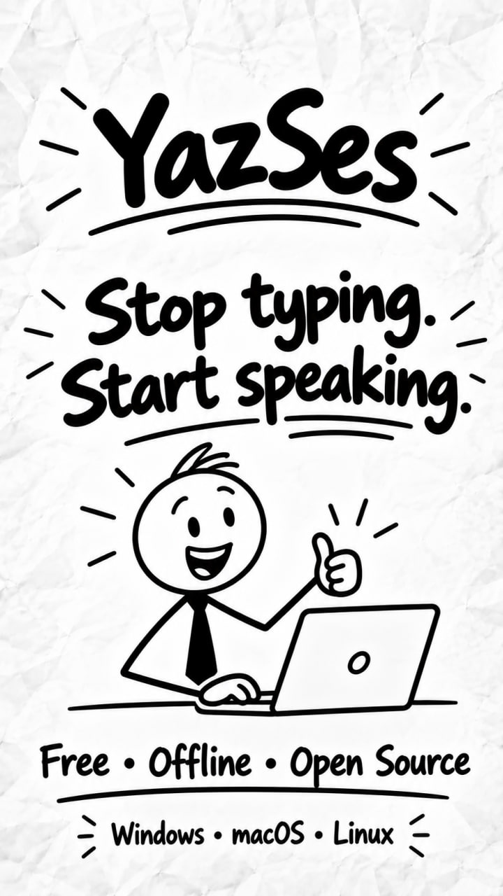
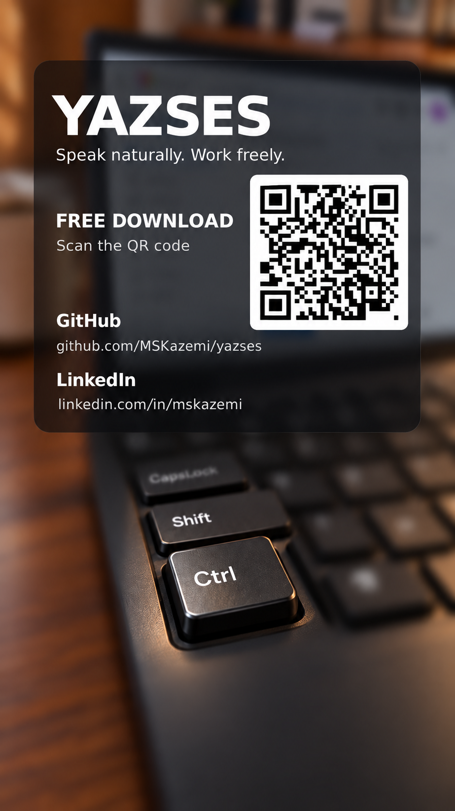
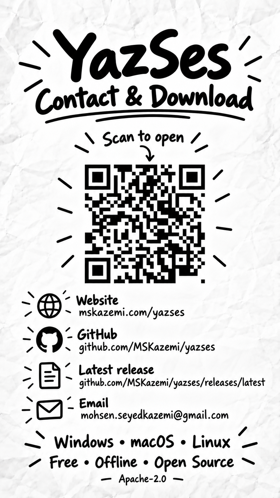

# Share your contribution

This page is entirely optional. If you have contributed to YazSes and you would like people
to see it — on LinkedIn, in a CV, on X, Instagram, or just with friends — these are free to use.
Nobody is expected to post anything, and nobody is asked to credit the project to stay on the
[contributors wall](https://github.com/MSKazemi/yazses/blob/main/CONTRIBUTORS.md).

A public contribution to an open-source project is real, checkable work. Linking to your merged
pull request or your wall entry is the most useful thing you can add to a CV or profile.

## Images

All are 9:16 portrait, sized for reels, stories and shorts. Right-click and save.

| Image | Use it for |
|---|---|
| [{ width=160 }](../assets/share/poster-720x1280.jpg) | Poster — "Stop typing. Start speaking." |
| [{ width=160 }](../assets/share/reel1-cover.png) | Cover for the first reel |
| [{ width=160 }](../assets/share/reel1-person.jpg) | Portrait still from the first reel |
| [{ width=160 }](../assets/share/reel2-cover.png) | Cover for the second reel |
| [{ width=160 }](../assets/share/reel2-info.png) | Contact and download card with a QR code |

The QR codes ([card QR](../assets/share/reel2-qr.png), [download QR](../assets/share/reel1-download-qr.png))
open the [latest release](https://github.com/MSKazemi/yazses/releases/latest).

## A caption you can adapt

> I contribute to YazSes, a free, fully offline, open-source voice-dictation tool for Windows,
> macOS and Linux. Nothing you say leaves your computer.
> https://github.com/MSKazemi/yazses

Change it freely — say what *you* did (a translation, a test on your own machine, a bug report).
Specific beats generic, and it is your work.

## Please keep it accurate

Describe only what you actually did. If your pull request is still open, say "contributing",
not "merged".
