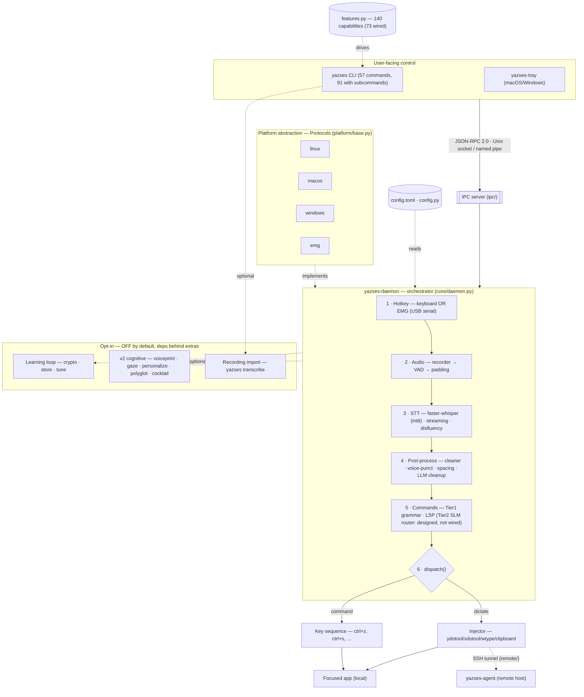

# Architecture Diagrams

The same YazSes subsystem architecture, shipped in three formats so you can read
it wherever you are:

| Format | File | Best for |
|---|---|---|
| **Mermaid** | [`yazses-architecture.mmd`](yazses-architecture.mmd) | Rendered on GitHub / Mermaid Live Editor; embedded below |
| **ASCII** | [`yazses-architecture.txt`](yazses-architecture.txt) | Terminals, code review, and the master reference PDF |
| **HTML** | [`yazses-architecture.html`](yazses-architecture.html) | A styled, self-contained page you can open in any browser (no internet needed) |

For the narrative explanation of each subsystem, see the
[Architecture](../architecture.md) page.

## Mermaid



## ASCII

```text
--8<-- "diagrams/yazses-architecture.txt"
```

> The ASCII block above is included verbatim from
> [`yazses-architecture.txt`](https://github.com/MSKazemi/yazses/blob/main/docs/diagrams/yazses-architecture.txt).
