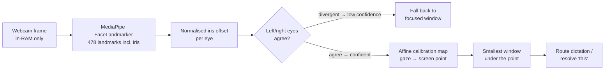
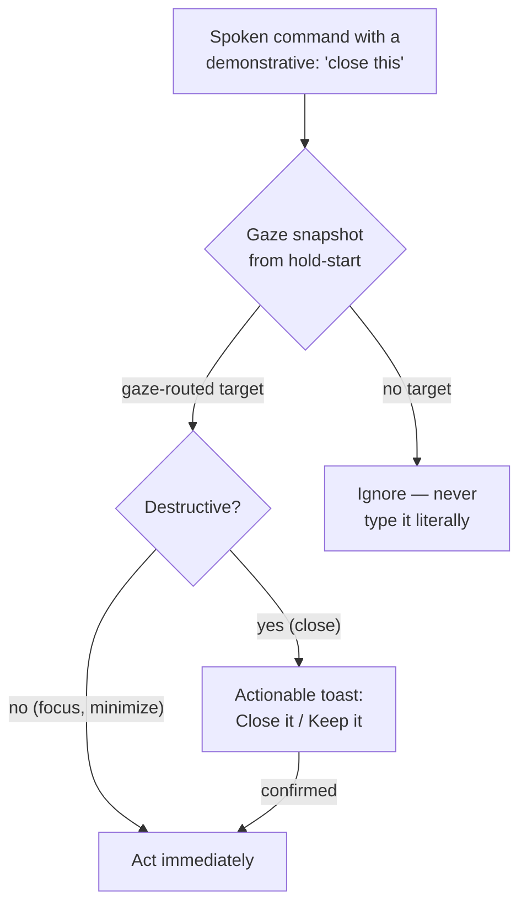

# Eye control: what a webcam can honestly know

*Updated 2026-08-07. Part of the [research series](index.md).*

Eye tracking sounds solved — the Apple Vision Pro selects UI elements with your
gaze, and Tobii has sold precise infrared trackers for years. But those systems
use **dedicated IR hardware at ~1° of angular error**
([Hou et al., 2024](https://arxiv.org/pdf/2406.00255)). The interesting
scientific question for everyone else is: how far can you get with the webcam
already in your laptop bezel?

## The physics sets the budget

At a normal 50–70 cm viewing distance, **1° of gaze error is roughly 1 cm on
screen**. That single conversion factor decides what interactions are possible:

| Setup | Angular error (measured) | On-screen blur | Good enough for |
|---|---|---|---|
| Webcam, no calibration | ~4° — WebGazer measured 4.17° vs commercial trackers ([2025 scoping review](https://www.sciencedirect.com/science/article/pii/S2772766125000655)) | ~4–5 cm | Which *half* of the screen |
| Webcam + person-specific calibration | ~2–3°; implicit adaptation reached **2.9°** ([Sugano et al., IEEE](https://ieeexplore.ieee.org/document/7050250/)) | ~2–3 cm | Which *window / pane* |
| Phone camera, calibrated (EyeMU) | 1.7 cm on-device ([ICMI '21](https://dl.acm.org/doi/fullHtml/10.1145/3462244.3479938)) | ~2 cm | Coarse targets |
| Best research models, in-dataset | L2CS-Net 3.92° MPIIGaze / 10.41° Gaze360 ([Abdelrahman et al., 2022](https://arxiv.org/abs/2203.03339)); transformers ~1.4° on ETH-XGaze *within-dataset only* | — | Doesn't transfer to your webcam |
| Dedicated IR (Tobii, Vision Pro) | ~1° ([Hou et al., 2024](https://arxiv.org/pdf/2406.00255)) | ~1 cm | Buttons, words |

Two conclusions fall straight out of the table:

1. **Caret-level gaze typing on a webcam is not honest** in 2026. A text caret
   is millimetres tall; the signal is centimetres wide.
2. **Zone- and window-level targeting is comfortably inside the budget** — and
   Google's Look to Speak shipped a 3-way webcam gaze selector on-device,
   proving the coarse regime is robust enough for production
   ([Google](https://blog.google/company-news/outreach-and-initiatives/accessibility/look-to-speak/)).

That is why Glance-Type is deliberately *look-to-pane*, never look-to-caret.

## A licensing trap most projects miss

Nearly every pretrained appearance-based gaze model is **non-commercial by
data contamination**: the popular training sets (Gaze360, ETH-XGaze, MPII)
carry CC BY-NC-style terms, so even MIT-licensed *code* produces encumbered
*weights*. In our survey, MediaPipe's face/iris landmarks were the only
clean-licensed route to a gaze signal — which is why it is YazSes's default
backend, with the heavier L2CS-Net strictly opt-in.

## How the pipeline works

The confidence gate is a 2026-08 addition with a story worth telling: the two
eyes estimate the *same* gaze independently, so their disagreement is a free,
per-frame landmark-quality signal (blur, extreme head pose, occlusion). Before
we measured it, the backend reported every frame as fully confident — the
config knob existed, but gated nothing. Fake precision is worse than honest
coarseness.

## Deixis: the oldest idea in multimodal HCI, finally on a desktop

In 1980, Richard Bolt's *"Put-That-There"* demoed pointing + speech resolving
pronouns. The modern revival is in AR: **GazePointAR** (CHI 2024) substitutes
the gazed object into the query before the language model sees it
([Lee et al.](https://dl.acm.org/doi/10.1145/3613904.3642230)), and
gaze-augmented transcripts measurably improve demonstrative resolution —
**+26.5% coreference accuracy** in one 2025 evaluation
([arXiv:2509.08689](https://arxiv.org/html/2509.08689)).

Curiously, we found **no open-source desktop implementation** of gaze+speech
deixis — the field moved to AR glasses and left the desktop niche empty. So we
built it: in command mode, "close **this**", "focus **that** window",
"minimize **that**" act on the window your gaze snapshot picked, and
destructive actions confirm first because coarse gaze can misroute:

The interaction grammar follows what a 103-study CHI 2026 scoping review
converged on: **gaze grounds and disambiguates; a second cheap modality
commits** ([ACM](https://dl.acm.org/doi/10.1145/3772318.3791662)) — Vision
Pro's pinch, Talon's pop sound, MAGIC-style cursor warping (+20.7% throughput
in a 2026 study, [CHI EA](https://dl.acm.org/doi/10.1145/3772363.3798896)).
In YazSes, the hold-to-talk key is the pinch.

## Open questions

We would genuinely like community measurements on these — each links to the
project [discussions](https://github.com/MSKazemi/yazses/discussions):

1. **Implicit calibration from mouse clicks.** A click is ground truth for
   "where you looked ~100 ms ago"; the literature reaches 2.9° with *zero*
   explicit calibration (Sugano et al.). How stable is that across laptop
   lids, docking stations, and glasses-wearers? Nobody has published
   longitudinal desktop data.
2. **Eye-agreement confidence vs. ground truth.** Our per-frame confidence is
   a proxy. How well does left/right iris-offset divergence actually correlate
   with gaze error across faces, lighting, and webcams?
3. **What is the right zone granularity?** 3×3 grid, window bounding boxes, or
   editor split-panes? Is there a measurable sweet spot where routing errors
   stop annoying users?
4. **Wayland.** Compositors forbid external window focus — the whole desktop
   half of gaze routing is X11-only today. Can the emerging `libei`/portal
   stack express "focus the window at (x, y)" safely?

*See also: [how to set up Glance-Type](../how-to/gaze-look-to-pane.md) — and
the accessibility angle in [muscle & brain control](muscle-brain-control.md),
where gaze dwell becomes a switch input.*
