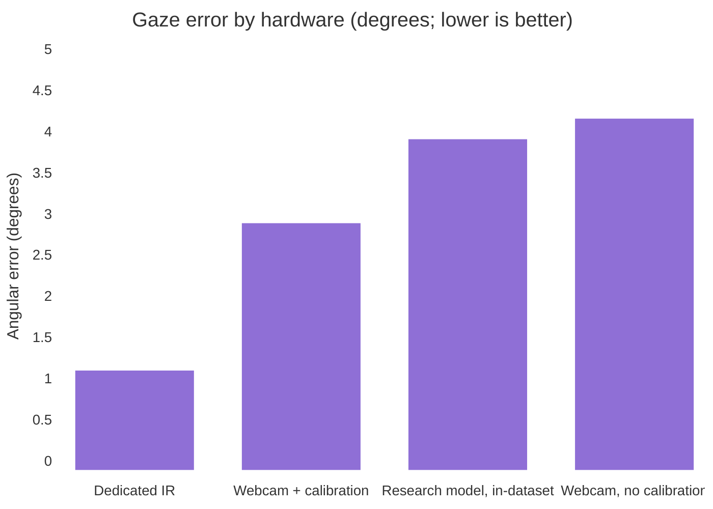
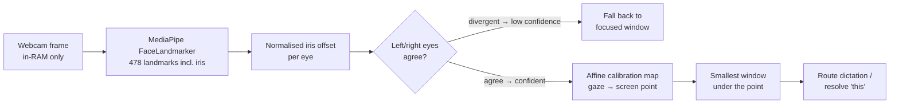
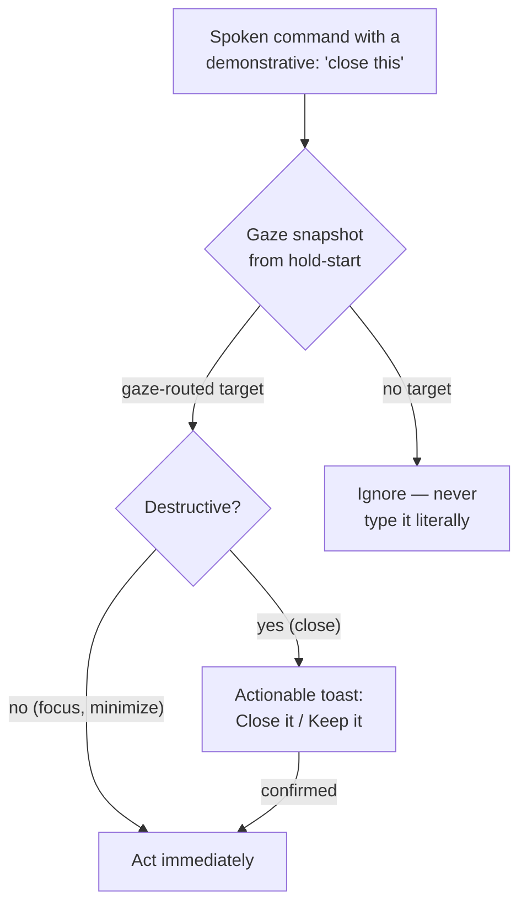

# Eye control: what a webcam can honestly know

*Updated 2026-08-07. Part of the [research series](index.md).*

!!! abstract "The short version"

    A laptop webcam can estimate your gaze to about **2–4°**, which is
    **2–5 cm on screen** at normal viewing distance. That is enough to know
    *which window* you are looking at and nowhere near enough to know *which
    character*. So the useful desktop interaction is **look-to-pane**, and the
    honest engineering job is knowing when the signal is too poor to trust.

Eye tracking sounds solved — the Apple Vision Pro selects UI elements with your
gaze, and Tobii has sold precise infrared trackers for years. But those systems
use **dedicated IR hardware**: a measurement study of the Vision Pro found
1.11° and 0.93° accuracy in two test setups ([Huang et al., 2024](#ref-huang)).
The interesting scientific question for everyone else is: how far can you get
with the webcam already in your laptop bezel?

## The physics sets the budget

At a normal 50–70 cm viewing distance, **1° of gaze error is roughly 1 cm on
screen**. That single conversion factor decides what interactions are possible:

| Setup | Angular error (measured) | On-screen blur | Good enough for |
|---|---|---|---|
| Webcam, no calibration | ~4° — WebGazer measured at 4.17° against commercial trackers ([scoping review](#ref-rmal)) | ~4–5 cm | Which *half* of the screen |
| Webcam + person-specific calibration | ~2–3°; implicit adaptation from mouse clicks reached **2.9°** ([Sugano et al.](#ref-sugano)) | ~2–3 cm | Which *window / pane* |
| Phone camera, calibrated (EyeMU) | 1.7 cm on-device ([Kong et al.](#ref-eyemu)) | ~2 cm | Coarse targets |
| Best research models, in-dataset | L2CS-Net 3.92° MPIIGaze / 10.41° Gaze360 ([Abdelrahman et al.](#ref-l2cs)); transformer models reach ~1.4° on ETH-XGaze *within-dataset only* | — | Doesn't transfer to your webcam |
| Dedicated IR (Tobii, Vision Pro) | 0.93–1.11° ([Huang et al.](#ref-huang)) | ~1 cm | Buttons, words |

Two conclusions fall straight out of the table:

1. **Caret-level gaze typing on a webcam is not honest** in 2026. A text caret
   is millimetres tall; the signal is centimetres wide.
2. **Zone- and window-level targeting is comfortably inside the budget** — and
   Google's Look to Speak shipped a 3-way webcam gaze selector on-device,
   proving the coarse regime is robust enough for production
   ([Google](#ref-looktospeak)).

That is why Glance-Type is deliberately *look-to-pane*, never look-to-caret.

## A licensing trap most projects miss

Nearly every pretrained appearance-based gaze model is **non-commercial by
data contamination**: the popular training sets (Gaze360, ETH-XGaze, MPII)
carry CC BY-NC-style terms, so even MIT-licensed *code* produces encumbered
*weights*. In our survey, MediaPipe's face/iris landmarks were the only
clean-licensed route to a gaze signal — which is why it is YazSes's default
backend, with the heavier L2CS-Net strictly opt-in. If you are building on this
research, check the licence of the **dataset**, not just the repository.

## How the pipeline works

The confidence gate is a 2026-08 addition with a story worth telling: the two
eyes estimate the *same* gaze independently, so their disagreement is a free,
per-frame landmark-quality signal (blur, extreme head pose, occlusion). Before
we measured it, the backend reported every frame as fully confident — the
config knob existed, but gated nothing. **Fake precision is worse than honest
coarseness**, because a user can work around a system that admits when it
doesn't know.

Frames are processed in RAM during a hold and are never written to disk or sent
anywhere — see the [privacy statement](../privacy-statement.md).

## Deixis: the oldest idea in multimodal HCI, finally on a desktop

In 1980, Richard Bolt's *Put-That-There* demoed pointing plus speech resolving
pronouns ([Bolt, SIGGRAPH '80](#ref-bolt)). The modern revival is in AR and VR:
**GazePointAR** (CHI 2024) substitutes the gazed object into the query before
the language model sees it ([Lee et al.](#ref-gazepointar)), and augmenting
speech transcripts with gaze and pointing improved a language model's
coreference-resolution accuracy by **26.5%** over a speech-only baseline in a
12-participant VR study ([Bovo et al.](#ref-bovo)).

Curiously, we found **no open-source desktop implementation** of gaze+speech
deixis — the field moved to headsets and left the desktop niche empty. So we
built it: in command mode, "close **this**", "focus **that** window",
"minimize **that**" act on the window your gaze snapshot picked, and
destructive actions confirm first because coarse gaze can misroute:

The interaction grammar follows what a CHI 2026 scoping review of gaze and
speech converged on: **gaze grounds and disambiguates; a second cheap modality
commits** ([Khan et al.](#ref-scoping)) — Vision Pro's pinch, Talon's pop
sound, MAGIC-style cursor warping ([Tian et al.](#ref-magic)). In YazSes, the
hold-to-talk key is the pinch.

## Open questions

We would genuinely like community measurements on these. Each is a
self-contained study; bring results to the
[discussions](https://github.com/MSKazemi/yazses/discussions):

1. **Implicit calibration from mouse clicks.** A click is ground truth for
   "where you looked ~100 ms ago"; the literature reaches 2.9° with *zero*
   explicit calibration ([Sugano et al.](#ref-sugano)). How stable is that
   across laptop lids, docking stations, and glasses-wearers? Nobody has
   published longitudinal desktop data.
2. **Eye-agreement confidence vs ground truth.** Our per-frame confidence is
   a proxy. How well does left/right iris-offset divergence actually correlate
   with gaze error across faces, lighting, and webcams?
3. **What is the right zone granularity?** 3×3 grid, window bounding boxes, or
   editor split-panes? Is there a measurable sweet spot where routing errors
   stop annoying users?
4. **Wayland.** Compositors forbid external window focus — the whole desktop
   half of gaze routing is X11-only today. Can the emerging `libei`/portal
   stack express "focus the window at (x, y)" safely?

!!! tip "Want to measure one of these?"

    You need a webcam and about an afternoon. `yazses gaze calibrate` fits the
    map, `yazses gaze status` reports live confidence, and the
    [setup guide](../how-to/gaze-look-to-pane.md) covers the rest. Post what
    you find — negative results are just as publishable here.

## References

**Evidence grade**: *measured* (peer-reviewed measurement), *vendor* (claimed
by the maker), *secondary* (review or write-up).

1. Huang, Z., Zhu, G., Duan, X., Wang, R., Li, Y.,
   Zhang, S., Wang, Z. "Measuring eye-tracking accuracy and its impact on
   usability in Apple Vision Pro." *arXiv:2406.00255*, 2024.
   [arXiv](https://arxiv.org/abs/2406.00255) — *measured* (1.11° and 0.93° in
   two setups)
2. Sugano, Y., Matsushita, Y., Sato, Y., Koike, H.
   "Appearance-based gaze estimation with online calibration from mouse
   operations." *IEEE Transactions on Human-Machine Systems* 45(6), 2015.
   [doi:10.1109/THMS.2015.2400434](https://doi.org/10.1109/THMS.2015.2400434) — *measured*
3. "Methodological recommendations for webcam-based eye
   tracking: a scoping review." *Research Methods in Applied Linguistics*, 2025.
   [ScienceDirect](https://www.sciencedirect.com/science/article/pii/S2772766125000655) — *secondary*
4. Kong, A., Ahuja, K., Goel, M., Harrison, C. "EyeMU
   interactions: gaze + IMU gestures on mobile devices." *ICMI '21*, 2021.
   [doi:10.1145/3462244.3479938](https://doi.org/10.1145/3462244.3479938) — *measured*
5. Abdelrahman, A. A., Hempel, T., Khalifa, A., Al-Hamadi, A.
   "L2CS-Net: fine-grained gaze estimation in unconstrained environments."
   *arXiv:2203.03339*, 2022. [arXiv](https://arxiv.org/abs/2203.03339) — *measured*
   (in-dataset)
6. Google. "Look to Speak" (Android accessibility
   app using webcam gaze selection).
   [blog.google](https://blog.google/company-news/outreach-and-initiatives/accessibility/look-to-speak/) — *vendor*
7. Bolt, R. A. "Put-that-there: voice and gesture at the
   graphics interface." *SIGGRAPH '80*, 1980.
   [doi:10.1145/800250.807503](https://doi.org/10.1145/800250.807503) — *measured*
8. Lee, J., Wang, J., Brown, E., Chu, L.,
   Rodriguez, S. S., Froehlich, J. E. "GazePointAR: a context-aware multimodal
   voice assistant for pronoun disambiguation in wearable augmented reality."
   *CHI '24*, 2024.
   [doi:10.1145/3613904.3642230](https://doi.org/10.1145/3613904.3642230) — *measured*
9. Bovo, R. et al. "Augmenting speech transcripts of VR
   recordings with gaze, pointing, and visual context for multimodal coreference
   resolution." *arXiv:2509.08689*, 2025.
   [arXiv](https://arxiv.org/abs/2509.08689) — *measured* (26.5% improvement,
   12 participants, VR)
10. Khan, A. A., Weidner, F., Rhee, J., Abdrabou, Y.,
    Bianchi, A., Velloso, E., Gellersen, H., Newn, J. "Gaze and speech in
    multimodal human-computer interaction: a scoping review." *CHI '26*, 2026.
    [doi:10.1145/3772318.3791662](https://doi.org/10.1145/3772318.3791662) — *secondary*
11. Tian, X. et al. "3D-MAGIC: expanding MAGIC pointing
    to stereoscopic displays." *CHI EA '26*, 2026.
    [doi:10.1145/3772363.3798896](https://doi.org/10.1145/3772363.3798896) — *measured*

*See also: [how to set up Glance-Type](../how-to/gaze-look-to-pane.md), the
[research index](index.md) for how this compares to voice and muscle input, and
[muscle & brain control](muscle-brain-control.md), where gaze dwell becomes a
switch input for people who cannot press a key.*
