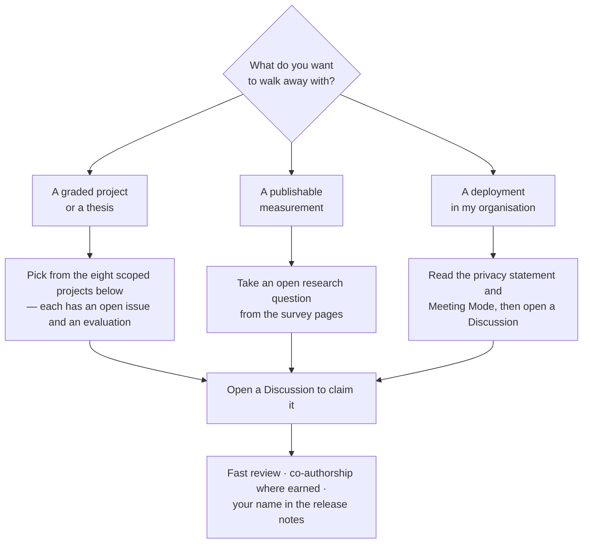

# Work with YazSes: students, researchers, industry

YazSes is a production dictation tool **and** an open research platform for
voice-first human-computer interaction. Everything runs on-device, every
subsystem sits behind a pluggable seam, and the project is small enough that
one person can still understand the whole pipeline — which makes it unusually
good material for coursework, theses, papers, and pilots.

This page maps what the project offers to each audience. Questions and
proposals are welcome in
[GitHub Discussions](https://github.com/MSKazemi/yazses/discussions) — the
**Research Corner** threads are the standing venue for scientific discussion.

## Why YazSes works as a research platform

The architecture separates every scientifically interesting component behind a
small interface, so an experiment replaces one box without touching the rest:

| Seam | Interface | Swap in… |
|---|---|---|
| Speech-to-text engine | `SttEngine` (`stt/base.py`) | your model — Whisper variants and NVIDIA Parakeet TDT already ship |
| Voice-activity detection | `[meeting] vad_backend`, `audio/vad_calibrated.py` | energy gates, Silero, your VAD |
| Speaker diarization | `recimport/diarizer.py` | sherpa-onnx today; pyannote seam open ([#71](https://github.com/MSKazemi/yazses/issues/71)) |
| Speaker embeddings | `voiceprint/` | ECAPA today; lighter embedders open ([#70](https://github.com/MSKazemi/yazses/issues/70)) |
| Activation source | `HotkeyBackend` protocol | keyboard, EMG squeeze (YESP serial), your sensor |
| Gaze targeting | `gaze/` backends | MediaPipe iris today; your estimator |

Two properties matter for studies: **everything is offline** (no cloud
confound, works in a lab without agreements with a third-party processor), and
the opt-in [learning corpus](../configuration.md) is **encrypted on-device**,
which is the right starting point for an ethics/IRB conversation rather than
an obstacle.

## For students: project-sized problems

Each of these is a real, wanted contribution with an open issue, a defined
evaluation, and a maintainer who reviews quickly. They are sized between a
course project and a bachelor/master thesis:

| Project | Open issue | Flavour |
|---|---|---|
| STT benchmark harness — WER/RTF methodology + community results | [#72](https://github.com/MSKazemi/yazses/issues/72) | empirical / reproducibility |
| Vocabulary biasing for transducer STT (Parakeet ignores prompts) | [#73](https://github.com/MSKazemi/yazses/issues/73) | speech ML, open design |
| Streaming STT: Moonshine engine + latency study | [#74](https://github.com/MSKazemi/yazses/issues/74) | systems / real-time |
| Noise suppression in the dictation hot path (DeepFilterNet) | [#69](https://github.com/MSKazemi/yazses/issues/69) | audio DSP |
| Speaker-embedding reliability on sub-second windows | [#70](https://github.com/MSKazemi/yazses/issues/70) | speaker modelling |
| Diarization accuracy vs speed trade-off (pyannote vs sherpa) | [#71](https://github.com/MSKazemi/yazses/issues/71) | evaluation |
| Gaze-aware target selection for dictation ("Glance-Type") | [research background](eye-control.md) | HCI / multimodal |
| Dysfluency-friendly transcription for stuttered speech | [accessibility use case](../use-cases/accessibility-rsi-hands-free.md) | accessibility / NLP |

Supervisors: if you want to run one of these as a course assignment or thesis,
open a Discussion — scoping a variant for your semester is exactly the
conversation we want to have.

## For researchers: evaluation, citation, collaboration

- **Cite the project** with the repository's `CITATION.cff` (GitHub's *Cite
  this repository* button), which also references the companion preprint
  (arXiv:2607.28878) — the
  [BibTeX entry is on the research index](index.md#how-to-cite).
- **Reproducibility**: pinned Python dependencies, CPU-int8 inference,
  offline models — a described configuration re-runs bit-for-bit on commodity
  hardware. The benchmark harness ([#72](https://github.com/MSKazemi/yazses/issues/72))
  is the intended home for shared methodology.
- **Study directions already grounded in the codebase**: multimodal input
  (gaze + voice + EMG), personal VAD and the cocktail-party problem on short
  windows, code-switching dictation ([Polyglot](../v2-features.md)),
  privacy-preserving on-device personalization (encrypted corpus + local
  fine-tuning), and dictation UX for people with RSI or dysfluent speech.
- The [research section](index.md) surveys the literature behind the
  post-keyboard input roadmap ([eye control](eye-control.md),
  [voice control](voice-control.md),
  [muscle & brain interfaces](muscle-brain-control.md)).

## For industry: private dictation you can actually deploy

- **Nothing leaves the machine** — see the [privacy statement](../privacy-statement.md).
  No per-seat cloud subscription, no audio retention, no data-processing
  agreement needed for the dictation path.
- **Meeting transcription on-premises** — [Meeting Mode](../meeting-notes-offline.md)
  produces speaker-labelled transcripts and minutes without audio ever
  reaching a third party.
- **Scriptable deployment** — plain TOML config, a CLI for everything,
  systemd/launchd lifecycle (Windows autostarts per-user; there is no Windows
  Service backend yet), and (coming) a container image for the
  headless transcription pipeline ([#76](https://github.com/MSKazemi/yazses/issues/76)).
- Pilots and integration questions: open a Discussion or contact the
  maintainer (see the repository profile). Honest expectations: this is an
  open-source project, not a vendor with an SLA — what you get is source
  access, fast issue turnaround, and a say in the roadmap.

## For everyone: the community rhythm

- **Research Corner** (Discussions) — a recurring scientific thread: one
  paper, question, or experiment per thread, tied where possible to something
  measurable in YazSes. Bring results, not just links.
- **[Contributor lanes](https://github.com/MSKazemi/yazses/issues/22)** — the
  pinned issue groups every open task by interest: GUI, packaging, speech/ML,
  voice-control features, docs and no-code testing.
- **[Benchmarks](../benchmarks.md)** — add a row for your machine once the
  harness lands.
