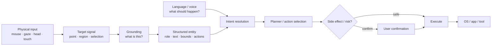
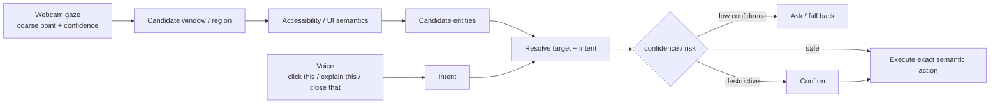
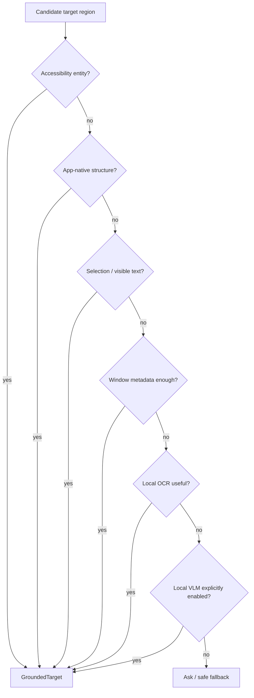
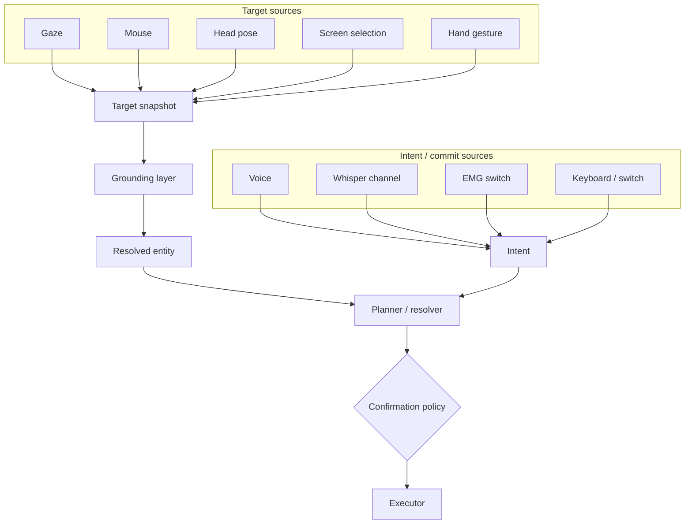

# Grounded multimodal interaction: pointer, gaze, voice and AI

*Updated 2026-09-22. Research synthesis; **not** an accepted YazSes architecture decision.*

!!! abstract "The short version"

    Google Magic Pointer and Apple's new Siri AI / Visual Intelligence stack point
    toward the same interaction pattern: the input device identifies **which thing**,
    language specifies **what to do**, a grounding layer resolves the visible thing
    into a structured entity, and a guarded action layer performs the operation.

    For YazSes, the important consequence is that eye control should not be framed
    only as "eyes move the mouse". Commodity-webcam gaze is too coarse for that to
    be reliable at small-target scale. A stronger design is:
    **target → ground → resolve → plan → confirm → act**.

This page records what Google and Apple publicly document, separates documented
facts from architectural inference, maps the result to the current YazSes codebase,
and identifies the missing layer. It complements [Eye control](eye-control.md),
which covers the accuracy physics of webcam gaze.

## Why this matters now

On 21 September 2026 Google began taking pre-orders for Googlebook and described
**Magic Pointer** as a system-level Gemini interaction: wiggle the cursor to invoke
it, then point, hover, highlight or select content for Gemini to understand and act
on. Google examples include turning a selected training schedule into Calendar
events, analyzing a suspicious email under the pointer, and combining selected
images. The feature is dormant until explicitly invoked by the cursor gesture
([Google](#ref-googlebook-magic)).

The TechCrunch launch coverage called the feature "Magic Cursor" in one passage,
but Google's own product name is **Magic Pointer** ([TechCrunch](#ref-techcrunch),
[Google](#ref-googlebook-magic)).

Google DeepMind explains the underlying research idea more generally: computers
traditionally know **where** a pointer is, while an AI-enabled pointer can also
reason about **what** is being indicated. DeepMind describes turning pixels into
structured, actionable entities such as places, dates and objects, and combining
pointing, context and speech so requests such as "fix this", "move that here" and
"what does this mean?" do not need a long prompt ([DeepMind](#ref-deepmind-pointer)).

Apple's 2026 platform changes converge on the same problem from a different
direction. On macOS 27, Siri AI can use Visual Intelligence with selected onscreen
content, windows or screen regions; Apple documents asking questions, searching or
taking actions based on what is visible ([Apple Support](#ref-macos-visual)).
For developers, App Intents, App Entities, schemas, Spotlight semantic indexing and
new onscreen-awareness APIs let an app explicitly connect visible views to the
entities they represent. That lets a person refer to visible content conversationally
as, for example, "this photo" ([Apple Developer](#ref-apple-siri-ai),
[contextual cues](#ref-apple-context)).

On visionOS 27, the target can be gaze itself: Apple documents looking at a physical
object or something in a window and then asking Siri about it. Visual Intelligence
uses what the person is looking at as part of the interaction context
([Apple Vision Pro Support](#ref-visionos-visual)).

## What layer is this?

The feature is easiest to understand by saying what it is **not**.

It is not primarily:

- a mouse driver;
- an eye tracker;
- an OCR feature;
- a single language model;
- an accessibility-only capability; or
- an application-specific shortcut.

It is primarily a **multimodal grounding and interaction layer** between raw input
and reasoning/action execution.



The pointer or gaze answers **which thing?**. Language answers **what operation?**.
Grounding connects those two.

A conventional pointer pipeline is:

```text
mouse → (x, y) → application → click
```

A grounded interaction pipeline is closer to:

```text
mouse / gaze
    → target region
    → visible/semantic context
    → entity
    + spoken or typed intent
    → action
```

That distinction is the central finding.

## Google: pointer-first, AI-grounded interaction

Google's public description has three documented properties.

### 1. Explicit invocation

Magic Pointer is summoned with a cursor wiggle and otherwise remains inactive.
This matters because an AI pointer has a Midas-touch equivalent: ordinary pointing
must not automatically mean "send this screen context to the assistant" or "take an
action" ([Google](#ref-googlebook-magic)).

### 2. Mixed visual and textual context

Google says Magic Pointer understands text, images and context. The user can hover,
highlight or select, then ask Gemini to reason about the target
([Google](#ref-googlebook-magic)).

### 3. Pointer context becomes actionable entities

DeepMind's description is the architectural clue: the research goal is to turn
pointed-at pixels into structured entities that can be acted on, instead of treating
the pointer as coordinates only ([DeepMind](#ref-deepmind-pointer)).

A conceptual representation is:

```text
Target {
    source: pointer
    screen_location: ...
    visible_content: ...
    entity_type: date | place | object | ...
    nearby_context: ...
    possible_actions: ...
}
```

That example is **our abstraction**, not a published Google API.

### What Google has not publicly specified

Google has not published a complete Magic Pointer implementation diagram. The public
material does **not** establish, for every target, exactly which of OCR, DOM data,
Android accessibility metadata, app-provided semantics, screenshots, local Gemini
models or remote Gemini services are used.

Therefore this page does not claim a hidden Google pipeline. The reliable statement is
the externally documented abstraction:

> **pointer/selection → contextual understanding → Gemini → action**

Googlebook itself is built on the Android technology stack with desktop foundations
from ChromeOS, which gives Google a system integration point deeper than an ordinary
browser extension ([Googlebook platform](#ref-googlebook-platform)).

## Apple: semantic entities first, visual intelligence when needed

Apple's stack makes the semantic layer more explicit to third-party developers.

### App Entities

An app can expose its domain objects as structured entities that the system can
understand. Apple Intelligence and Siri AI use App Intents, App Entities, enums and
schemas to represent app content and capabilities
([Apple Developer](#ref-apple-siri-ai)).

### View annotations and onscreen awareness

Apple's onscreen-awareness APIs associate visible views with App Entities. Apple
explicitly gives the conversational-reference use case: the system can understand
references such as **"this photo"** because the app has associated the visible view
with its entity ([contextual cues](#ref-apple-context)).

For custom-drawn content, `AppEntityUIElement` can carry an entity identifier,
bounds and UI state, giving the system both semantic identity and spatial information
([AppEntityUIElement](#ref-apple-ui-element)).

This is important because the system does not always need to infer semantics from
pixels:

```text
visible view
    ↓
app-provided entity identifier
    ↓
structured entity
    ↓
Siri resolves "this"
```

### App Intents and schemas

App Intents expose actions to the system. Schemas provide recognizable structures for
content and operations, and Apple says Siri uses them to match natural conversation to
the app's actions and data ([Apple Developer](#ref-apple-siri-ai)).

### Spotlight semantic index

Apps can contribute entities to Spotlight so Apple Intelligence can retrieve content
semantically even when the user's wording is vague
([Apple Developer](#ref-apple-siri-ai), [WWDC26](#ref-wwdc26)).

### Confirmation and side effects

Apple's WWDC26 App Intents guidance also discusses confirmation for intents with
meaningful side effects. That is the same architectural problem YazSes already handles
for destructive gaze-routed commands: grounding a target is not sufficient; execution
still needs a policy gate ([WWDC26](#ref-wwdc26)).

## Google and Apple are converging, but through different seams

| Layer | Google Magic Pointer | Apple Siri AI / Visual Intelligence | Architectural lesson |
|---|---|---|---|
| Physical input | pointer / trackpad | pointer, selection, keyboard; gaze on Vision Pro | target source should be replaceable |
| Invocation | cursor wiggle | Siri / contextual screen interaction | explicit commit avoids accidental AI activation |
| Target | hover / highlight / selection | onscreen item, window, region, gaze | preserve spatial target separately from intent |
| Grounding | AI understands text, images and context | App Entities + View Annotations + Visual Intelligence | prefer structured semantics; infer visually when necessary |
| Language | Gemini request | Siri conversation | language should describe the operation, not re-describe the target |
| Action model | Gemini-assisted tasks | App Intents + schemas | expose structured operations, not arbitrary clicks when possible |
| Retrieval | contextual screen understanding | Spotlight semantic index | semantic retrieval can complement immediate screen grounding |
| Guard | invocation and product UX | confirmation/permission behavior | consequential actions need a separate safety policy |
| Feedback | pointer/Gemini UI | Siri/Visual Intelligence UI | show what target and action the system understood |

The strongest synthesis for YazSes is not "copy Magic Pointer". It is:

> **Use the cheapest trustworthy semantic source first, and use visual inference only
> when the operating system or application cannot tell us what the target is.**

## Why this changes the eye-control roadmap

The [eye-control measurements](eye-control.md) already set the key physical limit:
commodity-webcam gaze is generally a **coarse** signal. It can often answer "which
window or pane?", but not reliably "which 14-pixel button?".

That makes this architecture:

```text
eyes → exact cursor → click tiny target
```

a poor default target for ordinary webcam hardware.

A grounded architecture is much stronger:



The eye only needs to get us into the right **neighbourhood**. Accessibility metadata,
application semantics, text context or a local visual fallback can do the fine
resolution.

That changes the user experience from:

> stare precisely enough to move a mouse pointer

to:

> look roughly at the thing, then speak naturally

Examples:

| User behavior | Grounded interpretation |
|---|---|
| Look at a terminal; say "focus this" | gaze chooses window → command chooses focus |
| Look at an email; say "summarize this" | gaze chooses region/message → semantic layer identifies content → summarizer receives text |
| Look at a Save button; say "click this" | gaze chooses candidate area → accessibility tree resolves Button(name=Save) → invoke action |
| Look at a paragraph; say "explain this" | gaze narrows region → text/accessibility layer selects candidate text → explanation |
| Look at a browser tab; say "close this" | gaze/deixis resolves tab or window → destructive guard → confirm → close |
| Look at a date; say "put this on my calendar" | target grounds to date/event entity → structured calendar action |

The interaction no longer requires gaze to carry both **selection** and **commit**.
That matches the HCI result already documented in [Eye control](eye-control.md):
gaze grounds; another cheap modality commits.

## Where YazSes already has the pieces

YazSes does not start from zero. The current codebase already contains several parts of
this stack, but they are exposed as separate features rather than one generalized
grounding pipeline.

| Need | Existing YazSes seam | Current role |
|---|---|---|
| Webcam gaze signal | `src/yazses/gaze/mediapipe_backend.py` | MediaPipe iris/face landmarks → gaze signal |
| Calibration / screen mapping | `src/yazses/gaze/calibrate.py` | maps gaze features to screen coordinates |
| Confidence-aware target routing | `src/yazses/gaze/targeter.py`, `route.py` | resolve window; fall back instead of guessing |
| Deictic language | `src/yazses/gaze/deixis.py` | resolve "this / that" against looked-at window |
| Context extraction | `src/yazses/system/context_read.py`, `commands/context.py` | collect active-window/selection terms |
| Accessibility-tree planning | `src/yazses/pilot/plan.py` | parses commands and matches UI labels; runtime backend remains a planned capability |
| Screen-grounded terms | `src/yazses/screengrounded/` | pure screen-term harvesting; broader runtime feature remains planned |
| Tool planning / confirmation | `src/yazses/agent/plan.py` | structured tool-call planning/guard; runtime agent feature remains planned |
| Other pointing modalities | `src/yazses/headpointer/`, mouse grid, modality router | designed seams for non-mouse target sources |
| Feedback | overlay / toast infrastructure | communicate state and confirmations |

The current shipped gaze path already demonstrates the first useful slice:

```text
webcam
  → gaze estimate
  → confidence
  → screen point
  → window
  → route dictation / resolve "this"
```

The missing generalization is between **screen point** and **planner/action**.

## The missing YazSes abstraction: a grounded target

A future architecture could introduce a small, dependency-free core object such as a
`GroundedTarget`. The name is provisional; adopting it would require an ADR.

Conceptually:

```text
GroundedTarget {
    source            gaze | pointer | head | selection | accessibility
    timestamp
    screen_point
    bounds
    confidence

    app_id
    window_id
    element_id
    role
    label
    visible_text

    entity_type
    entity_id
    available_actions

    evidence[]        accessibility | app_semantics | selection | OCR | VLM
}
```

The important property is not the exact fields. It is the **separation of concerns**:

1. **Target acquisition** says where the user is referring.
2. **Grounding** says what object is there.
3. **Intent resolution** says what the user wants done.
4. **Planning** picks a structured operation.
5. **Policy** decides whether it may run.
6. **Execution** performs the action.
7. **Feedback** shows what happened.

Every input modality can then reuse the same downstream logic.

## Semantic-first fallback order for YazSes

Apple's developer-facing design is particularly relevant because it demonstrates why
semantic context should come before expensive visual inference.

For a local-first, cross-platform YazSes implementation, the preferred resolution order
would be:

1. **Native accessibility / UI tree** — AT-SPI on Linux where available, macOS
   Accessibility, Windows UI Automation.
2. **Application-native structured context** — editor/LSP bridges, known application
   adapters, document selections.
3. **Focused/selected text and clipboard-safe context** — only where policy allows it.
4. **Window geometry and labels** — enough for coarse routing when element semantics are
   unavailable.
5. **Local OCR** — recover text from pixels when no structured representation exists.
6. **Local VLM / image understanding** — last resort for visual objects and custom canvases.
7. **Ask the user / fall back** — never manufacture certainty when target confidence is low.



This ordering is better aligned with YazSes than a screenshot-first architecture because
it is faster, more deterministic, easier to test, cheaper on CPU, more accessible and
more compatible with the project's privacy boundary.

## A cross-platform interaction model

Once target acquisition is separated from grounding, the same pipeline can accept many
modalities:



This gives each modality the job it is best at:

- **gaze / pointer / head:** where;
- **voice:** what;
- **accessibility and application semantics:** what exactly;
- **EMG / switch / hotkey:** commit or mode;
- **planner:** how;
- **policy:** whether.

That is a better description of the long-term YazSes opportunity than "eye control".

## Design implications for future YazSes work

These are research-derived recommendations, **not accepted decisions**.

### Keep gaze coarse and confidence-aware

Do not make exact eye-cursor movement the architectural center of the feature. Preserve
the existing confidence gate and focused-window fallback.

### Generalize target acquisition

A gaze target, mouse target, head-pointer target and explicit screen selection should be
able to produce the same target-snapshot interface.

### Ground before reasoning

Do not ask an LLM to infer a button from a screenshot when the accessibility tree already
says `role=button, name=Save`.

### Carry provenance and confidence

A target resolved from an exact accessibility node should not be treated the same as one
guessed by OCR or a VLM. The grounded target should preserve evidence source and confidence
so the policy layer can react appropriately.

### Prefer semantic action over synthetic clicking

If the system can invoke an accessibility action or structured tool operation, prefer that
to moving a cursor and synthesizing a click. Pixel automation remains the universal fallback,
not the first choice.

### Keep destructive confirmation downstream of grounding

"Close this" can be perfectly grounded and still deserve confirmation. Target confidence
and action risk are separate dimensions.

### Make feedback expose both target and action

The user should be able to tell:

1. what YazSes thinks **this** refers to; and
2. what YazSes is about to do to it.

That makes correction possible before a costly action.

## What should *not* be inferred from the Google and Apple announcements

The announcements are evidence that major platforms are investing in this interaction
shape. They are **not** evidence that:

- one proprietary implementation architecture is known in full;
- a general local VLM is required for YazSes;
- webcam gaze has suddenly become caret-accurate;
- the same permissions are available cross-platform;
- Wayland's cross-window restrictions have disappeared;
- all Apple or Google processing is on-device; or
- YazSes should become a conversational assistant.

The useful conclusion is narrower and stronger: **grounding is becoming a first-class
system interaction layer**.

## Questions to settle before an ADR

Before turning this research note into an accepted YazSes architecture, we should answer:

1. What is the minimal `TargetSnapshot` / `GroundedTarget` contract that covers gaze,
   mouse, head pose and explicit selection without becoming a giant object?
2. Which platform semantic source is authoritative on Linux/X11, Linux/Wayland, macOS and
   Windows?
3. How should multiple candidate UI elements inside a coarse gaze region be ranked?
4. Can voice intent narrow candidate elements safely without an LLM, for example
   "click **Save**" + gaze region?
5. What confidence model combines gaze uncertainty with grounding uncertainty?
6. Which actions can execute immediately, and which always require confirmation?
7. What information may be passed to OCR/VLM fallbacks under the existing egress/privacy
   rules?
8. What is the correct evaluation metric: target hit rate, task completion, correction
   cost, time-to-action, or a combination?
9. How should Wayland degrade when another application's semantic tree or focus control is
   unavailable?
10. Can the same protocol support dedicated IR eye trackers later without changing the
    planner or policy layers?

If this direction is adopted, those answers belong in a new ADR and implementation spec.
Until then this page is the research record that motivates the decision.

## References

Evidence labels: **vendor** = documented by the platform maker; **secondary** =
independent reporting. Vendor documentation establishes public behavior and APIs, not
undocumented internal implementation.

1. <a id="ref-googlebook-magic"></a>Google. "Googlebook's built-in intelligence
   reinvents the way you use your laptop." 21 Sep 2026. Magic Pointer invocation,
   examples, context claim and privacy behavior.  
   [Google](https://blog.google/products-and-platforms/devices/googlebook/googlebook-built-in-intelligence/) — *vendor*
2. <a id="ref-deepmind-pointer"></a>Google DeepMind. "Shaping the future of AI
   interaction by reimagining the mouse pointer." 2026. Pointing + context + speech;
   pixels → actionable entities; Chrome and Googlebook product direction.  
   [DeepMind](https://deepmind.google/blog/ai-pointer/) — *vendor/research*
3. <a id="ref-googlebook-platform"></a>Google. "Googlebook: The laptop your Android
   phone has been waiting for." 21 Sep 2026. Android technology stack + desktop
   foundations from ChromeOS.  
   [Google](https://blog.google/products-and-platforms/devices/googlebook/pre-order-googlebook/) — *vendor*
4. <a id="ref-techcrunch"></a>Sarah Perez. "Google's $899 Googlebook is a bet that
   you'll buy a new laptop for Gemini." *TechCrunch*, 21 Sep 2026. Launch coverage;
   uses the term "Magic Cursor" while Google uses "Magic Pointer."  
   [TechCrunch](https://techcrunch.com/2026/09/21/googles-899-googlebook-is-a-bet-that-youll-buy-a-new-laptop-for-gemini/) — *secondary*
5. <a id="ref-macos-visual"></a>Apple Support. "Top tips, tricks, and keyboard
   shortcuts for MacBook Air", macOS 27. Siri AI + Visual Intelligence over onscreen
   items, windows and selected screen regions.  
   [Apple Support](https://support.apple.com/guide/macbook-air/tips-tricks-and-shortcuts-apde5ace2f6f/2026/mac/27) — *vendor*
6. <a id="ref-apple-siri-ai"></a>Apple Developer. "Apple Intelligence and Siri AI."
   App Intents, App Entities, schemas, Spotlight semantic indexing and onscreen context.  
   [Apple Developer](https://developer.apple.com/documentation/appintents/apple-intelligence-and-siri-ai) — *vendor*
7. <a id="ref-apple-context"></a>Apple Developer. "Providing contextual cues to Apple
   Intelligence and Siri." Associating visible views and custom UI with App Entities.  
   [Apple Developer](https://developer.apple.com/documentation/appintents/providing-contextual-cues-to-apple-intelligence-and-siri) — *vendor*
8. <a id="ref-apple-ui-element"></a>Apple Developer. `AppEntityUIElement`.
   Entity identifier + bounds + state for discoverable custom-view content.  
   [Apple Developer](https://developer.apple.com/documentation/appintents/appentityuielement) — *vendor*
9. <a id="ref-wwdc26"></a>Apple. "Explore advanced App Intents features for Siri and
   Apple Intelligence." WWDC26 session 343. Semantic index, onscreen awareness and
   confirmation behavior.  
   [Apple Developer](https://developer.apple.com/videos/play/wwdc2026/343/) — *vendor*
10. <a id="ref-visionos-visual"></a>Apple Support. "Siri AI: Use Visual Intelligence
    on Apple Vision Pro", visionOS 27. Look at an object or window content, then ask
    Siri about it.  
    [Apple Support](https://support.apple.com/guide/apple-vision-pro/siri-ai-use-visual-intelligence-tanee58a6e66/visionos) — *vendor*

*See also: [Eye control](eye-control.md) for the measured webcam-gaze accuracy budget,
[Where YazSes goes next](directions.md) for roadmap triage, and
[the research index](index.md) for the broader post-keyboard input program.*
