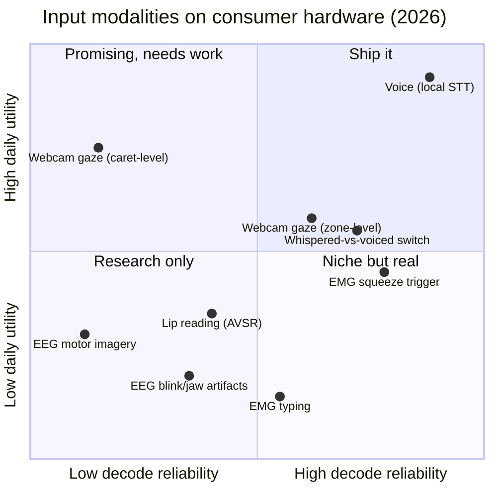

# Research: the science of post-keyboard input

YazSes is a dictation tool, but the question behind it is bigger: **what does a
computer interface look like when the keyboard stops being the bottleneck?**
This section is our public research notebook — the state of the art in eye,
voice, and muscle/brain input as of mid-2026, what the measurements actually
say, what we shipped because of them, and the questions we don't have answers
to yet.

Everything here is offline-first: a technique only counts if it can run on an
ordinary laptop CPU, with no cloud and no telemetry. That constraint is the
research program.

- :material-eye-outline: **[Eye control](eye-control.md)**
  What a $20 webcam can and cannot know about where you look — and why
  "coarse but honest" beats "precise but fake".

- :material-microphone-outline: **[Voice control](voice-control.md)**
  Local speech recognition passed the cloud in 2025–26. The numbers, the
  latency physics, and the whisper channel.

- :material-arm-flex-outline: **[Muscle & brain control](muscle-brain-control.md)**
  Why a $50 EMG electrode beats a $1,000 EEG headset for controlling a
  computer — measured, not vibes.

## The one-chart summary

Where each input modality sits in 2026, judged on the two axes that matter for
a shipping product: how reliably the signal can be decoded on consumer
hardware, and how much day-to-day utility it delivers per unit of user effort.

Placement is our synthesis of the measurements cited on the three pages — each
page gives the numbers and the sources behind its dots.

## How this feeds the product

Every YazSes perception feature traces to a finding on these pages, and each
finding names the feature it produced:

| Finding | What we shipped |
|---|---|
| Webcam gaze is ~2–4° → zone-level only | Glance-Type routes dictation to the *pane* you look at, never the caret |
| Gaze grounds speech; a second modality commits | Gaze deixis: "close **this**" acts on the looked-at window |
| Whispered speech has no fundamental frequency | Sotto-voce channel: whisper = command, voice = text |
| A dedicated EMG electrode dominates EEG artifacts | EMG squeeze-to-talk backend (YESP serial protocol) |
| Parakeet TDT beats whisper-large-v3 at small-model CPU cost | `yazses features enable stt-parakeet` |

## Open questions — we want your data

Each page ends with open research questions. If you can measure something on
your own hardware — a different webcam, a different accent, a DIY EMG rig —
that is exactly the evidence this project runs on.
**[Join the discussion →](https://github.com/MSKazemi/yazses/discussions)**

*Provenance: these pages condense four state-of-the-art dossiers compiled
2026-08-07 with live web research, and the decisions recorded in the project's
ADRs. Measured values are cited inline; where a number is vendor-claimed
rather than independently measured, we say so.*
