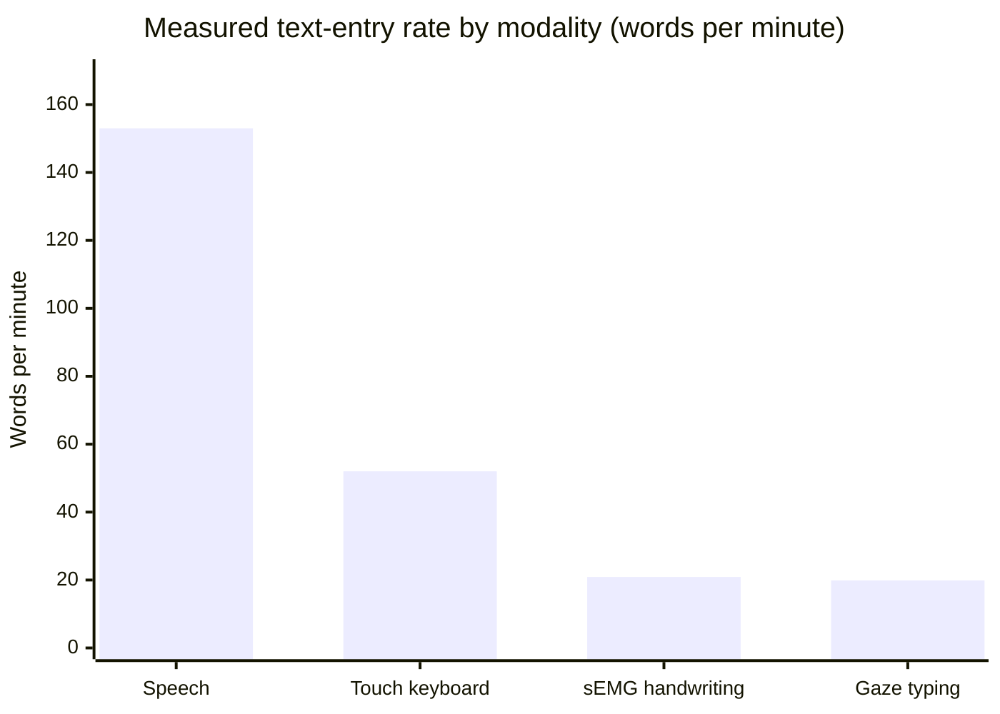
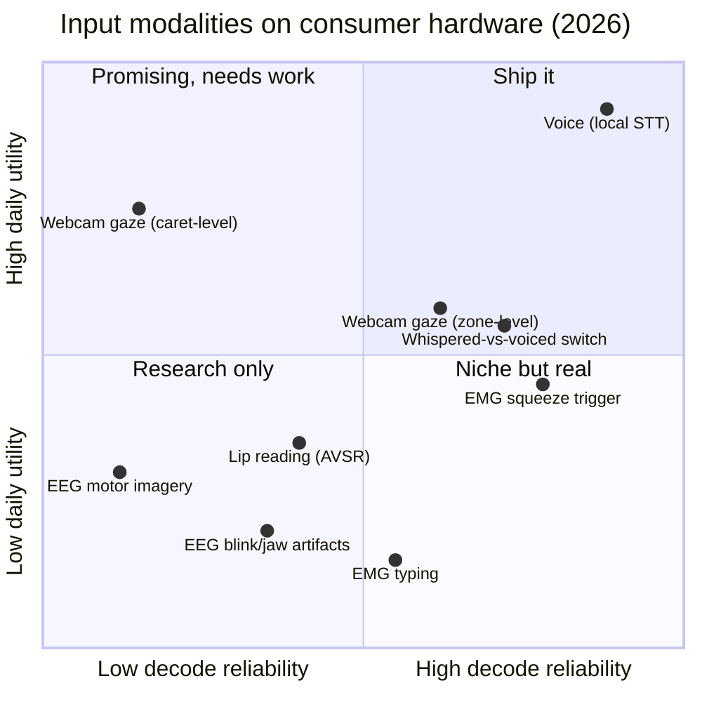
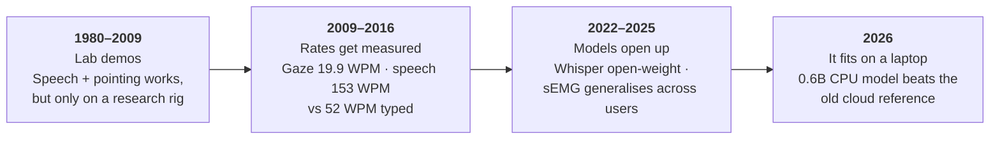

# Research: the science of post-keyboard input

YazSes is a dictation tool, but the question behind it is bigger: **what does a
computer interface look like when the keyboard stops being the bottleneck?**

This section is our public research notebook on eye, voice, and muscle/brain
input — what the measurements actually say as of mid-2026, what we shipped
because of them, and the questions nobody has answered yet. Every number is
cited. Every technique has to clear one bar: **it must run on an ordinary
laptop CPU, offline, with no telemetry.** That constraint is the research
program, not a limitation of it.

## The 30-second version

If you read nothing else, these five results are the whole argument:

1. **Speech is the highest-bandwidth channel a healthy human has.** 153 WPM
   spoken vs 52 WPM typed, measured head-to-head in the same lab study
   ([Ruan et al., 2016](#ref-ruan)).
2. **Offline speech recognition passed the cloud reference in 2026.** A 0.6B
   transducer now beats whisper-large-v3 on word-error rate at roughly 30×
   realtime on a CPU ([NVIDIA](#ref-parakeet), [benchmark](#ref-snailtext)).
3. **Webcam gaze is honest at ~2–4°, which is centimetres on screen.** That is
   enough to know *which window* you mean, never *which character*
   ([Sugano et al.](#ref-sugano), [scoping review](#ref-rmal)).
4. **The reliable "brain" switches in consumer EEG are not brain signals.**
   Blink and jaw-clench are muscle and eye artifacts leaking into the EEG — so
   put the electrode on the muscle, where the same signal is orders of
   magnitude cleaner ([Li et al.](#ref-blink), [Tibrewal et al.](#ref-mi)).
5. **Muscle interfaces are triggers, not typewriters.** Meta's landmark
   calibration-free sEMG wristband handwrites at 20.9 WPM — a seventh of
   speech ([Kaifosh et al., *Nature* 2025](#ref-kaifosh)). The muscle should
   carry the *intent to speak*; the voice carries the words.

## Start here — pick your door

<div class="grid cards" markdown>

- :material-flask-outline: **I'm a researcher.**
  Read the three survey pages below, then take an
  [open question](#open-questions--we-want-your-data). Every subsystem sits
  behind a swappable interface, so an experiment replaces one box and leaves
  the rest of the pipeline intact —
  [platform details & how to cite](get-involved.md#for-researchers-evaluation-citation-collaboration).

- :material-school-outline: **I'm a student.**
  There are eight thesis- and course-sized projects with an open issue, a
  defined evaluation, and a maintainer who reviews quickly —
  [see the list](get-involved.md#for-students-project-sized-problems).
  Supervisors welcome; scoping a variant for your semester is a Discussion away.

- :material-code-braces: **I build things.**
  Each finding names the feature it produced and the code that implements it —
  [see the traceability table](#how-this-feeds-the-product). All of it is
  Apache-2.0 and runs on your machine.

- :material-human-cane: **I can't use a keyboard.**
  This research exists because the assistive-tech market prices hands-free
  computing at $10,000–20,000 and skips Linux entirely —
  [the accessibility stakes](muscle-brain-control.md#the-accessibility-stakes)
  and the [hands-free setup guide](../use-cases/accessibility-rsi-hands-free.md).

</div>

## The three surveys

<div class="grid cards" markdown>

- :material-eye-outline: **[Eye control](eye-control.md)**
  What a $20 webcam can and cannot know about where you look — and why
  "coarse but honest" beats "precise but fake".

- :material-microphone-outline: **[Voice control](voice-control.md)**
  Local speech recognition passed the cloud in 2025–26. The numbers, the
  latency physics, and the whisper channel.

- :material-arm-flex-outline: **[Muscle & brain control](muscle-brain-control.md)**
  Why a $50 EMG electrode beats a $1,000 EEG headset for controlling a
  computer — measured, not vibes.

</div>

## How fast can a human get text into a computer?

Every input modality is ultimately a bandwidth question. These are measured
text-entry rates, not projections:



| Modality | Rate | Source | Conditions |
|---|---|---|---|
| Speech (voiced) | **153 WPM** | [Ruan et al., 2016](#ref-ruan) | Lab, English, transcription task |
| Touch keyboard | **52 WPM** | [Ruan et al., 2016](#ref-ruan) | Same study, same participants |
| sEMG handwriting | **20.9 WPM** | [Kaifosh et al., 2025](#ref-kaifosh) | Wristband, calibration-free, held-out users |
| Gaze typing (dwell) | **19.9 WPM** | [Majaranta et al., 2009](#ref-majaranta) | After 10 training sessions; 6.9 WPM on session 1 |

Consumer EEG doesn't get a bar because it isn't in the same order of
magnitude: a consumer-grade headset delivers roughly **12 bits/min** of
information — measured online with a 14-channel consumer headset
([Lin et al., 2014](#ref-ssvep)) — which is on the order of a couple of
characters per minute. Even the record-setting laboratory speller
([Chen et al., *PNAS* 2015](#ref-chen)) is a wet-electrode research rig, not
something you wear to work.

The design conclusion is the one the whole project is built on: **let voice
carry the words, and use everything else to say *where* and *whether*.**

## Where each modality actually sits

The same picture on the two axes that decide whether something ships: how
reliably the signal decodes on consumer hardware, and how much daily utility
it returns per unit of user effort.



Placement is our synthesis of the measurements cited on the three pages — each
page gives the numbers and the sources behind its dots.

## Forty-five years in one line

Post-keyboard input is not a new idea. What changed is that the hardware
requirement collapsed from a research lab to the laptop you already own:



| Year | Milestone | Why it mattered | Source |
|---|---|---|---|
| 1980 | *Put-That-There* | Pointing plus speech resolves "this" — the founding demo of multimodal input | [Bolt](#ref-bolt) |
| 2009 | Adjustable-dwell gaze typing | Gaze text entry reaches 19.9 WPM after training | [Majaranta et al.](#ref-majaranta) |
| 2015 | Implicit gaze calibration | 2.9° from mouse clicks alone — no calibration ritual | [Sugano et al.](#ref-sugano) |
| 2016 | Speech vs keyboard, head to head | 153 vs 52 WPM in the same lab task | [Ruan et al.](#ref-ruan) |
| 2022 | Whisper; DualVoice | Robust ASR becomes open-weight; whispering proposed as a command channel | [Radford et al.](#ref-radford), [Rekimoto](#ref-rekimoto) |
| 2024 | GazePointAR | Gaze substituted into the query before the model sees it | [Lee et al.](#ref-lee) |
| 2025 | Generic sEMG interface | Calibration-free decoding across ~11,000 people | [Kaifosh et al.](#ref-kaifosh) |
| 2026 | CPU-class ASR overtakes the cloud reference | A 0.6B transducer beats whisper-large-v3 at ~30× realtime | [NVIDIA](#ref-parakeet), [benchmark](#ref-snailtext) |

## How this feeds the product

Every YazSes perception feature traces to a finding on these pages, and each
finding names the feature it produced:

| Finding | What we shipped |
|---|---|
| Webcam gaze is ~2–4° → zone-level only | Glance-Type routes dictation to the *pane* you look at, never the caret |
| Gaze grounds speech; a second modality commits | Gaze deixis: "close **this**" acts on the looked-at window |
| Two eyes estimating one gaze give free per-frame confidence | Divergent eyes → fall back to the focused window instead of guessing |
| Whispered speech has no fundamental frequency | Sotto-voce channel: whisper = command, voice = text |
| A dedicated EMG electrode dominates EEG artifacts | EMG squeeze-to-talk backend (YESP serial protocol) |
| Transducer models emit nothing on silence | `yazses features enable stt-parakeet` — no `[BLANK_AUDIO]` hallucinations |
| Parakeet TDT beats whisper-large-v3 at small-model CPU cost | Pluggable `SttEngine` seam, so the engine is a config line |

## Key terms

New to this field? These are the words the three pages lean on.

ASR / STT
:   Automatic speech recognition / speech-to-text — turning audio into words.

WER
:   Word error rate: the percentage of words an ASR system gets wrong.
    Lower is better; ~6% is state of the art on hard multi-domain audio.

RTF / "×realtime"
:   How much faster than realtime a model decodes. 30× realtime means one
    second of audio is transcribed in ~33 ms.

EMG (electromyography)
:   Recording the electrical activity of a muscle with a surface electrode.
    sEMG is the non-invasive, skin-surface variety.

EEG (electroencephalography)
:   Recording brain electrical activity at the scalp. High noise, low
    bandwidth, and easily contaminated by muscle and eye movement.

BCI
:   Brain–computer interface. Non-invasive (EEG headsets) and invasive
    (implanted electrodes) are entirely different performance regimes — nothing
    on these pages applies to the invasive kind.

Deixis
:   Words whose meaning depends on context — "this", "that", "here". Resolving
    them is what makes "close **this**" work.

Midas touch problem
:   In gaze interfaces, the fact that you look at everything, so looking cannot
    by itself mean "select". A second signal must commit the action.

Dwell
:   Holding your gaze on a target for a set time to select it — the classic
    Midas-touch workaround, and the slowest part of gaze typing.

AAC
:   Augmentative and alternative communication — the assistive devices people
    use when speech or typing isn't available.

## Open questions — we want your data

Each survey page ends with open research questions, and they are genuinely
open: if you can measure something on your own hardware — a different webcam,
a different accent, a DIY EMG rig — that is exactly the evidence this project
runs on.

| Question | Page | What would settle it |
|---|---|---|
| Does implicit calibration from mouse clicks stay stable over weeks? | [Eye control](eye-control.md#open-questions) | Longitudinal desktop data — nobody has published any |
| Does eye-agreement predict gaze error? | [Eye control](eye-control.md#open-questions) | Per-frame confidence vs ground truth, across faces and lighting |
| What is the false-"whisper" rate across voices? | [Voice control](voice-control.md#open-questions) | Voicing-gate verdicts on quiet, breathy and tonal speakers |
| What does phrase boosting cost on ONNX transducers? | [Voice control](voice-control.md#open-questions) | A minimal reimplementation and its WER/latency delta |
| What is a real EMG false-activation rate over a workday? | [Muscle & brain](muscle-brain-control.md#open-questions) | FP/hour logs from anyone running a squeeze trigger |

**[Join the discussion →](https://github.com/MSKazemi/yazses/discussions)** ·
**[Browse contributor lanes →](https://github.com/MSKazemi/yazses/issues/22)** ·
**[Student & thesis projects →](get-involved.md)**

## How to cite

The system is described in a preprint, and every page in this section is part
of the same public record:

```bibtex
@article{seyedkazemi2026yazses,
  title   = {YazSes: An Offline, Privacy-First, Cross-Platform
             Hold-to-Talk Voice-Dictation System},
  author  = {Seyedkazemi Ardebili, Mohsen},
  journal = {arXiv preprint arXiv:2607.28878},
  year    = {2026},
  url     = {https://arxiv.org/abs/2607.28878}
}
```

GitHub's *Cite this repository* button reads the same metadata from
[`CITATION.cff`](https://github.com/MSKazemi/yazses/blob/main/CITATION.cff).
If you cite a specific measurement, please cite the primary source below
rather than this page — we are a synthesis, not the origin.

## References

Sources for every number on this page. **Evidence grade** says how the figure
was produced: *measured* (peer-reviewed measurement), *vendor* (claimed by the
maker, not independently reproduced), *secondary* (review or benchmark
write-up).

1. <a id="ref-bolt"></a>Bolt, R. A. "Put-that-there: Voice and gesture at the
   graphics interface." *SIGGRAPH '80*, 1980.
   [doi:10.1145/800250.807503](https://doi.org/10.1145/800250.807503) — *measured*
2. <a id="ref-majaranta"></a>Majaranta, P., Ahola, U.-K., Špakov, O. "Fast gaze
   typing with an adjustable dwell time." *CHI '09*, 2009.
   [doi:10.1145/1518701.1518758](https://doi.org/10.1145/1518701.1518758) — *measured*
   (6.9 → 19.9 WPM over ten sessions)
3. <a id="ref-sugano"></a>Sugano, Y., Matsushita, Y., Sato, Y., Koike, H.
   "Appearance-based gaze estimation with online calibration from mouse
   operations." *IEEE Transactions on Human-Machine Systems* 45(6), 2015.
   [doi:10.1109/THMS.2015.2400434](https://doi.org/10.1109/THMS.2015.2400434) — *measured*
4. <a id="ref-ruan"></a>Ruan, S., Wobbrock, J. O., Liou, K., Ng, A., Landay, J.
   "Comparing speech and keyboard text entry for short messages in two
   languages on touchscreen phones." *arXiv:1608.07323*, 2016.
   [arXiv](https://arxiv.org/abs/1608.07323) — *measured* (153 vs 52 WPM, English)
5. <a id="ref-radford"></a>Radford, A. et al. "Robust speech recognition via
   large-scale weak supervision." *arXiv:2212.04356*, 2022.
   [arXiv](https://arxiv.org/abs/2212.04356) — *measured*
6. <a id="ref-rekimoto"></a>Rekimoto, J. "DualVoice: Speech interaction that
   discriminates between normal and whispered voice input." *UIST '22*, 2022.
   [doi:10.1145/3526113.3545685](https://doi.org/10.1145/3526113.3545685) — *measured*
7. <a id="ref-lee"></a>Lee, J. et al. "GazePointAR: A context-aware multimodal
   voice assistant for pronoun disambiguation in wearable augmented reality."
   *CHI '24*, 2024.
   [doi:10.1145/3613904.3642230](https://doi.org/10.1145/3613904.3642230) — *measured*
8. <a id="ref-kaifosh"></a>Kaifosh, P. et al. "A generic non-invasive
   neuromotor interface for human-computer interaction." *Nature*, 2025.
   [doi:10.1038/s41586-025-09255-w](https://doi.org/10.1038/s41586-025-09255-w) — *measured*
   (20.9 WPM handwriting; >90% offline gesture decoding on held-out users)
9. <a id="ref-chen"></a>Chen, X. et al. "High-speed spelling with a
   noninvasive brain-computer interface." *PNAS* 112(44), 2015.
   [doi:10.1073/pnas.1508080112](https://doi.org/10.1073/pnas.1508080112) — *measured*
   (wet-electrode laboratory rig)
10. <a id="ref-ssvep"></a>Lin, Y.-P., Wang, Y., Jung, T.-P. "Assessing the
    feasibility of online SSVEP decoding in human walking using a consumer EEG
    headset." *Journal of NeuroEngineering and Rehabilitation* 11:119, 2014.
    [doi:10.1186/1743-0003-11-119](https://doi.org/10.1186/1743-0003-11-119) — *measured*
    (ITR above 12 bits/min, 14-channel consumer headset)
11. <a id="ref-blink"></a>Li, Y., He, S., Huang, Q., Gu, Z., Yu, Z. L. "A
    EOG-based switch and its application for start/stop control of a
    wheelchair." *Neurocomputing* 275, 2018.
    [doi:10.1016/j.neucom.2017.09.085](https://doi.org/10.1016/j.neucom.2017.09.085) — *measured*
    (99.5% accuracy, 1.3 s response, 0.10 false positives/min)
12. <a id="ref-mi"></a>Tibrewal, N. et al. "Classification of motor imagery EEG
    using deep learning increases performance in inefficient BCI users."
    *PLOS ONE*, 2022.
    [doi:10.1371/journal.pone.0268880](https://doi.org/10.1371/journal.pone.0268880) — *measured*
13. <a id="ref-rmal"></a>"Methodological recommendations for webcam-based eye
    tracking: a scoping review." *Research Methods in Applied Linguistics*, 2025.
    [ScienceDirect](https://www.sciencedirect.com/science/article/pii/S2772766125000655) — *secondary*
14. <a id="ref-parakeet"></a>NVIDIA. "Parakeet TDT 0.6B" model card.
    [Hugging Face](https://huggingface.co/nvidia/parakeet-tdt-0.6b-v3) — *vendor*
15. <a id="ref-snailtext"></a>Independent CPU benchmark, Whisper vs Parakeet TDT.
    [snailtext.app](https://snailtext.app/blog/whisper-vs-parakeet-tdt/) — *secondary*

*Provenance: these pages condense four state-of-the-art dossiers compiled
2026-08-07 with live web research, plus the decisions recorded in the project's
ADRs. Every citation above was resolved against Crossref or the arXiv API
before publication. Where a number is vendor-claimed rather than independently
measured, we say so.*
