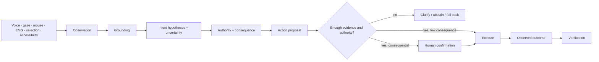

# Grounded Interaction Kernel

*Research architecture, 2026-09-23. This page is a design and research synthesis, not a claim that the kernel is implemented. The corresponding decision record is [ADR-025](https://github.com/MSKazemi/yazses/blob/main/design/adr/adr-025-grounded-interaction-kernel.md), currently **Proposed**.*

## The short version

YazSes already has many of the pieces of a post-keyboard interaction system: voice,
gaze, EMG activation, context extraction, command classification, screen/target guards,
tool planning, confirmation, and feedback. The next durable step is **not another
independent feature**. It is to give those pieces one small common language.

The proposed Grounded Interaction Kernel separates six questions that are currently
answered in different places:

1. **Observation** — what did a sensor or software source actually observe?
2. **Grounded target** — what real UI/application object might the person be referring to?
3. **Intent hypothesis** — what might the person want, with explicit uncertainty?
4. **Authority** — is the proposed action allowed, and what consequence does a mistake carry?
5. **Action proposal** — what exactly would execute if approved?
6. **Outcome** — what actually happened, and did reality match the proposal?

The key design rule is:

> **uncertainty is data, not an exception.**

A system that is 92% correct and abstains or asks on the remaining 8% may be safer and
more useful than one that is 97% correct but confidently performs the wrong destructive
action 3% of the time.

This is deliberately smaller than an "AI operating system", "agent mesh", "digital twin",
or "metaverse" architecture. Those may later be adapters. The kernel itself should remain
a dependency-free, local, deterministic core.

## Why this is the right layer for YazSes

The current repository already contains the same architectural pattern in several places:

| Need | Existing seam | Today |
|---|---|---|
| Coarse visual reference | `src/yazses/gaze/` | gaze point/window routing with confidence |
| Deictic speech | `src/yazses/gaze/deixis.py` | resolves words such as "this" and "that" |
| Screen/application context | `system/context_read.py`, `commands/context.py` | collects active context |
| Accessibility-aware planning | `src/yazses/pilot/` | pure planning exists; runtime remains limited/planned |
| Tool planning | `src/yazses/agent/plan.py` | deterministic tool matching + confirmation policy |
| Destination awareness | `src/yazses/inject/target.py` | detects whether a useful text target exists |
| Consequence guards | `cmdsafety/`, `staged/`, check-digit validation | holds risky operations instead of blindly executing |
| Human feedback | overlay / toast / read-back infrastructure | communicates state, warnings and confirmations |

[Grounded multimodal interaction](grounded-multimodal-interaction.md) already identified
the missing abstraction between a coarse screen point and action planning. ADR-021
independently reached the same conclusion from the safety side: several apparently
different features are really one deeper mechanism — **the cost of being wrong depends on
where an action lands**.

The kernel unifies those insights without turning YazSes into an autonomous agent.

## Proposed pipeline



The pipeline separates **what was observed** from **what the system inferred**.
That distinction is essential for debugging, evaluation and safety.

## Core data model

The exact Python names remain subject to ADR review, but the conceptual contract is:

### 1. Observation

An `Observation` is a fact reported by one source, not an interpretation of intent.

```text
Observation {
    source           voice | gaze | pointer | emg | selection | accessibility | app
    timestamp
    payload
    confidence
    coordinate_frame
    freshness
}
```

Examples:

- gaze reports a coarse point with 0.74 confidence;
- accessibility reports `Button(name="Save")`;
- voice reports the transcript "click this";
- an EMG source reports a deliberate squeeze;
- a selection source reports the currently selected paragraph.

No observation is allowed to silently claim that it knows what the user wants.

### 2. GroundedTarget

A `GroundedTarget` combines one or more observations into a candidate referent.

```text
GroundedTarget {
    source
    timestamp

    app_id
    window_id
    element_id
    role
    label
    bounds

    entity_type
    entity_id
    available_actions

    confidence
    evidence[]
}
```

Grounding should prefer the cheapest trustworthy semantic source:

1. native accessibility/UI tree;
2. application-native structure;
3. selection/focused text;
4. window metadata;
5. local OCR;
6. explicitly enabled local visual model;
7. ask or fall back.

Visual inference is a last resort when the operating system or application cannot tell us
what the object is.

### 3. IntentHypothesis

The kernel must not collapse ambiguous multimodal evidence directly into one intent.

```text
IntentHypothesis {
    action
    target
    arguments
    confidence
    supporting_evidence[]
    conflicting_evidence[]
}
```

Example:

```text
User says: "close this"

A: close browser tab      0.56
B: close browser window   0.37
C: dismiss dialog         0.07
```

For a destructive operation this distribution should trigger a clarification, not an
automatic click.

### 4. AuthorityContext

Confidence answers "how likely is this interpretation?" It does **not** answer "may we do
it?"

```text
AuthorityContext {
    principal
    grantee
    permitted_actions
    permitted_targets
    consequence_class
    confirmation_required
    delegation_allowed
    expires_at
}
```

The first version does not need a distributed capability-security system. It does need to
make authority explicit enough that future MCP, mobile, spatial or robotic adapters cannot
bypass it.

Suggested consequence classes:

```text
OBSERVE       read-only; no external side effect
REVERSIBLE    local reversible write
EXTERNAL      sends/publishes/changes state outside the local document
DESTRUCTIVE   deletes, overwrites, purchases, publishes, or loses data
PHYSICAL      affects a robot/device/environment
```

`PHYSICAL` is reserved for future adapters; it is not a commitment to build robotics
support.

### 5. ActionProposal

```text
ActionProposal {
    action
    target
    arguments

    intent_confidence
    target_confidence

    consequence_class
    confirmation_required

    provenance[]
    reversible
}
```

The proposal is what the user may be shown or read back before a consequential action.

### 6. ActionOutcome

The interaction does not end at "the executor returned no exception."

```text
ActionOutcome {
    proposal_id
    started_at
    finished_at

    executor_result
    observed_state
    success
    verification_method
    discrepancy
}
```

A future agent or robot adapter must be able to say not just "I tried" but "the observable
state changed in the way the proposal predicted."

## The decision function: confidence × consequence

The kernel should not have one global threshold such as `confidence > 0.8`.

A better policy is:

| Evidence | Consequence | Default behavior |
|---|---|---|
| High | OBSERVE | execute/read |
| Medium | OBSERVE | execute with lightweight feedback |
| Low | OBSERVE | ask/fall back if ambiguity matters |
| High | REVERSIBLE | execute or confirm according to user mode |
| Medium | REVERSIBLE | confirm |
| Any ambiguity | EXTERNAL | confirm or clarify |
| Less than high | DESTRUCTIVE | clarify / refuse to guess |
| Any | PHYSICAL | future dedicated safety policy; kernel alone never authorizes actuators |

This is the natural extension of ADR-021's cost-weighted-error direction.

## First vertical slice

Do **not** implement every modality.

The smallest meaningful experiment is:

> **gaze + voice + accessibility semantics**

Scenario:

1. the user looks approximately at a Save button;
2. says "click this";
3. gaze narrows the region;
4. the accessibility tree identifies candidate controls;
5. voice supplies the operation;
6. the resolver produces ranked hypotheses;
7. policy decides whether to execute, confirm or ask.

Clear case:

```text
Save button      0.91
Cancel button    0.06
Filename field   0.03

=> execute exact semantic action
```

Ambiguous case:

```text
Save             0.47
Export           0.41
Other            0.12

=> do not click
=> ask: "Save or Export?"
```

This experiment directly tests whether multimodal grounding reduces the precision burden
on commodity webcam gaze.

## Scientific and engineering bottlenecks

The kernel is useful precisely because it makes the hard parts visible instead of hiding
them behind "AI understands the user."

### 1. Human intention is not a schema

"This", "that", "send this", "fix this" and "move that there" are under-specified without
social, temporal and application context. A JSON structure can represent an interpretation;
it cannot make the ambiguity disappear.

**Research requirement:** measure target and intent ambiguity, not only final command
accuracy.

### 2. Temporal multimodal binding

Gaze, speech, mouse movement, head pose and EMG do not occur at the same instant. A user may
look at an object, start speaking, look away and then say "that".

The system therefore needs a short-lived interaction window, not a single synchronous
sample.

**Research requirement:** estimate the temporal window that maximizes correct grounding
without binding stale observations.

### 3. Calibrating uncertainty

Confidence emitted by gaze, ASR, accessibility matching and a local intent model are not
directly comparable probabilities.

**Research requirement:** calibration curves and selective-prediction evaluation:
when the system says 0.8, is it actually right roughly 80% of the time?

### 4. Abstention quality

A system can appear accurate by asking the user about everything. It can also appear fast
by guessing too often.

The useful quantity is the frontier between:

- wrong automatic actions;
- correct automatic actions;
- correct clarifications;
- unnecessary clarifications.

**Research requirement:** report risk/coverage and clarification burden together.

### 5. Confirmation fatigue

A safety system that asks "are you sure?" constantly trains the user to confirm
reflexively. ADR-021 already identifies this failure mode.

**Engineering requirement:** confirmations must be consequence-sensitive and rare.

### 6. Agent/tool prompt injection and delegated authority

If future MCP tools read untrusted email, webpages or documents, those data can contain
instructions intended to manipulate the planner.

The kernel must preserve a distinction between:

- human instruction;
- trusted system policy;
- tool output/data;
- model-generated proposal.

**Engineering requirement:** external content never acquires authority merely because a
model repeated it.

### 7. Long-horizon autonomy

ADR-v2-006 deliberately scopes Spoken MCP to short, verifiable, human-confirmed actions.
The kernel does not change that decision.

**Constraint:** do not interpret this architecture as permission to build an autonomous
multi-agent loop. ADR-020 explicitly declines A2A because YazSes has no goals of its own.

### 8. Personal memory can become stale or wrong

If the future Recall layer stores preferences, facts or inferred context, every persistent
item must distinguish:

```text
observation != fact != inference != preference != decision
```

and carry provenance and time validity.

**Research requirement:** memory correctness and correction/deletion behavior before a
"personal twin" is treated as authoritative context.

### 9. Spatial/digital-twin identity

A future spatial adapter would have to reconcile device-local IDs, UI objects, visual
detections and physical objects over time. "The blue mug" is not a stable identifier.

**Constraint:** OpenXR/OpenUSD/digital-twin support, if ever added, belongs outside the
kernel as an adapter and needs its own entity-resolution research.

### 10. Sim-to-real and physical safety

Simulation can reveal known failures; it cannot prove a physical action is safe.

If a future ROS 2 adapter is explored, the boundary must remain:

```text
human intent
  -> YazSes task-level proposal
  -> robot planning / certified safety controller
  -> actuators
```

Never:

```text
LLM / YazSes
  -> raw motor commands
```

YazSes must not become the low-level robot safety controller.

### 11. Platform capability gaps

Accessibility semantics differ across AT-SPI, macOS Accessibility and Windows UI
Automation. Wayland also deliberately prevents classes of cross-application control that
are possible on X11.

**Engineering requirement:** the kernel must support honest "unavailable" and fallback
states rather than pretending cross-platform parity.

### 12. Project complexity

The repository already contains a large designed-capability surface. A kernel that becomes
another umbrella for dozens of new features would make the problem worse.

**Governance requirement:** the kernel earns its place only by *collapsing* existing
special cases, not by creating a new feature wave.

## Evaluation program

Word-error rate is not the main metric for grounded interaction.

Minimum metrics:

| Metric | What it answers |
|---|---|
| Target resolution accuracy | Did "this/that" resolve to the correct object? |
| Intent resolution accuracy | Was the requested operation understood? |
| Wrong-action rate | How often did the system execute the wrong action? |
| Unsafe-action rate | How often was a wrong consequential action actually executed? |
| Abstention precision | When YazSes declined to act, was ambiguity genuinely high? |
| Clarification rate | How often does the user have to answer a follow-up? |
| Unnecessary clarification rate | How much safety friction did the system add without benefit? |
| Task-completion rate | Can users actually finish workflows? |
| Time-to-action | Does multimodal grounding save time? |
| Cost-weighted error | ADR-021's central metric: how expensive were the mistakes? |
| False activation / working hour | Can the interaction stay enabled during real work? |
| Confirmation burden | Are users being trained to reflexively confirm? |

### Unsafe Action Rate

A key primary metric for consequential tasks should be:

```text
Unsafe Action Rate =
  incorrect consequential actions executed
  / consequential action opportunities
```

A desirable result can therefore look like:

```text
92% automatically resolved correctly
 7% correctly clarified
 1% correctly abstained
 0% wrong destructive actions
```

rather than chasing a single headline intent-classification accuracy number.

## Phased research and engineering plan

### Phase 0 — contract only

- settle names and invariants through ADR-025;
- write golden examples for clear, ambiguous and conflicting evidence;
- no daemon wiring;
- no new dependencies.

**Exit:** contributors can implement the same decision function from the contract and get
the same result on the golden vectors.

### Phase 1 — pure core

If ADR-025 is accepted:

```text
src/yazses/interaction/
    observation.py
    target.py
    hypothesis.py
    authority.py
    proposal.py
    outcome.py
    policy.py
```

Requirements:

- pure Python;
- deterministic;
- no model;
- no network;
- no camera;
- no accessibility runtime;
- no MCP dependency;
- property/fuzz tests where appropriate.

**Exit:** the core is fully testable without hardware.

### Phase 2 — one read-only integration

Adapt existing gaze/window/context signals into the kernel but permit **read-only** actions
only.

**Exit:** target and intent metrics can be collected without risking side effects.

### Phase 3 — reversible semantic action

Run the gaze + voice + accessibility vertical slice on one supported platform.

**Exit:** demonstrate that semantic grounding beats exact cursor aiming and quantify
clarification burden.

### Phase 4 — unify consequence policy

Only after measurement, consider collapsing duplicated confirmation logic from
`cmdsafety`, staged dictation, gaze confirmation and destination guards into a shared
policy.

**Exit:** fewer special-case safety paths, not more.

## What this does not authorize

This research direction does **not** approve:

- A2A support;
- autonomous goal pursuit;
- an always-listening assistant;
- cloud processing;
- third-party in-process plug-ins;
- persistent personal memory expansion;
- OpenXR/OpenUSD dependencies;
- ROS 2 dependencies;
- robot control;
- a visual-language model on the default path;
- automatic execution of ambiguous interpretations.

Each of those requires independent evidence and, where it changes architecture or risk,
a separate ADR.

## Relationship to future adapters

The value of the kernel is that future integrations can remain adapters:

```text
                         Grounded Interaction Kernel
                                    |
             +----------------------+----------------------+
             |          |           |          |           |
           desktop     MCP       mobile     spatial      robot
           actions     tools                 adapter      adapter
```

If a protocol disappears, the interaction model survives.

### MCP

Compatible with ADR-020: YazSes may call narrow tools or expose narrow stdio tools without
becoming an autonomous agent.

### A2A

Not part of this proposal. ADR-020 currently rejects it. A future ADR may supersede that
only if YazSes acquires a real goal/delegation requirement that MCP cannot express.

### Personal context / Recall

May provide observations to grounding in the future, but persistent context must carry
provenance, validity and user correction semantics.

### Spatial computing

OpenXR/OpenUSD could eventually map spatial observations/entities into
`GroundedTarget`; the kernel itself should know nothing about those dependencies.

### Human-robot interaction

A future ROS 2 adapter may translate an approved **task-level** proposal into a robot goal.
Robot-specific planning, collision avoidance, force limits and emergency-stop behavior
remain outside YazSes.

## Open research questions

1. What temporal window best binds gaze to demonstratives in natural desktop work?
2. How should confidence from heterogeneous modalities be calibrated and combined?
3. Can semantic UI grounding reduce webcam-gaze precision requirements enough to improve
   task completion?
4. At what ambiguity threshold is clarification faster than a wrong action plus recovery?
5. How should cost-weighted error be operationalized across chat boxes, terminals, forms,
   source code and external-send actions?
6. Can the system maintain zero wrong destructive actions without creating unacceptable
   confirmation burden?
7. Which observations are safe to retain for a few seconds, and which should be discarded
   immediately for privacy?
8. What cross-platform subset of accessibility semantics is stable enough for golden
   conformance tests?
9. What is the correct user-facing explanation when evidence sources disagree?
10. Which part of the current confirmation logic can actually be unified without increasing
    the blast radius of safety defects?

## Decision rule for the next five years

A futuristic integration should be considered only if it passes all four gates:

1. **Problem:** it solves a measured user/HCI problem rather than adding protocol novelty.
2. **Boundary:** it can enter through observations/proposals without weakening offline and
   safety invariants.
3. **Evaluation:** success and failure can be measured, including abstention and error cost.
4. **Complexity:** it removes or composes existing special cases rather than multiplying
   independent feature paths.

The durable research question is therefore not "which futuristic protocol should YazSes
support?"

It is:

> **Given noisy multimodal observations, can YazSes infer enough about human intention to
> act usefully while knowing when it does not know enough — and can it prove that the
> observed outcome matches the action the human actually authorized?**
