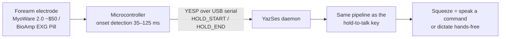
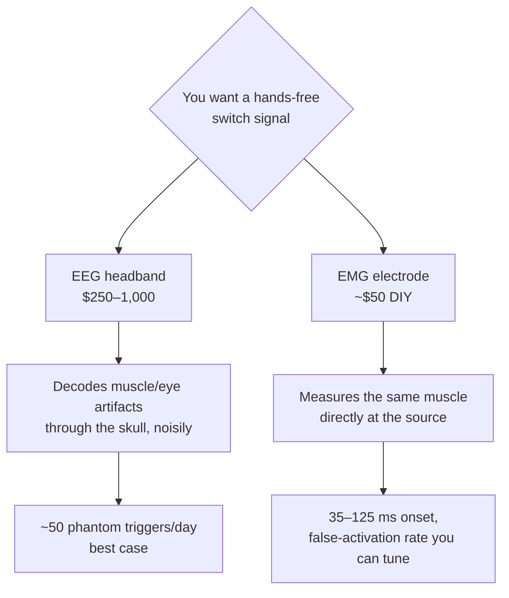

# Muscle & brain control: the honest hierarchy

*Updated 2026-08-07. Part of the [research series](index.md).*

"Control your computer with your mind" is the most over-promised sentence in
consumer tech. This page is the measured version: what electromyography (EMG —
muscle electricity) and electroencephalography (EEG — scalp-recorded brain
electricity) can each *actually* deliver for controlling a computer in 2026,
and why YazSes bet on the muscle.

## The headline result nobody reads carefully

Meta's Nature 2025 paper on the sEMG wristband is a genuine landmark:
**calibration-free gesture decoding across users** (>90% offline on held-out
participants, 9 gestures; ~20.9 words-per-minute handwriting) trained on
~11,000 people ([Nature](https://www.nature.com/articles/s41586-025-09255-w)).
The band shipped in September 2025 — but bundled with $799 display glasses,
with a developer kit that exposes **six fixed gestures, no raw EMG, and no
Linux** ([Meta dev FAQ](https://developers.meta.com/wearables/faq/)). The
released datasets and checkpoints are non-commercial
([generic-neuromotor-interface](https://github.com/facebookresearch/generic-neuromotor-interface)).

Read the numbers again, though: **20.9 WPM**. Speech dictates at ~150 WPM.
The scientific conclusion for a dictation product is not "EMG will replace
typing" — it is:

> **EMG's job is the *trigger*, not the text.** The voice carries the
> bandwidth; the muscle carries the intent to speak.

That's a push-to-talk switch that works with your hands full, under a desk,
or when your motor impairment makes a keyboard hold difficult. And a trigger
has beautifully forgiving requirements: squeeze-onset detection lands at
**35–125 ms** with classical threshold/TKEO methods
([PLOS ONE](https://journals.plos.org/plosone/article?id=10.1371%2Fjournal.pone.0127990)) —
faster than human reaction time. Even continuous grip *force* regresses at
r≈0.97 ([arXiv:2410.23986](https://arxiv.org/html/2410.23986v1)), which is why
"light squeeze = talk, hard squeeze = command" is on our roadmap.

YazSes speaks this protocol today (`[emg] device_port`); the sensors are
open-hardware DIY parts (SparkFun's MyoWare 2.0 muscle sensor at ~$50; the
CERN-OHL-licensed BioAmp EXG Pill), and the canonical Python stacks for fancier
hardware are [LibEMG](https://libemg.github.io/libemg/) and MIT-licensed
[BrainFlow](https://brainflow.org/) — both offline, both Linux-native.

## Why EEG loses this contest (for now)

Consumer EEG headsets (Muse, Neurosity Crown, OpenBCI) record real brain
signals. The question is what's *decodable* as a reliable command:

| Signal | Best measured performance | Fatal problem for daily control |
|---|---|---|
| Blink (EOG artifact) | 99.5% detection, ~1.3 s, **0.10 false positives/min** ([PMC7013717](https://pmc.ncbi.nlm.nih.gov/articles/PMC7013717/)) | 0.10 FP/min ≈ **~50 phantom activations per workday** |
| Jaw clench (EMG artifact on EEG) | ~90%, sub-second possible | Confounded by chewing — and by **talking**, fatal in a dictation tool |
| SSVEP (flicker-evoked) | Up to ~139 bits/min in wet-lab rigs; **~12 bits/min on consumer headsets** ([PMC4245767](https://www.ncbi.nlm.nih.gov/pmc/articles/PMC4245767/)) | Needs occipital electrodes no headband has, plus permanently flashing on-screen stimuli |
| P300 | 20–70 bits/min | Flashing grids + per-session calibration |
| Motor imagery ("think left hand") | 70–85% *binary* after 3–10 training sessions | **15–30% of users never reach usable accuracy** ([PLOS ONE](https://journals.plos.org/plosone/article?id=10.1371%2Fjournal.pone.0268880)) — nobody accepts a talk key that fails one user in five |

Note the pattern: the only *reliable* "EEG" switches — blink, jaw clench —
are not brain signals at all. They are **muscle and eye artifacts** leaking
into the EEG. At which point the honest engineering move is to put a proper
electrode *on the muscle*, where the same signal is orders of magnitude
cleaner:

This is the reasoning recorded in ADR-v2-129: **consumer-EEG triggers are
rejected** — not because BCIs aren't coming, but because in 2026 a dedicated
EMG channel strictly dominates on signal-to-noise, latency, and false
activations. (For completeness: invasive BCIs are a different world entirely,
and none of this applies to them.)

One metric we can contribute back: Meta's Nature paper reports **no
false-activation rate** — the single number that decides whether a trigger is
livable. YazSes's encrypted learning corpus records every activation locally,
so an EMG user can *measure* their own FP rate. We'd love to publish
community-collected numbers.

## The accessibility stakes

This isn't gadgeteering. The commercial assistive-tech landscape for people
who can't use a keyboard is brutal: eye-gaze AAC devices cost **$10,000–20,000**
and are Windows/iPad-locked (TD Pilot ~$10k on iPad, TD I-Series ~$20k on
Windows; [reporting on access barriers](https://kffhealthnews.org/news/medicare-changes-could-limit-patient-access-to-als-communication-tools/)),
consumer Dragon is discontinued, and the Linux hands-free stack is a
graveyard — eViacam unmaintained since ~2019, Google's Project Gameface
archived in 2025, dwell-click broken under Wayland. A free, offline,
maintained stack that combines voice + gaze dwell + a cheap muscle switch has
essentially **no living competitor** on Linux. That is the long-term program
these three research pages add up to.

## Open questions

**[Discuss →](https://github.com/MSKazemi/yazses/discussions)**

1. **Measured false-activation rates.** If you run the EMG backend (or build
   the MyoWare/EXG-Pill rig), what FP/hour do you see across a real workday?
   This is the number the field doesn't publish.
2. **Graded squeeze semantics.** Is two force levels (talk / command) the
   right ceiling, or is a third ("verbatim mode"?) learnable without error?
   Grip-force regression says the signal is there; the human factors are
   unmeasured.
3. **Which buyable armband should we adapt next?** MindRove exposes raw
   8-channel EMG with an official Linux SDK; second-hand Myo works via
   `pyomyo`; Mudra Link exposes continuous pressure but lacks a Linux host.
   What do you actually own?
4. **Dwell-to-talk.** Gaze dwell on a screen zone as the mic trigger (the
   Look-to-Speak pattern) would close the loop for users who can neither
   press nor squeeze. What dwell time balances speed against the Midas-touch
   problem on a webcam-grade signal?

*See also: [eye control](eye-control.md) for the gaze half of the hands-free
stack, and the [accessibility use-case guide](../use-cases/accessibility-rsi-hands-free.md).*
