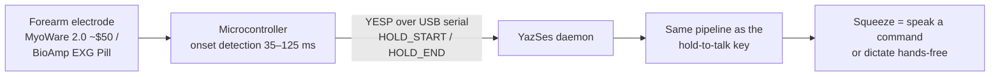
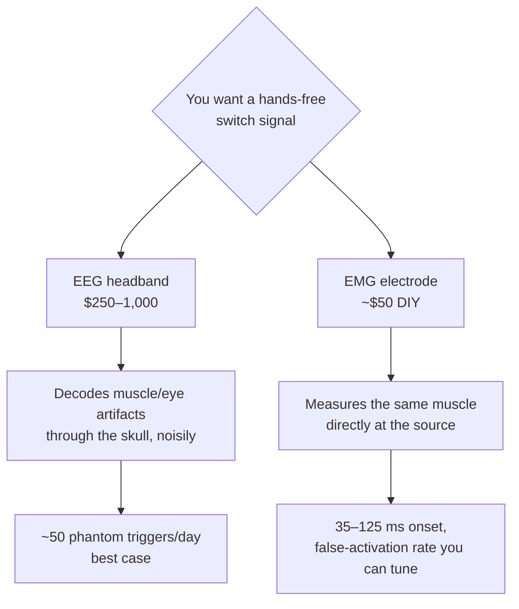
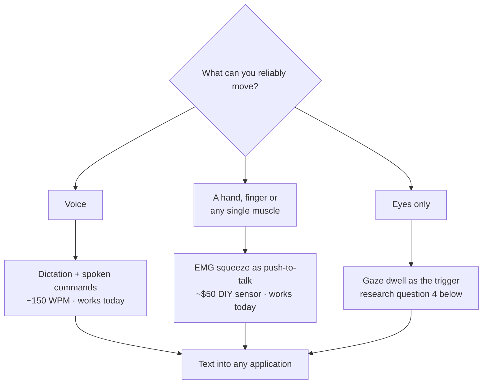

# Muscle & brain control: the honest hierarchy

*Updated 2026-08-07. Part of the [research series](index.md).*

!!! abstract "The short version"

    Consumer "mind control" is mostly muscle. The only reliable switches you
    can decode from a consumer EEG headset — blink, jaw clench — are **eye and
    muscle artifacts leaking into the EEG**, so the honest move is to put the
    electrode on the muscle, where the same signal is orders of magnitude
    cleaner and costs ~$50 instead of ~$1,000. And even the best muscle
    interface handwrites at **20.9 WPM** versus speech at ~150 — so the muscle
    should carry the *intent to speak*, not the words.

"Control your computer with your mind" is the most over-promised sentence in
consumer tech. This page is the measured version: what electromyography (EMG —
muscle electricity) and electroencephalography (EEG — scalp-recorded brain
electricity) can each *actually* deliver for controlling a computer in 2026,
and why YazSes bet on the muscle.

## The headline result nobody reads carefully

Meta's *Nature* 2025 paper on the sEMG wristband is a genuine landmark:
**calibration-free gesture decoding across users** (>90% offline on held-out
participants, 9 gestures; ~20.9 words-per-minute handwriting) trained on
~11,000 people ([Kaifosh et al.](#ref-kaifosh)). The band shipped in September
2025 — but bundled with $799 display glasses, with a developer kit that
exposes **six fixed gestures, no raw EMG, and no Linux**
([Meta dev FAQ](#ref-metafaq)). The released datasets and checkpoints are
non-commercial ([repository](#ref-metarepo)).

Read the numbers again, though: **20.9 WPM**. Speech dictates at ~150 WPM
([Ruan et al.](#ref-ruan)). The scientific conclusion for a dictation product
is not "EMG will replace typing" — it is:

> **EMG's job is the *trigger*, not the text.** The voice carries the
> bandwidth; the muscle carries the intent to speak.

That's a push-to-talk switch that works with your hands full, under a desk,
or when a motor impairment makes holding a key difficult. And a trigger
has beautifully forgiving requirements: squeeze-onset detection lands at
**35–125 ms** with classical threshold/TKEO methods ([Liu et al.](#ref-onset)) —
faster than human reaction time. Even continuous grip *force* regresses at
r≈0.97 ([Rahimi et al.](#ref-grip)), which is why "light squeeze = talk, hard
squeeze = command" is on our roadmap.

YazSes speaks this protocol today (`[emg] device_port`); the sensors are
open-hardware DIY parts (SparkFun's MyoWare 2.0 muscle sensor at ~$50; the
CERN-OHL-licensed BioAmp EXG Pill), and the canonical Python stacks for fancier
hardware are [LibEMG](https://libemg.github.io/libemg/) and MIT-licensed
[BrainFlow](https://brainflow.org/) — both offline, both Linux-native.

## Why EEG loses this contest (for now)

Consumer EEG headsets (Muse, Neurosity Crown, OpenBCI) record real brain
signals. The question is what's *decodable* as a reliable command:

| Signal | Best measured performance | Fatal problem for daily control |
|---|---|---|
| Blink (EOG artifact) | 99.5% accuracy, 1.3 s response, **0.10 false positives/min** ([Li et al.](#ref-eogswitch)) | 0.10 FP/min ≈ **~50 phantom activations per workday** |
| Jaw clench (EMG artifact on EEG) | ~90%, sub-second possible | Confounded by chewing — and by **talking**, fatal in a dictation tool |
| SSVEP (flicker-evoked) | **>12 bits/min** online with a 14-channel consumer headset ([Lin et al.](#ref-ssvep)); far higher only on wet-electrode lab rigs ([Chen et al.](#ref-chen)) | Needs occipital electrodes no headband has, plus permanently flashing on-screen stimuli |
| P300 | 20–70 bits/min | Flashing grids + per-session calibration |
| Motor imagery ("think left hand") | 70–85% *binary* after 3–10 training sessions | **BCI "inefficiency" — some users never produce usable patterns at all — is a known, unsolved problem** ([Tibrewal et al.](#ref-mi)); nobody accepts a talk key that simply never works for part of its audience |

Note the pattern: the only *reliable* "EEG" switches — blink, jaw clench —
are not brain signals at all. They are **muscle and eye artifacts** leaking
into the EEG. At which point the honest engineering move is to put a proper
electrode *on the muscle*, where the same signal is orders of magnitude
cleaner:

Worth noting what *does* fix the false-positive problem in the EEG literature:
switching signal entirely. A breath-hold switch read from respiration-modulated
photoplethysmography reached **0.02 false operations/min**, five times better
than the blink switch ([Han et al.](#ref-ppg)). The lesson generalises — pick
the physiological channel where your intended action is loudest, rather than
trying to filter it out of a noisier one.

This is the reasoning recorded in ADR-v2-129: **consumer-EEG triggers are
rejected** — not because BCIs aren't coming, but because in 2026 a dedicated
EMG channel strictly dominates on signal-to-noise, latency, and false
activations. (For completeness: invasive BCIs are a different world entirely,
and none of this applies to them.)

One metric we can contribute back: Meta's *Nature* paper reports **no
false-activation rate** — the single number that decides whether a trigger is
livable. YazSes's encrypted learning corpus records every activation locally,
so an EMG user can *measure* their own FP rate without sending anything
anywhere. We'd love to publish community-collected numbers.

## The accessibility stakes

This isn't gadgeteering. The commercial assistive-tech landscape for people
who can't use a keyboard is brutal: eye-gaze AAC devices cost **$10,000–20,000**
and are Windows/iPad-locked (TD Pilot ~$10k on iPad, TD I-Series ~$20k on
Windows; [reporting on access barriers](#ref-kff)), consumer Dragon is
discontinued, and the Linux hands-free stack is a graveyard — eViacam
unmaintained since ~2019, Google's Project Gameface archived in 2025,
dwell-click broken under Wayland. A free, offline, maintained stack that
combines voice + gaze dwell + a cheap muscle switch has essentially **no living
competitor** on Linux. That is the long-term program these three research pages
add up to.

## Silent speech: when the muscle *does* carry the words

The claim above — muscle for the trigger, voice for the text — was clean while
the only muscle-to-text result was slow handwriting. Between 2020 and 2026 it
stopped being the whole story, and the honest version is more interesting.

**Gaddy and Klein** were the first to train a model on EMG recorded during
*silently articulated* speech rather than vocalised speech, by transferring
audio targets from vocalised to silent signals. Transcription word error rate
fell from **64% to 4%** in one data condition and from **88% to 68%** in another
([2020](#ref-gaddy20), improved in [2021](#ref-gaddy21)). Quote the second pair,
not the first: 4% is a closed, single-speaker condition, and 68% WER is what
open silent speech actually cost at that point.

**emg2speech** went further and skipped text entirely. Self-supervised speech
(S3) representations turn out to be strongly linearly related to the electrical
power of muscle activity — **r = 0.85** — so EMG can be mapped *into* the S3
representation space and synthesised to audio with no explicit articulatory
model and no vocoder training. It was demonstrated with a participant with
**ALS**, converting orofacial EMG recorded while she silently articulated
([Gowda et al.](#ref-emg2speech)).

**emg2qwerty** supplies the missing ingredient — scale. 1,135 sessions, 108
users, **346 hours** of wrist sEMG recorded during touch typing, with baselines
built from standard ASR machinery ([Sivakumar et al.](#ref-emg2qwerty)). Its
stated central difficulty is not accuracy but **domain shift across users and
sessions**, which is the same wall every EMG interface hits.

Three 2025–2026 wearables show where the hardware is:

| System | Result | Constraint |
|---|---|---|
| [SilentWear](#ref-silentwear) — 14-ch neck EMG, GAP9 | **20.5 mW**, >27 h on 150 mAh, 15k-param CNN on-device | 8 commands, 4 subjects |
| [Textile EMG in headphones](#ref-tang25) — graphene electrodes, ESP32-S3 | **96%** accuracy | 10 control words |
| [Soft active EMG interface](#ref-kurotaki) | **97.2% ± 1.3** | 30 words, 3 subjects |

The pattern is consistent and it is the single most useful thing on this page:
**small closed vocabularies are solved; open dictation from muscle is not.**

### The measured hierarchy, end to end

Every number below is from a peer-reviewed measurement, not a demo video.

| Path | Rate / accuracy | Source |
|---|---|---|
| Natural speech | ~150 WPM | [Ruan et al.](#ref-ruan) |
| Intracortical speech BCI | **62 WPM**; 9.1% WER on a 50-word vocabulary, 23.8% on 125k | [Willett et al. 2023](#ref-willett) |
| Intracortical, rapidly calibrating | **2.5% WER** on a 125k vocabulary | [Card et al. 2024](#ref-card) |
| sEMG handwriting (wristband) | 20.9 WPM | [Kaifosh et al.](#ref-kaifosh) |
| sEMG silent speech, closed vocabulary | 96–97% on 10–30 words | [Tang](#ref-tang25), [Kurotaki](#ref-kurotaki) |
| sEMG silent speech, open vocabulary | ~68% WER | [Gaddy and Klein](#ref-gaddy20) |
| Subvocal wearable (first of its kind) | 92%, ~0.5 s latency | [Kapur et al. 2018](#ref-alterego) |

The gap between rows five and six is the whole design problem. It is also why
the honest reading of "mind-controlled dictation" in 2026 is: **the fast,
accurate, open-vocabulary paths all still require surgery**
([Card et al. 2026](#ref-card26) report long-term independent home use), and
every non-invasive path buys reliability by shrinking the vocabulary.

### What this changes for YazSes

Not the thesis — the *seam*. Splitting the earlier claim in two:

1. **A closed vocabulary of ≤30 silent commands is buildable today.** That maps
   onto the command grammar YazSes already has, which separates "type this" from
   "do this" — not onto the dictation path. Silently mouthing *undo*, *new line*,
   *send* while speech carries the prose is a hybrid the literature supports and
   nobody ships.
2. **Open dictation stays with the voice**, until a non-invasive path beats 68%
   WER outside a single-speaker condition.

Three concrete consequences we are treating as design work rather than
speculation:

- **The activation seam is currently trigger-only.** `EMGBackend` implements
  `HotkeyBackend` — it can say *start* and *stop*, and nothing else. A decoder
  that produces an intent or a word cannot express it. Widening that protocol to
  admit an intent-carrying source is the smallest change that makes every system
  in the table above pluggable.
- **The shared representation is the cheap integration point.** If S3 features
  linearly track EMG power ([r = 0.85](#ref-emg2speech)), an EMG decoder that
  targets the same latent space a speech encoder already produces can reuse the
  downstream stack — language model, vocabulary priming, post-processing —
  instead of rebuilding it.
- **Cross-user domain shift is a personalisation problem we already have.**
  [emg2qwerty](#ref-emg2qwerty) names it as the central obstacle; YazSes already
  carries per-user calibration and an on-device learning corpus for exactly this
  failure in the voice path. The machinery is shared even though the signal is not.

Robustness has a known shape too: fusing sEMG with lipreading under
**cross-modal masking** keeps a system usable when one modality drops out
([del Blanco et al.](#ref-crossmodal)) — the same argument for treating YazSes's
several activation sources as a degradation ladder rather than alternatives.

And the ceiling is not fixed. Silent-speech decoding from **around-ear EEG**
improves substantially with training-set scale ([Inoue et al. 2026](#ref-earEEG)),
and a single model can now span **heterogeneous electrode configurations**
([Inoue et al. 2025](#ref-hetero)) — which is the sensor-side equivalent of the
device-neutral contract this project uses to keep implementations honest. For a
full survey of the sensing modalities, see [Tang et al.'s review](#ref-review).

## The seam, if you want to plug a decoder in

Until recently YazSes could only accept an **onset and an offset** from a device —
the vocabulary of a key. A decoder that recognised "undo" at 96% had to throw the
label away, emit a bare onset, and wait for the user to say the word out loud,
which is the opposite of what a silent interface is for.

An activation source can now declare a **vocabulary** and emit an **intent**: a
label plus a confidence. Three properties are worth knowing before you build
against it:

- **The label goes through the ordinary command grammar.** A silent "undo" and a
  spoken "undo" take the same code path, so they cannot diverge.
- **A label outside your declared vocabulary is refused** before it reaches that
  grammar. Declaring up front is what makes a mis-decode a refusal rather than an
  action.
- **Free text is out of scope, deliberately.** At ~68% WER for non-invasive
  decoding ([Gaddy & Klein](#ref-gaddy20)), injecting decoded prose would be typing
  noise. Labels from a small closed set are the part that is reliable — which is
  exactly what the 96–97% / 10–30 word results measure.

**Confidence alone does not decide whether an intent runs.** The gate is
confidence × *consequence*, and an irreversible action confirms at any confidence:
at roughly one command in thirty wrong, no threshold makes silently executing
something unrecoverable defensible. Reversible actions act above 0.90 and confirm
below it; below 0.50 the intent is dropped rather than prompted, because
confirming coin flips teaches people to dismiss prompts.

`contract/vectors/activation.json` is an executable specification of all of the
above — 20 cases covering onset/offset, intents, out-of-vocabulary and empty
labels, out-of-range confidence, a repeated onset, and a source that disappears
mid-hold. **You can prove your decoder conforms without reading our source**, and
without owning our pipeline. See [`contract/README.md`](https://github.com/MSKazemi/yazses/blob/main/contract/README.md).

Configuration lives under `[activation]`; it is off by default and changes nothing
until an intent-carrying source exists.

## Open questions

**[Discuss →](https://github.com/MSKazemi/yazses/discussions)**

1. **Measured false-activation rates.** If you run the EMG backend (or build
   the MyoWare/EXG-Pill rig), what FP/hour do you see across a real workday?
   This is the number the field doesn't publish — and the one that decides
   whether a trigger is livable.
2. **Graded squeeze semantics.** Is two force levels (talk / command) the
   right ceiling, or is a third ("verbatim mode"?) learnable without error?
   Grip-force regression says the signal is there; the human factors are
   unmeasured.
3. **Which buyable armband should we adapt next?** MindRove exposes raw
   8-channel EMG with an official Linux SDK; second-hand Myo works via
   `pyomyo`; Mudra Link exposes continuous pressure but lacks a Linux host.
   What do you actually own?
4. **Dwell-to-talk.** Gaze dwell on a screen zone as the mic trigger (the
   Look-to-Speak pattern) would close the loop for users who can neither
   press nor squeeze. What dwell time balances speed against the Midas-touch
   problem on a webcam-grade signal?
5. **Where is the silent-command ceiling in practice?** The literature reports
   96–97% on 10–30 words ([Tang](#ref-tang25), [Kurotaki](#ref-kurotaki)) with
   3–4 subjects. Nobody reports what happens across a workday, across sessions,
   with electrodes re-seated — which is exactly the domain shift
   [emg2qwerty](#ref-emg2qwerty) identifies as the hard part. A silent command
   set is only useful if it survives taking the device off and putting it
   back on.
6. **Should the activation seam carry intent, not just onset?** Today a source
   can say *start* and *stop*. Widening it so a decoder can deliver a word or
   an intent would make every system in the table above pluggable — but it
   also invites a source to inject text the user never reviewed. What is the
   right confirmation model for a channel with a 3% error rate?

!!! tip "If you build the rig, we'll help"

    A MyoWare 2.0 or BioAmp EXG Pill plus any microcontroller that can speak
    the YESP serial protocol is enough to drive YazSes today
    (`[emg] device_port`). Post your build and your false-activation numbers in
    a Discussion — hardware reports are the contribution this page most needs.

## References

**Evidence grade**: *measured* (peer-reviewed measurement), *vendor* (claimed
by the maker), *secondary* (review or reporting).

1. Kaifosh, P., Reardon, T. R. et al. "A generic
   non-invasive neuromotor interface for human-computer interaction." *Nature*,
   2025. [doi:10.1038/s41586-025-09255-w](https://doi.org/10.1038/s41586-025-09255-w)
   — *measured* (20.9 WPM handwriting; >90% offline gesture decoding on
   held-out users; ~11,000 participants)
2. Meta. "Wearables developer FAQ" (sEMG wristband
   developer kit scope). [developers.meta.com](https://developers.meta.com/wearables/faq/) — *vendor*
3. Meta Research. `generic-neuromotor-interface`
   (datasets and checkpoints, non-commercial licence).
   [GitHub](https://github.com/facebookresearch/generic-neuromotor-interface) — *vendor*
4. Ruan, S., Wobbrock, J. O., Liou, K., Ng, A., Landay, J.
   "Comparing speech and keyboard text entry for short messages in two
   languages on touchscreen phones." *arXiv:1608.07323*, 2016.
   [arXiv](https://arxiv.org/abs/1608.07323) — *measured* (153 WPM speech)
5. Liu, J., Ying, D., Rymer, W. Z., Zhou, P. "Robust
   muscle activity onset detection using an unsupervised electromyogram
   learning framework." *PLOS ONE*, 2015.
   [doi:10.1371/journal.pone.0127990](https://doi.org/10.1371/journal.pone.0127990) — *measured*
6. Rahimi, F. et al. "Simultaneous control of human hand
   joint positions and grip force via HD-EMG and deep learning."
   *arXiv:2410.23986*, 2024. [arXiv](https://arxiv.org/abs/2410.23986) — *measured*
7. Li, Y., He, S., Huang, Q., Gu, Z., Yu, Z. L. "A
   EOG-based switch and its application for start/stop control of a
   wheelchair." *Neurocomputing* 275, 2018.
   [doi:10.1016/j.neucom.2017.09.085](https://doi.org/10.1016/j.neucom.2017.09.085)
   — *measured* (99.5% accuracy, 1.3 s, 0.10 false positives/min)
8. Han, C.-H. et al. "Development of a brain-computer
   interface toggle switch with low false-positive rate using
   respiration-modulated photoplethysmography." *Sensors* 20(2), 2020.
   [PMC7013717](https://pmc.ncbi.nlm.nih.gov/articles/PMC7013717/) — *measured*
   (0.02 false operations/min)
9. Lin, Y.-P., Wang, Y., Jung, T.-P. "Assessing the
   feasibility of online SSVEP decoding in human walking using a consumer EEG
   headset." *Journal of NeuroEngineering and Rehabilitation* 11:119, 2014.
   [doi:10.1186/1743-0003-11-119](https://doi.org/10.1186/1743-0003-11-119) — *measured*
   (ITR above 12 bits/min)
10. Chen, X., Wang, Y., Nakanishi, M., Gao, X., Jung, T.-P.,
    Gao, S. "High-speed spelling with a noninvasive brain-computer interface."
    *PNAS* 112(44), 2015.
    [doi:10.1073/pnas.1508080112](https://doi.org/10.1073/pnas.1508080112) — *measured*
    (wet-electrode laboratory rig)
11. Tibrewal, N., Leeuwis, N., Alimardani, M.
    "Classification of motor imagery EEG using deep learning increases
    performance in inefficient BCI users." *PLOS ONE*, 2022.
    [doi:10.1371/journal.pone.0268880](https://doi.org/10.1371/journal.pone.0268880) — *measured*
12. KFF Health News. Reporting on access barriers to ALS
    communication tools.
    [kffhealthnews.org](https://kffhealthnews.org/news/medicare-changes-could-limit-patient-access-to-als-communication-tools/) — *secondary*
13. Gaddy, D., Klein, D. "Digital Voicing of Silent
    Speech." *arXiv:2010.02960*, 2020 (EMNLP).
    [arXiv](https://arxiv.org/abs/2010.02960) — *measured* (silent-EMG WER
    64%→4% in one condition, 88%→68% in another; first training on silently
    articulated EMG)
14. Gaddy, D., Klein, D. "An Improved Model for Voicing
    Silent Speech." *arXiv:2106.01933*, 2021.
    [arXiv](https://arxiv.org/abs/2106.01933) — *measured*
15. Gowda, H. T., Comstock, D. C., Miller, L. M.
    "emg2speech: Synthesizing speech from electromyography using
    self-supervised speech models." *arXiv:2510.23969*, 2025.
    [arXiv](https://arxiv.org/abs/2510.23969) — *measured* (S3 representations
    predict EMG power at r = 0.85; end-to-end EMG→audio demonstrated with an
    ALS participant)
16. Sivakumar, V., Seely, J., Du, A., Bittner, S. R.,
    Berenzweig, A. et al. "emg2qwerty: A Large Dataset with Baselines for Touch
    Typing using Surface Electromyography." *arXiv:2410.20081*, 2024.
    [arXiv](https://arxiv.org/abs/2410.20081) — *measured* (1,135 sessions, 108
    users, 346 h; cross-user and cross-session domain shift as the central
    problem)
17. Spacone, G., Frey, S., Pollo, G., Burrello, A.,
    Jahier Pagliari, D., Kartsch, V., Cossettini, A., Benini, L. "SilentWear: an
    Ultra-Low Power Wearable System for EMG-based Silent Speech Recognition."
    *arXiv:2603.02847*, 2026. [arXiv](https://arxiv.org/abs/2603.02847) —
    *measured* (14 EMG channels, 20.5 mW, >27 h on 150 mAh, 15k-parameter CNN
    on-device; 8 commands, 4 subjects)
18. Tang, C., Mallah, J., Kazieczko, D., Yi, W.,
    Kandukuri, T. R. et al. "Wireless Silent Speech Interface Using
    Multi-Channel Textile EMG Sensors Integrated into Headphones."
    *arXiv:2504.13921*, 2025. [arXiv](https://arxiv.org/abs/2504.13921) —
    *measured* (96% on 10 control words)
19. Kurotaki, Y., Yamakoshi, S., Yoshida, R., Isoda, Y.,
    Takano, T., Isano, Y. et al. "Soft Active Electromyography Interface for
    Machine Learning-Enabled Silent Speech Recognition." *Advanced Intelligent
    Systems*, 2026. [doi:10.1002/aisy.70440](https://doi.org/10.1002/aisy.70440)
    — *measured* (97.2% ± 1.3 on a 30-word vocabulary, 3 subjects)
20. Willett, F. R., Kunz, E. M., Fan, C. et al. "A
    high-performance speech neuroprosthesis." *Nature*, 2023.
    [doi:10.1038/s41586-023-06377-x](https://doi.org/10.1038/s41586-023-06377-x)
    — *measured* (62 WPM; 9.1% WER on a 50-word vocabulary, 23.8% on 125k)
21. Card, N. S., Wairagkar, M., Iacobacci, C. et al. "An
    Accurate and Rapidly Calibrating Speech Neuroprosthesis." *New England
    Journal of Medicine*, 2024.
    [doi:10.1056/NEJMoa2314132](https://doi.org/10.1056/NEJMoa2314132) —
    *measured* (2.5% WER on a 125,000-word vocabulary)
22. Card, N. S., Singer-Clark, T., Peracha, H. et al.
    "Long-term independent use of an intracortical brain-computer interface for
    speech and cursor control." *Nature Medicine*, 2026.
    [doi:10.1038/s41591-026-04414-6](https://doi.org/10.1038/s41591-026-04414-6)
    — *measured*
23. Kapur, A., Kapur, S., Maes, P. "AlterEgo: A
    Personalized Wearable Silent Speech Interface." *23rd International
    Conference on Intelligent User Interfaces (IUI)*, 2018.
    [doi:10.1145/3172944.3172977](https://doi.org/10.1145/3172944.3172977) —
    *measured* (92% accuracy, ~0.5 s latency, 10 subjects)
24. del Blanco, E., Gimeno-Gómez, D., Navas, E.,
    Martínez-Hinarejos, C.-D., Hernáez, I. "Cross-Modal Masking for Robust
    Silent Speech Synthesis Using sEMG and Lipreading." *arXiv:2606.09667*,
    2026. [arXiv](https://arxiv.org/abs/2606.09667) — *measured*
25. Inoue, M., Hatakeyama, E., Kita, Y., Sasai, S.
    "Large-scale training data enhances silent speech decoding with around-ear
    EEG." *Journal of Neural Engineering*, 2026.
    [doi:10.1088/1741-2552/ae54d0](https://doi.org/10.1088/1741-2552/ae54d0) —
    *measured*
26. Inoue, M., Sato, M., Tomeoka, K., Nah, N.,
    Hatakeyama, E. et al. "A Silent Speech Decoding System from EEG and EMG with
    Heterogenous Electrode Configurations." *arXiv:2506.13835*, 2025
    (Interspeech 2025). [arXiv](https://arxiv.org/abs/2506.13835) — *measured*
27. Tang, C., Qi, L., Gao, S., Zhang, Z., Yi, W., Xu, M.
    et al. "Sensing technologies for silent speech interfaces." *Nature
    Sensors*, 2026.
    [doi:10.1038/s44460-025-00010-2](https://doi.org/10.1038/s44460-025-00010-2)
    — *secondary* (review)
28. Tang, C., Xu, M., Yi, W., Zhang, Z., Occhipinti, E.,
    Dong, C. et al. "Ultrasensitive textile strain sensors redefine wearable
    silent speech interfaces with high machine learning efficiency." *npj
    Flexible Electronics*, 2024.
    [doi:10.1038/s41528-024-00315-1](https://doi.org/10.1038/s41528-024-00315-1)
    — *measured*

*See also: [eye control](eye-control.md) for the gaze half of the hands-free
stack, the [accessibility use-case guide](../use-cases/accessibility-rsi-hands-free.md),
and the [research index](index.md) for how these channels compare on bandwidth.*
