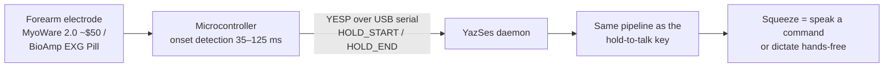
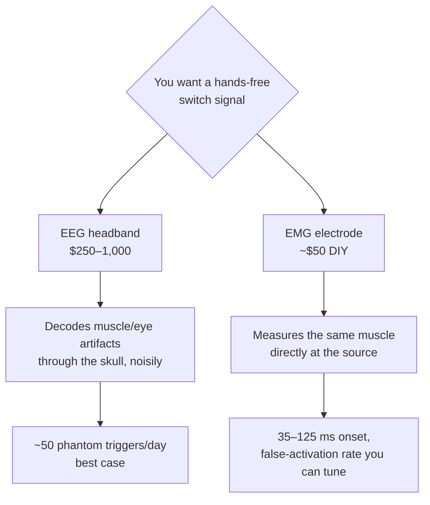
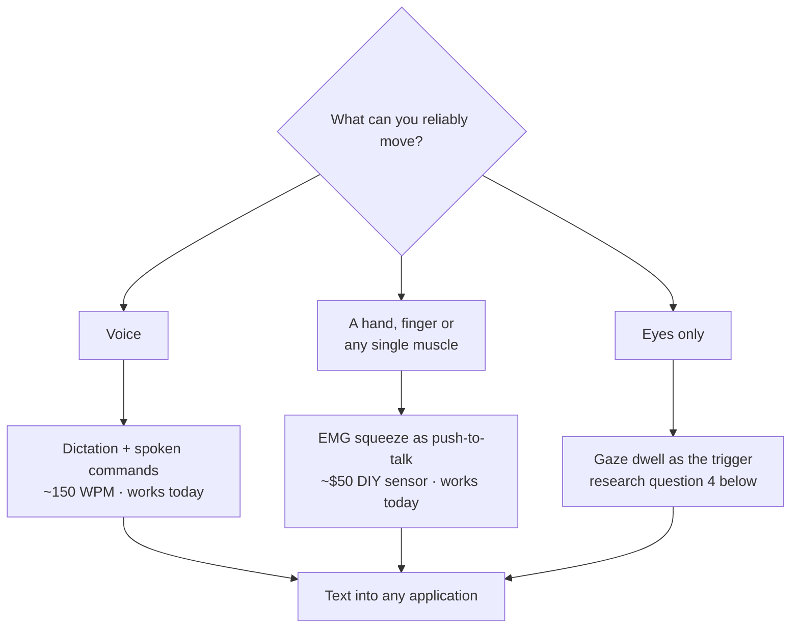

# Muscle & brain control: the honest hierarchy

*Updated 2026-08-07. Part of the [research series](index.md).*

!!! abstract "The short version"

    Consumer "mind control" is mostly muscle. The only reliable switches you
    can decode from a consumer EEG headset — blink, jaw clench — are **eye and
    muscle artifacts leaking into the EEG**, so the honest move is to put the
    electrode on the muscle, where the same signal is orders of magnitude
    cleaner and costs ~$50 instead of ~$1,000. And even the best muscle
    interface handwrites at **20.9 WPM** versus speech at ~150 — so the muscle
    should carry the *intent to speak*, not the words.

"Control your computer with your mind" is the most over-promised sentence in
consumer tech. This page is the measured version: what electromyography (EMG —
muscle electricity) and electroencephalography (EEG — scalp-recorded brain
electricity) can each *actually* deliver for controlling a computer in 2026,
and why YazSes bet on the muscle.

## The headline result nobody reads carefully

Meta's *Nature* 2025 paper on the sEMG wristband is a genuine landmark:
**calibration-free gesture decoding across users** (>90% offline on held-out
participants, 9 gestures; ~20.9 words-per-minute handwriting) trained on
~11,000 people ([Kaifosh et al.](#ref-kaifosh)). The band shipped in September
2025 — but bundled with $799 display glasses, with a developer kit that
exposes **six fixed gestures, no raw EMG, and no Linux**
([Meta dev FAQ](#ref-metafaq)). The released datasets and checkpoints are
non-commercial ([repository](#ref-metarepo)).

Read the numbers again, though: **20.9 WPM**. Speech dictates at ~150 WPM
([Ruan et al.](#ref-ruan)). The scientific conclusion for a dictation product
is not "EMG will replace typing" — it is:

> **EMG's job is the *trigger*, not the text.** The voice carries the
> bandwidth; the muscle carries the intent to speak.

That's a push-to-talk switch that works with your hands full, under a desk,
or when a motor impairment makes holding a key difficult. And a trigger
has beautifully forgiving requirements: squeeze-onset detection lands at
**35–125 ms** with classical threshold/TKEO methods ([Liu et al.](#ref-onset)) —
faster than human reaction time. Even continuous grip *force* regresses at
r≈0.97 ([Rahimi et al.](#ref-grip)), which is why "light squeeze = talk, hard
squeeze = command" is on our roadmap.

YazSes speaks this protocol today (`[emg] device_port`); the sensors are
open-hardware DIY parts (SparkFun's MyoWare 2.0 muscle sensor at ~$50; the
CERN-OHL-licensed BioAmp EXG Pill), and the canonical Python stacks for fancier
hardware are [LibEMG](https://libemg.github.io/libemg/) and MIT-licensed
[BrainFlow](https://brainflow.org/) — both offline, both Linux-native.

## Why EEG loses this contest (for now)

Consumer EEG headsets (Muse, Neurosity Crown, OpenBCI) record real brain
signals. The question is what's *decodable* as a reliable command:

| Signal | Best measured performance | Fatal problem for daily control |
|---|---|---|
| Blink (EOG artifact) | 99.5% accuracy, 1.3 s response, **0.10 false positives/min** ([Li et al.](#ref-eogswitch)) | 0.10 FP/min ≈ **~50 phantom activations per workday** |
| Jaw clench (EMG artifact on EEG) | ~90%, sub-second possible | Confounded by chewing — and by **talking**, fatal in a dictation tool |
| SSVEP (flicker-evoked) | **>12 bits/min** online with a 14-channel consumer headset ([Lin et al.](#ref-ssvep)); far higher only on wet-electrode lab rigs ([Chen et al.](#ref-chen)) | Needs occipital electrodes no headband has, plus permanently flashing on-screen stimuli |
| P300 | 20–70 bits/min | Flashing grids + per-session calibration |
| Motor imagery ("think left hand") | 70–85% *binary* after 3–10 training sessions | **BCI "inefficiency" — some users never produce usable patterns at all — is a known, unsolved problem** ([Tibrewal et al.](#ref-mi)); nobody accepts a talk key that simply never works for part of its audience |

Note the pattern: the only *reliable* "EEG" switches — blink, jaw clench —
are not brain signals at all. They are **muscle and eye artifacts** leaking
into the EEG. At which point the honest engineering move is to put a proper
electrode *on the muscle*, where the same signal is orders of magnitude
cleaner:

Worth noting what *does* fix the false-positive problem in the EEG literature:
switching signal entirely. A breath-hold switch read from respiration-modulated
photoplethysmography reached **0.02 false operations/min**, five times better
than the blink switch ([Han et al.](#ref-ppg)). The lesson generalises — pick
the physiological channel where your intended action is loudest, rather than
trying to filter it out of a noisier one.

This is the reasoning recorded in ADR-v2-129: **consumer-EEG triggers are
rejected** — not because BCIs aren't coming, but because in 2026 a dedicated
EMG channel strictly dominates on signal-to-noise, latency, and false
activations. (For completeness: invasive BCIs are a different world entirely,
and none of this applies to them.)

One metric we can contribute back: Meta's *Nature* paper reports **no
false-activation rate** — the single number that decides whether a trigger is
livable. YazSes's encrypted learning corpus records every activation locally,
so an EMG user can *measure* their own FP rate without sending anything
anywhere. We'd love to publish community-collected numbers.

## The accessibility stakes

This isn't gadgeteering. The commercial assistive-tech landscape for people
who can't use a keyboard is brutal: eye-gaze AAC devices cost **$10,000–20,000**
and are Windows/iPad-locked (TD Pilot ~$10k on iPad, TD I-Series ~$20k on
Windows; [reporting on access barriers](#ref-kff)), consumer Dragon is
discontinued, and the Linux hands-free stack is a graveyard — eViacam
unmaintained since ~2019, Google's Project Gameface archived in 2025,
dwell-click broken under Wayland. A free, offline, maintained stack that
combines voice + gaze dwell + a cheap muscle switch has essentially **no living
competitor** on Linux. That is the long-term program these three research pages
add up to.

## Open questions

**[Discuss →](https://github.com/MSKazemi/yazses/discussions)**

1. **Measured false-activation rates.** If you run the EMG backend (or build
   the MyoWare/EXG-Pill rig), what FP/hour do you see across a real workday?
   This is the number the field doesn't publish — and the one that decides
   whether a trigger is livable.
2. **Graded squeeze semantics.** Is two force levels (talk / command) the
   right ceiling, or is a third ("verbatim mode"?) learnable without error?
   Grip-force regression says the signal is there; the human factors are
   unmeasured.
3. **Which buyable armband should we adapt next?** MindRove exposes raw
   8-channel EMG with an official Linux SDK; second-hand Myo works via
   `pyomyo`; Mudra Link exposes continuous pressure but lacks a Linux host.
   What do you actually own?
4. **Dwell-to-talk.** Gaze dwell on a screen zone as the mic trigger (the
   Look-to-Speak pattern) would close the loop for users who can neither
   press nor squeeze. What dwell time balances speed against the Midas-touch
   problem on a webcam-grade signal?

!!! tip "If you build the rig, we'll help"

    A MyoWare 2.0 or BioAmp EXG Pill plus any microcontroller that can speak
    the YESP serial protocol is enough to drive YazSes today
    (`[emg] device_port`). Post your build and your false-activation numbers in
    a Discussion — hardware reports are the contribution this page most needs.

## References

**Evidence grade**: *measured* (peer-reviewed measurement), *vendor* (claimed
by the maker), *secondary* (review or reporting).

1. Kaifosh, P., Reardon, T. R. et al. "A generic
   non-invasive neuromotor interface for human-computer interaction." *Nature*,
   2025. [doi:10.1038/s41586-025-09255-w](https://doi.org/10.1038/s41586-025-09255-w)
   — *measured* (20.9 WPM handwriting; >90% offline gesture decoding on
   held-out users; ~11,000 participants)
2. Meta. "Wearables developer FAQ" (sEMG wristband
   developer kit scope). [developers.meta.com](https://developers.meta.com/wearables/faq/) — *vendor*
3. Meta Research. `generic-neuromotor-interface`
   (datasets and checkpoints, non-commercial licence).
   [GitHub](https://github.com/facebookresearch/generic-neuromotor-interface) — *vendor*
4. Ruan, S., Wobbrock, J. O., Liou, K., Ng, A., Landay, J.
   "Comparing speech and keyboard text entry for short messages in two
   languages on touchscreen phones." *arXiv:1608.07323*, 2016.
   [arXiv](https://arxiv.org/abs/1608.07323) — *measured* (153 WPM speech)
5. Liu, J., Ying, D., Rymer, W. Z., Zhou, P. "Robust
   muscle activity onset detection using an unsupervised electromyogram
   learning framework." *PLOS ONE*, 2015.
   [doi:10.1371/journal.pone.0127990](https://doi.org/10.1371/journal.pone.0127990) — *measured*
6. Rahimi, F. et al. "Simultaneous control of human hand
   joint positions and grip force via HD-EMG and deep learning."
   *arXiv:2410.23986*, 2024. [arXiv](https://arxiv.org/abs/2410.23986) — *measured*
7. Li, Y., He, S., Huang, Q., Gu, Z., Yu, Z. L. "A
   EOG-based switch and its application for start/stop control of a
   wheelchair." *Neurocomputing* 275, 2018.
   [doi:10.1016/j.neucom.2017.09.085](https://doi.org/10.1016/j.neucom.2017.09.085)
   — *measured* (99.5% accuracy, 1.3 s, 0.10 false positives/min)
8. Han, C.-H. et al. "Development of a brain-computer
   interface toggle switch with low false-positive rate using
   respiration-modulated photoplethysmography." *Sensors* 20(2), 2020.
   [PMC7013717](https://pmc.ncbi.nlm.nih.gov/articles/PMC7013717/) — *measured*
   (0.02 false operations/min)
9. Lin, Y.-P., Wang, Y., Jung, T.-P. "Assessing the
   feasibility of online SSVEP decoding in human walking using a consumer EEG
   headset." *Journal of NeuroEngineering and Rehabilitation* 11:119, 2014.
   [doi:10.1186/1743-0003-11-119](https://doi.org/10.1186/1743-0003-11-119) — *measured*
   (ITR above 12 bits/min)
10. Chen, X., Wang, Y., Nakanishi, M., Gao, X., Jung, T.-P.,
    Gao, S. "High-speed spelling with a noninvasive brain-computer interface."
    *PNAS* 112(44), 2015.
    [doi:10.1073/pnas.1508080112](https://doi.org/10.1073/pnas.1508080112) — *measured*
    (wet-electrode laboratory rig)
11. Tibrewal, N., Leeuwis, N., Alimardani, M.
    "Classification of motor imagery EEG using deep learning increases
    performance in inefficient BCI users." *PLOS ONE*, 2022.
    [doi:10.1371/journal.pone.0268880](https://doi.org/10.1371/journal.pone.0268880) — *measured*
12. KFF Health News. Reporting on access barriers to ALS
    communication tools.
    [kffhealthnews.org](https://kffhealthnews.org/news/medicare-changes-could-limit-patient-access-to-als-communication-tools/) — *secondary*

*See also: [eye control](eye-control.md) for the gaze half of the hands-free
stack, the [accessibility use-case guide](../use-cases/accessibility-rsi-hands-free.md),
and the [research index](index.md) for how these channels compare on bandwidth.*
