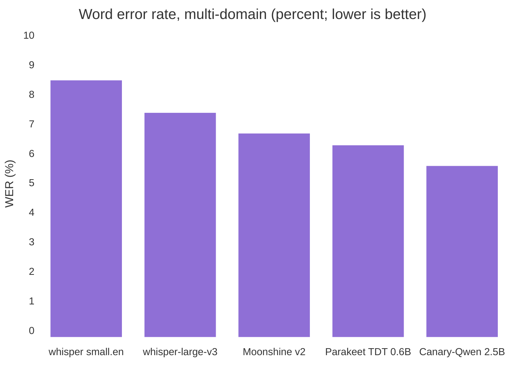
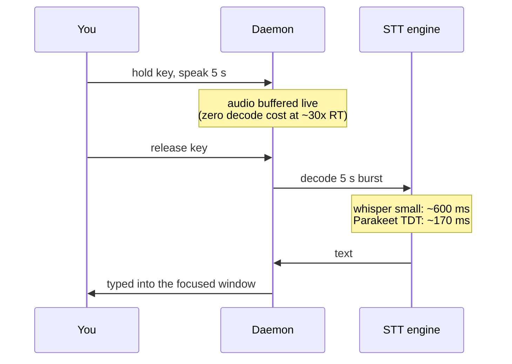
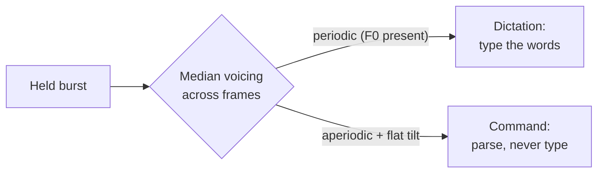

# Voice control: the year local speech passed the cloud

*Updated 2026-08-07. Part of the [research series](index.md).*

!!! abstract "The short version"

    Speech is the fastest way a person can put text into a computer —
    **153 WPM spoken vs 52 WPM typed** in a head-to-head lab study
    ([Ruan et al.](#ref-ruan)). As of 2026 the best accuracy-per-CPU-cycle
    model runs **on your laptop**, not in a datacenter, and a 5-second burst
    decodes in about 170 ms. The remaining hard problem is not accuracy — it
    is *modes*: telling "write this down" apart from "delete that".

For a decade the deal was: accurate speech recognition lives in a datacenter.
That deal quietly expired. The measurements below are why a fully-offline
dictation daemon is no longer a compromise — and where the remaining hard
problems actually are.

## Accuracy: the 2026 leaderboard, CPU edition

Word-error rates (WER) on multi-domain evaluations, with the constraint that
matters here — **runs on a laptop CPU**:

*Bars use the midpoint where a source reports a range; the table below gives
the range, the CPU speed, and the licence — which is usually the number that
decides whether you can actually ship it.*

| Engine | Avg WER | CPU speed | License | Notes |
|---|---|---|---|---|
| whisper small.en (common baseline) | ~8–9% | ~8× realtime | MIT | What most offline tools ship |
| whisper-large-v3 | ~7.4% | heavy on CPU | MIT | The old "cloud-quality" reference |
| **Parakeet TDT 0.6B** | **~6.3%** — beats large-v3 ([NVIDIA](#ref-parakeet), [independent CPU benchmark](#ref-snailtext)) | **~30× realtime** | CC-BY-4.0 | No hallucinated text on silence |
| Moonshine v2 medium-stream | ~6.7% ([Kudlur et al.](#ref-moonshine)) | edge-CPU, 258 ms latency | MIT (En) | True streaming encoder |
| Canary-Qwen 2.5B | ~5.6% | server-class | CC-BY-4.0 | Out of CPU reach |

The headline: **a 0.6B model now beats the 1.5B flagship at a quarter of the
compute** — the transducer (TDT) architecture, not scale, did it. A pleasant
side effect: transducers emit nothing on silence, so the whole class of
`[BLANK_AUDIO]` / "thanks for watching" hallucinations Whisper produces on
quiet audio ([survey](#ref-northflank)) disappears at the source. This is why
`yazses features enable stt-parakeet` exists — and why it lazy-installs its
runtime so pure-Whisper users carry zero extra weight.

## Latency: the physics of "feels instant"

The commercial bar is explicit: Aqua Voice starts capturing in <50 ms and
lands text in 450 ms–1 s; cloud tools like Wispr Flow take 1–3 s for the
round-trip ([comparison](#ref-voibe)). Users call the first "instant" and the
second "fine". Offline tools that wait 2–5 s after speech get abandoned — it is
a top complaint in reviews of the most popular open-source tool
([review](#ref-handy)).

For hold-to-talk, the whole latency story is one number — decode time after
key release:

At ~30× realtime, batch decode of a 5-second burst is ~170 ms — inside the
"instant" budget *without any streaming machinery*. Streaming still matters
for long-form dictation preview; the state of the art there is Moonshine v2's
cached streaming encoder (148–258 ms measured, with its streaming mode
reported as *more* accurate than its own batch mode —
[Kudlur et al.](#ref-moonshine)).

## The whisper channel: one microphone, two modes

A dictation tool has a mode problem: the same audio channel must carry *text*
("write this down") and *commands* ("delete that"). Keyboards solve it with a
second key. But there is a purely acoustic solution hiding in phonetics:

**Whispered speech has no fundamental frequency.** Voiced speech is driven by
vocal-fold vibration (an F0 around 80–300 Hz plus harmonics); whispering
replaces that periodic source with turbulent airflow — aperiodic, flatter
spectrum. Detecting the difference needs no ML at all: an autocorrelation
voicing check plus spectral tilt, in numpy, per frame.

The interaction design is **DualVoice** (Rekimoto, UIST 2022): whisper =
command channel, normal voice = literal text, on a plain microphone
([Rekimoto](#ref-dualvoice)). It was a research prototype that never shipped in
a product; YazSes now ships it as the sotto-voce channel
(`[whispermode] command_channel`). Two honest caveats from the literature: STT
accuracy *on* whispered speech is markedly worse than on voiced speech (~18.8%
WER off-the-shelf vs 2–6%; per-user fine-tuning closes it to <1% —
[Farhadipour et al.](#ref-whisperedasr)), which is tolerable because command
phrases are short and grammar-matched; and a median vote across the burst is
needed so one breathy word can't flip a sentence.

## Personalization: what actually moves WER

Ranked by measured return-on-effort for a personal dictation tool:

1. **Decode-time phrase boosting** — rescoring the decoder toward your
   vocabulary, up to ~20k phrases with no retraining and no speed penalty on
   transducer models ([Andrusenko et al., TurboBias](#ref-turbobias)).
   Strictly stronger than Whisper's `initial_prompt`, which is capped at 224
   tokens, only reliably affects the first 30-second window, and raises
   hallucination risk with dense term lists
   ([OpenAI's own guide](#ref-openai-prompt), [Jogi et al.](#ref-rareword)).
2. **Corpus-mined vocabulary** — what `yazses tune` already proposes from the
   encrypted local learning corpus, with no data leaving the machine.
3. **LoRA fine-tuning** — real gains (−2.2 WER multilingual; dramatic for
   atypical speech with ~1.4 h of data — [Diabolocom](#ref-diabolocom))
   but needs a consumer GPU; CPU-only training remains impractical in 2026.

The ordering matters for accessibility: option 3 is the one that helps
dysfluent and atypical speakers most, and it is the one gated behind hardware
most of them don't have. Making option 1 work on a CPU transducer is therefore
an accessibility problem disguised as an engineering problem.

## Open questions

**[Discuss →](https://github.com/MSKazemi/yazses/discussions)** ·
**[Benchmark harness issue →](https://github.com/MSKazemi/yazses/issues/72)**

1. **Whisper-detection thresholds across voices.** Our voicing/tilt gate ships
   with literature-derived defaults. How do they hold up across quiet talkers,
   breathy voices, tonal languages, and cheap microphones? A false
   "whispered" verdict silently eats a sentence — what's the measured false
   positive rate in the wild?
2. **Phrase boosting on ONNX transducers.** TurboBias lives in NeMo; the
   lightweight `onnx-asr` path has no boosting hook yet. What is the cheapest
   faithful reimplementation — and does edit-distance post-correction get 80%
   of the win for 5% of the work ([Lall & Tan](#ref-contextual))?
3. **Latency benchmarking as a feature.** No offline tool publishes measured
   release-to-text times per model and CPU. What would a fair, reproducible
   `yazses bench` protocol look like?
4. **Code-switching.** Stock Whisper cannot mix two languages in one utterance
   ("one language per 30 s window"); adapter-based approaches reach ~14% mixed
   error rate but need per-pair training. Which language pairs matter most to
   real dictation users?

!!! tip "The cheapest useful contribution"

    Run `yazses doctor` and time a fixed sentence on your own CPU with two
    engines. Three numbers — CPU model, engine, release-to-text milliseconds —
    posted in a Discussion are more than any offline dictation project
    currently publishes.

## References

**Evidence grade**: *measured* (peer-reviewed measurement), *vendor* (claimed
by the maker), *secondary* (review or benchmark write-up).

1. Ruan, S., Wobbrock, J. O., Liou, K., Ng, A., Landay, J.
   "Comparing speech and keyboard text entry for short messages in two
   languages on touchscreen phones." *arXiv:1608.07323*, 2016.
   [arXiv](https://arxiv.org/abs/1608.07323) — *measured* (153 vs 52 WPM, English)
2. Radford, A., Kim, J. W., Xu, T., Brockman, G.,
   McLeavey, C., Sutskever, I. "Robust speech recognition via large-scale weak
   supervision." *arXiv:2212.04356*, 2022.
   [arXiv](https://arxiv.org/abs/2212.04356) — *measured*
3. NVIDIA. "Parakeet TDT 0.6B" model card.
   [Hugging Face](https://huggingface.co/nvidia/parakeet-tdt-0.6b-v3) — *vendor*
4. Independent CPU benchmark: Whisper vs Parakeet TDT.
   [snailtext.app](https://snailtext.app/blog/whisper-vs-parakeet-tdt/) — *secondary*
5. Kudlur, M. et al. "Moonshine v2: ergodic streaming
   encoder ASR for latency-critical speech applications." *arXiv:2602.12241*, 2026.
   [arXiv](https://arxiv.org/abs/2602.12241) — *measured*
6. "Best open-source speech-to-text models in 2026:
   benchmarks." Northflank.
   [northflank.com](https://northflank.com/blog/best-open-source-speech-to-text-stt-model-in-2026-benchmarks) — *secondary*
7. "Aqua Voice vs Wispr Flow" latency comparison.
   [getvoibe.com](https://www.getvoibe.com/resources/aqua-voice-vs-wispr-flow/) — *secondary*
8. Handy (open-source dictation) user review.
   [getvoibe.com](https://www.getvoibe.com/resources/handy-review/) — *secondary*
9. Rekimoto, J. "DualVoice: speech interaction that
   discriminates between normal and whispered voice input." *UIST '22*, 2022.
   [doi:10.1145/3526113.3545685](https://doi.org/10.1145/3526113.3545685) — *measured*
10. Farhadipour, A. et al. "Leveraging
    self-supervised models for automatic whispered speech recognition."
    *arXiv:2407.21211*, 2024. [arXiv](https://arxiv.org/abs/2407.21211) — *measured*
11. Andrusenko, A. et al. "TurboBias: universal ASR
    context-biasing powered by GPU-accelerated phrase-boosting tree."
    *arXiv:2508.07014*, 2025. [arXiv](https://arxiv.org/abs/2508.07014) — *measured*
12. OpenAI. "Whisper prompting guide."
    [cookbook.openai.com](https://cookbook.openai.com/examples/whisper_prompting_guide) — *vendor*
13. Jogi, Y. et al. "Improving rare-word recognition of
    Whisper in zero-shot settings." *arXiv:2502.11572*, 2025.
    [arXiv](https://arxiv.org/abs/2502.11572) — *measured*
14. Lall, V., Liu, Y. "Contextual biasing to improve
    domain-specific custom vocabulary audio transcription without explicit
    fine-tuning." *arXiv:2410.18363*, 2024.
    [arXiv](https://arxiv.org/abs/2410.18363) — *measured*
15. Diabolocom Research. "Fine-tuning ASR: focus on
    Whisper."
    [diabolocom.com](https://www.diabolocom.com/research/fine-tuning-asr-focus-on-whisper/) — *secondary*

*See also: [voice commands in practice](../use-cases/voice-commands.md),
[eye control](eye-control.md) for how gaze resolves "this" in a spoken command,
and the [research index](index.md) for how speech compares to every other input
channel.*
