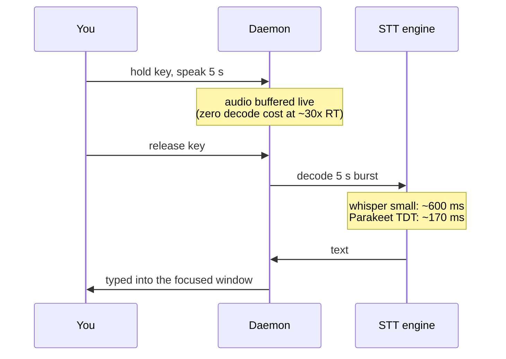
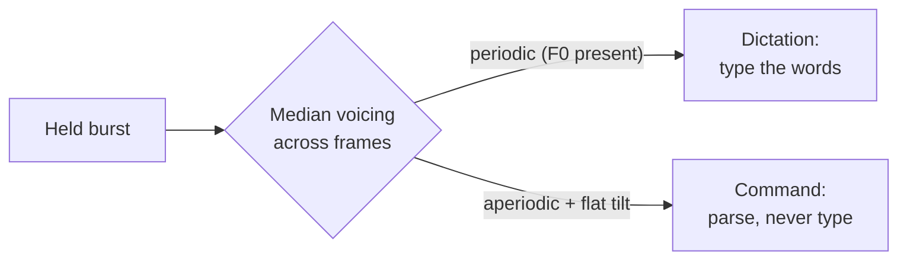

# Voice control: the year local speech passed the cloud

*Updated 2026-08-07. Part of the [research series](index.md).*

For a decade the deal was: accurate speech recognition lives in a datacenter.
That deal quietly expired. The measurements below are why a fully-offline
dictation daemon is no longer a compromise — and where the remaining hard
problems actually are.

## Accuracy: the 2026 leaderboard, CPU edition

Word-error rates (WER) on the multi-domain Open-ASR-style evaluations, with
the constraint that matters here — **runs on a laptop CPU**:

| Engine | Avg WER | CPU speed | License | Notes |
|---|---|---|---|---|
| whisper small.en (common baseline) | ~8–9% | ~8× realtime | MIT | What most offline tools ship |
| whisper-large-v3 | ~7.4% | heavy on CPU | MIT | The old "cloud-quality" reference |
| **Parakeet TDT 0.6B v2** | **~6.3%** — beats large-v3 ([NVIDIA model card](https://huggingface.co/nvidia/parakeet-tdt-0.6b-v3), [independent CPU benchmark](https://snailtext.app/blog/whisper-vs-parakeet-tdt/)) | **~30× realtime** | CC-BY-4.0 | No hallucinated text on silence |
| Moonshine v2 medium-stream | ~6.7% ([paper](https://arxiv.org/pdf/2602.12241)) | edge-CPU, 258 ms latency | MIT (En) | True streaming encoder |
| Canary-Qwen 2.5B | ~5.6% | server-class | CC-BY-4.0 | Out of CPU reach |

The headline: **a 0.6B model now beats the 1.5B flagship at a quarter of the
compute** — the transducer (TDT) architecture, not scale, did it. A pleasant
side effect: transducers emit nothing on silence, so the whole class of
`[BLANK_AUDIO]` / "thanks for watching" hallucinations Whisper produces on
quiet audio ([survey](https://northflank.com/blog/best-open-source-speech-to-text-stt-model-in-2026-benchmarks))
disappears at the source. This is why `yazses features enable stt-parakeet`
exists — and why it lazy-installs its runtime so pure-Whisper users carry
zero extra weight.

## Latency: the physics of "feels instant"

The commercial bar is explicit: Aqua Voice starts capturing in <50 ms and
lands text in 450 ms–1 s; cloud tools like Wispr Flow take 1–3 s for the
round-trip ([comparison](https://www.getvoibe.com/resources/aqua-voice-vs-wispr-flow/)).
Users call the first "instant" and the second "fine". Offline tools that wait
2–5 s after speech get abandoned — it is a top complaint in reviews of the
most popular open-source tool ([Handy review](https://www.getvoibe.com/resources/handy-review/)).

For hold-to-talk, the whole latency story is one number — decode time after
key release:

At ~30× realtime, batch decode of a 5-second burst is ~170 ms — inside the
"instant" budget *without any streaming machinery*. Streaming still matters
for long-form dictation preview; the state of the art there is Moonshine v2's
cached streaming encoder (148–258 ms measured, and its streaming mode is
*more* accurate than its own batch mode — [paper](https://arxiv.org/pdf/2602.12241)).

## The whisper channel: one microphone, two modes

A dictation tool has a mode problem: the same audio channel must carry *text*
("write this down") and *commands* ("delete that"). Keyboards solve it with a
second key. But there is a purely acoustic solution hiding in phonetics:

**Whispered speech has no fundamental frequency.** Voiced speech is driven by
vocal-fold vibration (an F0 around 80–300 Hz plus harmonics); whispering
replaces that periodic source with turbulent airflow — aperiodic, flatter
spectrum. Detecting the difference needs no ML at all: an autocorrelation
voicing check plus spectral tilt, in numpy, per frame.

The interaction design is **DualVoice** (Rekimoto, UIST 2022): whisper =
command channel, normal voice = literal text, on a plain microphone
([project](https://lab.rekimoto.org/projects/dualvoice/)). It was a research
prototype that never shipped in a product; YazSes now ships it as the
sotto-voce channel (`[whispermode] command_channel`). Two honest caveats from
the literature: STT accuracy *on* whispered speech is markedly worse than
voiced (~18.8% WER off-the-shelf vs 2–6%; per-user fine-tuning closes it to
<1% — [arXiv:2407.21211](https://arxiv.org/html/2407.21211v1)), which is
tolerable because command phrases are short and grammar-matched; and a median
vote across the burst is needed so one breathy word can't flip a sentence.

## Personalization: what actually moves WER

Ranked by measured return-on-effort for a personal dictation tool:

1. **Decode-time phrase boosting** — rescoring the decoder toward your
   vocabulary, up to ~20k phrases with no retraining and no speed penalty on
   transducer models ([NVIDIA TurboBias](https://arxiv.org/abs/2508.07014)).
   Strictly stronger than Whisper's `initial_prompt`, which is capped at 224
   tokens, only reliably affects the first 30-second window, and raises
   hallucination risk with dense term lists
   ([OpenAI's own guide](https://cookbook.openai.com/examples/whisper_prompting_guide),
   [rare-word study](https://arxiv.org/html/2502.11572v1)).
2. **Corpus-mined vocabulary** — what `yazses tune` already proposes from the
   encrypted local learning corpus.
3. **LoRA fine-tuning** — real gains (−2.2 WER multilingual; dramatic for
   atypical speech with ~1.4 h of data —
   [Diabolocom research](https://www.diabolocom.com/research/fine-tuning-asr-focus-on-whisper/))
   but needs a consumer GPU; CPU-only training remains impractical in 2026.

## Open questions

**[Discuss →](https://github.com/MSKazemi/yazses/discussions)**

1. **Whisper-detection thresholds across voices.** Our voicing/tilt gate ships
   with literature-derived defaults. How do they hold up across quiet talkers,
   breathy voices, tonal languages, and cheap microphones? A false
   "whispered" verdict silently eats a sentence — what's the measured false
   positive rate in the wild?
2. **Phrase boosting on ONNX transducers.** TurboBias lives in NeMo; the
   lightweight `onnx-asr` path has no boosting hook yet. What is the cheapest
   faithful reimplementation — and does edit-distance post-correction get 80%
   of the win for 5% of the work ([evidence](https://arxiv.org/pdf/2410.18363))?
3. **Latency benchmarking as a feature.** No offline tool publishes measured
   release-to-text times per model/CPU. What would a fair, reproducible
   `yazses bench` protocol look like?
4. **Code-switching.** Stock Whisper cannot mix two languages in one utterance
   ("one language per 30 s window"); adapter-based approaches reach ~14% mixed
   error rate but need per-pair training. Which language pairs matter most to
   real dictation users?

*See also: [voice commands in practice](../use-cases/voice-commands.md) and
[eye control](eye-control.md) for how gaze resolves "this" in a spoken command.*
