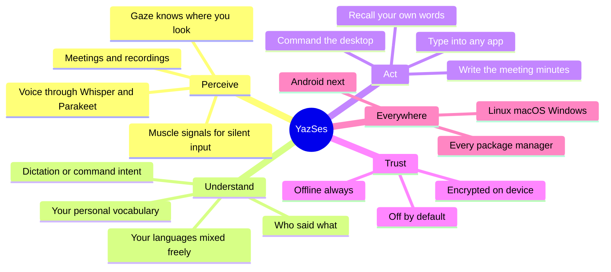
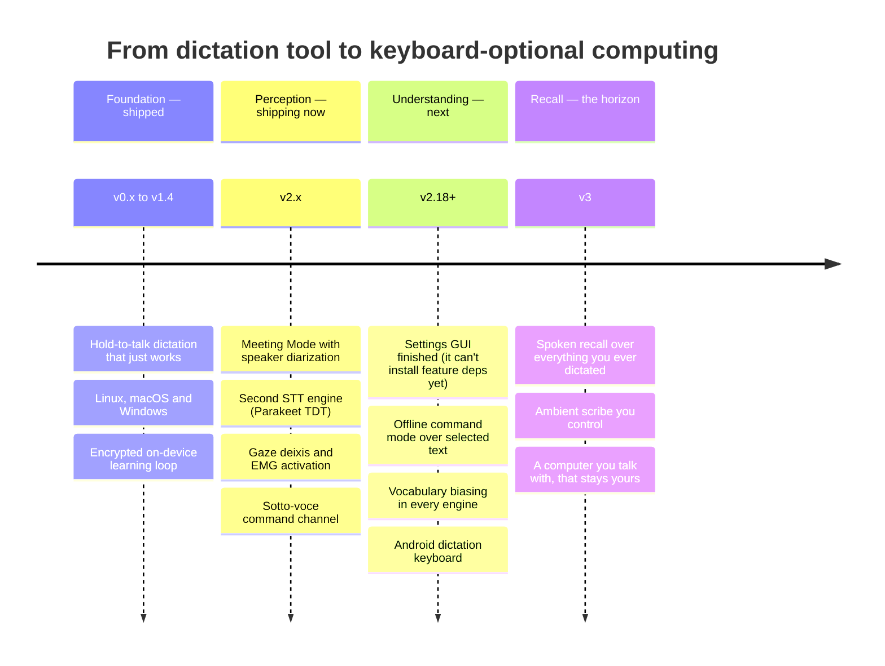

# Roadmap

YazSes is a fully-offline, hold-to-talk voice dictation daemon for Linux,
macOS, and Windows — no cloud, no account, nothing leaves your machine.
**The current stable release is v2.29.0**, published on PyPI, GitHub
Releases, Snap, and the APT repository.

This page is two things at once: an honest status report, and a statement of
where we are going. If you only read one thing, read the pictures.

## The destination

The keyboard is a 150-year-old constraint, not a law of nature. YazSes exists
to make it **optional** — to become the private layer between you and your
computer that *hears* you, *understands* you, and *acts* for you, entirely on
your own hardware. Not a cloud assistant that rents you access to your own
words: an instrument you own, that gets better the more it learns about you,
and that never tells anyone what it learned.

The finished shape has three faculties, wrapped in two promises:



## The eras

Each era is a promise kept before the next one starts. Foundation is shipped.
Perception is shipping now. Understanding is the active frontier. Recall is
the reason the project exists.




*(solid = shipped · bold = in progress · dashed = ahead)*

## Working milestones — where you can join

Every open issue belongs to exactly one milestone, and every milestone is an
outcome, not a bucket. Pick the one that sounds like you:

| Milestone | The promise | Flavour |
|---|---|---|
| [Settings GUI — click, not config](https://github.com/MSKazemi/yazses/milestone/5) | Configure everything from a window and a tray icon | Desktop / Python / Qt |
| [Install anywhere](https://github.com/MSKazemi/yazses/milestone/6) | One command on every distro and OS — you own a channel | Packaging |
| [Hear better — speech intelligence](https://github.com/MSKazemi/yazses/milestone/7) | Accuracy measured, not asserted: benchmarks, denoising, new engines | Speech / ML |
| [Voice control — beyond dictation](https://github.com/MSKazemi/yazses/milestone/8) | Git, files, windows, and symbols — commanded, not typed | Systems / HCI |
| [Welcome mat](https://github.com/MSKazemi/yazses/milestone/9) | The first hour is easy, the first contribution is likely | Docs / testing / no-code |
| [M0–M3 — Android](https://github.com/MSKazemi/yazses/milestones) | An offline dictation keyboard in your pocket, designed in the open | Mobile / Kotlin |

Start at the [pinned contributor guide](https://github.com/MSKazemi/yazses/issues/22),
or — for research-shaped work — at
[Students, researchers & industry](research/get-involved.md).

## Three principles that never move

- **Offline first.** Transcription runs on your CPU. No telemetry, no network
  dependency for dictation, ever. The one designed cloud-escalation path stays
  deliberately unbuilt so this promise is never quietly weakened.
- **Off by default.** The stable dictation path is small and predictable. The
  large catalogue of capabilities is opt-in: `yazses features enable <name>`,
  then `yazses restart`. An upgrade never changes behaviour you didn't ask for.
- **Honest about what exists.** `yazses features` distinguishes what is wired
  and working from what is designed-but-planned, and refuses to pretend
  otherwise. This roadmap follows the same rule.

## Shipped

| Version | Date | Headline |
|---|---|---|
| **v0.1.x** | — | Linux-only foundation: hold-to-talk hotkey, text injection, systemd lifecycle, offline `faster-whisper` transcription. |
| **v0.2.0** | 2026-05-08 | Cross-platform: macOS and Windows support, tray icon, and installers for all three platforms (`.dmg`, `.exe`, `.deb`). |
| **v0.3.0** | 2026-05-15 | SSH/remote voice forwarding, streaming transcription, voice command grammar, offline disfluency filter, accessibility enrollment wizard. |
| **v0.4.x** | 2026-05-17 | Offline small-language-model intent routing, editor (LSP) context injection, EMG/BLE silent-speech input, and a GGUF model manager. |
| **v0.5.x** | 2026-05-29 | Opt-in, local, **encrypted** self-improvement loop (`yazses tune` / `mark-wrong` / `corpus`) plus the voice-activity overlay. All off by default. |
| **v0.6.0** | 2026-06-19 | Prosody Ink (pauses → paragraphs, emphasis → bold), endpoint pre-warm, and re-record ("Punch-In") wiring. |
| **v0.7.0** | 2026-06-19 | Held-out validation for the learning loop — every tuning proposal is checked against data it wasn't derived from. |
| **v0.8.0** | 2026-06-19 | Dysfluency-Friendly Mode — an opt-in pass that cleans stuttered/dysarthric speech out of the final text. |
| **v0.9.0** | 2026-06-19 | CLI quality of life: `yazses update`, a friendlier help system, Tab completion. |
| **v1.0.0** | 2026-06-19 | First stable release of the Python app: fully-offline dictation for Linux/macOS/Windows with a deep, off-by-default feature set. |
| **v1.1.0** | 2026-06-19 | Enriched `yazses doctor` (version, daemon status, model, config summary, `--mic` check) and reliable spoken-name recognition. |
| **v1.2.0** | 2026-06-20 | CLI usability without hand-editing TOML: `yazses features` / `vocab` / `hotkey`, a dedicated command key, and no more duplicate daemons. |
| **v1.3.0** | 2026-06-23 | Voice-activity overlay on by default (PySide6 promoted to a base dependency). |
| **v1.3.x** | 2026-07-01 | Wayland injection reliability: type-everywhere via ydotool, a flood guard for Ubuntu 26+ compositors, and longer maximum recordings. |
| **v1.4.x** | 2026-07-01 | Opt-in voice punctuation, a selectable injection backend, and cross-platform CI green again. |
| **v2.12.0** | 2026-07-31 | **First stable v2**: Meeting Mode (hands-free capture → speaker-labelled transcript + minutes), offline recording import with diarization (`yazses transcribe`), Glance-Type on X11, mic-change guard, system tray, "no text target" guard. |
| **v2.12.1** | 2026-08-06 | Bug-fix release: four defects in the "enabled but doing nothing" class — a leaked transcription thread burning CPU indefinitely, and three features that reported themselves as working while silently doing nothing (or pointing users at an install that could not help). |
| **v2.13.0** | 2026-08-07 | The reliability release: config self-repair, `yazses autostart enable` for pipx/uv installs, self-retuning VAD gate, supervised tray, `yazses verify` end-to-end proof. |
| **v2.14.0** | 2026-08-07 | The perception release: **Parakeet TDT** second STT engine, gaze deixis with real confidence, sotto-voce command channel, EMG activation seam, honest feature registry. |
| **v2.15.0** | 2026-08-07 | The honesty release: dictation stops deleting real words (contract 1.1.0 → 4.0.0), `doctor` stops giving snap users advice that cannot work, `install.sh` pins and checksums its bootstrap, property-based fuzz tests over the text pipeline. First release to ship all three desktop installers (`.deb`, `.dmg`, `.exe`). |
| **v2.15.1** | 2026-08-07 | Patch: dictation stops deleting the verb `err` (contract 4.0.0 → 5.0.0), and the mypy gate goes 73 errors → 0, surfacing a latent `yazses update` crash. |
| **v2.16.0** | 2026-08-09 | The snap becomes whole: it now **bundles** the libraries a snap can never install at runtime, so Meeting Mode, diarized import and Read-Back work there for the first time — and the four that cannot fit refuse honestly instead of writing a config key nothing can honour. Also `yazses settings` (a GUI built from the feature registry), `man yazses`, a real `[stt] language`, and a contract that pins **meaning**, not only parity (5.1.0). |
| **v2.17.0** | 2026-08-09 | What the snap release surfaced within a day of real use: streaming dictation could **delete text it had never typed** (a fixed injector timeout that fired mid-type, and a commit racing the partial-poll thread), a fresh snap install never mentioned the `raw-input` interface its hotkey needs, and `yazses start` never actually survived a reboot. Plus Style-Consistency Enforcer, `yazses gitvoice`, whole-graph Diagrams-as-Code, a tray Settings entry, and five default filler words removed after they were shown to eat real meaning (contract 6.0.0). |
| **v2.18.0** | 2026-08-13 | Qt becomes the `desktop` extra, so a headless install is **~650 MB lighter** — PySide6 was 59% of a 1.1 GB install and existed for two features a server can never display. Plus `[stt] chinese_script`, the Russian and Simplified Chinese READMEs, Indic heading anchors that stopped dropping every vowel, and the removal of the DCO gate that browser contributors could not clear. |
| **v2.18.1** | 2026-08-13 | The backends config had offered but no build could run (#70, #71): resemblyzer and pyannote adapters ship, each behind its own extra. pyannote 4.x's **default-on OpenTelemetry** — which reports the duration of the audio being diarized — is disabled before import. LLM cleanup can no longer POST transcribed text to an arbitrary host. Eleven Windows platform defects, including a liveness probe that *terminated* the daemon. |
| **v2.18.2** | 2026-08-13 | Patch: cutting a release could not publish to PyPI. The manifest gate ran at the new tag and demanded manifests describing assets that did not exist yet, so 2.18.1 never reached PyPI at all. |
| **v2.19.0** | 2026-08-14 | The tray can answer the questions you ask it: **About**, **Help ▸** and **Check for updates…** on Linux, macOS and Windows. Three shipped commands (`gitvoice`, `fileopen`, `jump`) rejoin the CLI reference, now guarded against the live Click tree. Real AUR and Fedora packages, built and installed on clean containers; the Nix flake evaluates for the first time. |
| **v2.20.0** | 2026-08-14 | The Windows release that actually works, driven by live user reports: a firewall-blocked model download killed the daemon with a raw traceback (#310), every CLI command was unreachable because `YazSes.exe` shadowed its own `.cmd` shim through `PATHEXT`, and `assets/yazses.ico` had never existed — so every build shipped PyInstaller's default artwork behind a silent `else None`. Plus `yazses model download` for speech models, and Windows tray colours that finally match Linux. |
| **v2.21.0** | 2026-08-15 | Sixty-nine commits of things that were reported as working and were not: a CI job that could only ever be red, eleven tests skipped in every job, three packaging guards that passed by iterating an empty list, a CLI-reference guard that checked 58 names and ignored 50, a crashed daemon that stayed dead on Windows and macOS while the tray watched, and "Update installed" for upgrades that never happened. Plus a `DOWNLOAD` column in `yazses features`, the Command Safety Gate wired, check-digit validation on dictated numbers, a mic-level ring in the tray, and an Intel macOS build. **Current stable release.** |

## In `[Unreleased]` — since v2.24.0

Not yet in a tagged release, but on `main`:

- **Three guards that stop a confident mistake reaching its destination.** A dictated
  `rm -rf` waits for a spoken *confirm* (`cmdsafety`); a dictated card number that fails
  its own check digit waits too (`checkdigit`); both share one release word. Each is
  judged on how **rarely** it fires — a guard that stops a house number teaches you to
  dismiss it. This is the direction [ADR-021](https://github.com/MSKazemi/yazses/blob/main/design/adr/adr-021-invest-in-error-cost.md)
  picked to invest in, out of four scored candidates.
- **The tray says whether the microphone is hearing you**, not just whether the daemon is
  recording — a live level ring with the silence gate marked. Those two come apart exactly
  when it matters.
- **Earcons**: non-speech state cues, so the daemon is usable without watching the tray.
- **`yazses features` prices a capability before installing it.** Measured: the three
  speaker-voiceprint features pull 3.1 GB each, because `speechbrain` resolves to PyTorch
  and the NVIDIA CUDA stack on a CPU-only tool.
- **An Intel macOS build**, and `.dmg` filenames that name their architecture.
- **The engineering tier is on the docs site** — decision records, specifications and
  research notes, 242 pages that were previously reachable only by browsing GitHub.
- **Settings-window secondary text now meets WCAG AA** on every theme; it was a hardcoded
  grey failing on both light and dark.

## Future work

The items below are planned directions. We distinguish clearly between what is
**designed but deliberately not built yet** and what is **speculative**.

**Designed, but explicitly deferred:**

- **Cloud escalation for transcription.** Fully designed with strict
  guardrails — and **not implemented**, so the "nothing leaves your machine"
  default is never quietly weakened. Offline remains the only path.
  [ADR-019](https://github.com/MSKazemi/yazses/blob/main/design/adr/adr-019-egress-inventory-and-escalation.md)
  now generalises those guardrails to *any* future feature, enumerates every way data can
  leave today, and names three things that may never leave at all whatever the consent:
  voiceprint embeddings, the learning corpus, and anything captured from someone who did
  not consent — the operator can consent for themselves, not for the room.
- **Third-party plug-ins: declined, not deferred.**
  [ADR-018](https://github.com/MSKazemi/yazses/blob/main/design/adr/adr-018-feature-packs-and-the-plugin-question.md)
  records why — a plug-in would sit on the dictation hot path with the microphone, the
  transcript and the injector — and what would reverse it: a real isolation boundary.
- **Agent protocols.** YazSes as an **MCP server over stdio** is worth building, for two
  tools: transcription, and *asking a human a question out loud*. FastAPI and
  agent-to-agent are declined with reasons in
  [ADR-020](https://github.com/MSKazemi/yazses/blob/main/design/adr/adr-020-agent-protocols.md).
- **Personal speech adapters (LoRA).** On-device fine-tuning that adapts the
  model to your voice — including atypical speech (dysarthria, ALS,
  Parkinson's) — gated on a measured accuracy win on held-out data.
  Prompt-level personalization from your own corpus already ships.
- **Per-language model auto-switching** and **code-switch dictation.** The
  routing layers exist; the language-specific and code-switch models are the
  deferred part.

**Hardware- or model-gated (designed, waiting on the missing piece):**

- **Silent-speech input (sEMG).** The activation seam ships today; it comes
  alive when the wristband hardware is present.
- **Vision-based screen commanding.** Gaze targeting ships on X11; deeper
  pure-vision commanding depends on platform support that is not universal yet.

**Speculative / research directions:**

- Spoken recall — semantic retrieval (RAG) over your personal dictation
  corpus, fully offline. This is the Recall era's core bet.
- Deeper multi-step task chaining over long sessions.

When research directions ship, they follow the same rule as everything else:
off by default, opt-in, on-device.

## Known limitations

- **CPU transcription latency.** Whisper runs on your CPU (int8). First model
  load takes roughly 10–30 seconds, and larger models trade latency for
  accuracy. Choose a model to suit your machine.
- **English-tuned by default.** The default configuration targets English
  (`small.en` / `base.en`). Other languages work; per-language auto-switching
  and code-switch support are still in progress.
- **Desktop-only, today.** An **Android app is in design** — see
  [the mobile programme](mobile/index.md) for the architecture and how to help.
  iOS follows Android for a platform reason explained there.
- **Some capabilities need optional extras or hardware.** Diarization, gaze,
  EMG, neural denoise and others stay dormant until you install their extras
  and enable them.
- **Linux packaging caveat.** Install via the APT script or `pipx` for
  hold-to-talk dictation. The strictly-confined snap cannot read the keyboard
  device, so the snap only serves the offline file-transcription use case.

## Requesting features and reporting bugs

Feedback drives what gets built next. To report a bug or request a feature,
open a GitHub issue — or run:

```bash
yazses about
```

It prints the author, version, project links, and where to report issues.
`yazses doctor` also ends with a contact footer, so if you hit a problem you
always know where to go.
