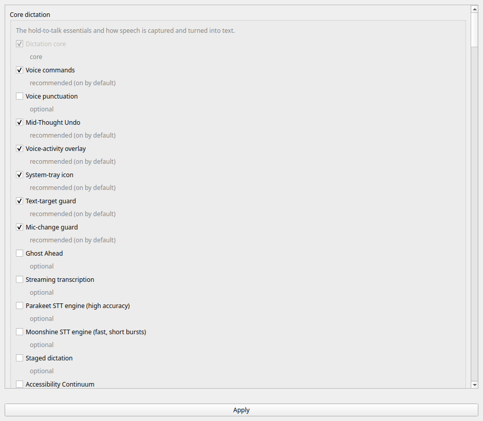

# The Settings window

Everything YazSes can do is a switch, and this is the switchboard. It writes the
same `config.toml` keys as `yazses features enable/disable`, so the window and the
CLI can never disagree about what is on.



## Opening it

Three ways, all the same window:

- **From your app grid** — search for *YazSes Settings*. A `.deb` or snap install
  puts it there; a `pipx` or `uv tool` install cannot write outside its own
  environment, so add it yourself once:

  ```bash
  yazses settings --install-launcher
  ```

  (`--uninstall-launcher` removes it again.)

- **From the tray** — click the "Y" badge → **Settings…**. Present on Linux, macOS
  and Windows.

- **From a terminal** — `yazses settings`.

It needs a graphical session but **not** a system tray. On a headless or SSH
machine use `yazses features` instead, which does the same job in text.

## Reading the window

Capabilities are grouped the way `yazses features` groups them — core dictation,
accuracy and correction, accessibility, and so on — and each row carries a
**recommendation tier** rather than just a checkbox:

| Tier | Meaning |
|---|---|
| **on by default** | shipped on; leave it unless you have a reason |
| **recommended** | safe and useful, worth turning on |
| **optional** | enable it if you want that capability |
| **experimental** | known rough edges, not advised yet |

A greyed-out row is one that cannot be switched — `Dictation core` is the pipeline
itself, not a feature.

**Experimental capabilities are refused here as they are on the CLI**, where
`yazses features enable` requires `--force`. That refusal is the point: it is the
difference between "you can turn this on" and "we suggest you do".

## Features that need extra packages

Roughly fifteen capabilities need an optional Python package — gaze needs
mediapipe, Cocktail Filter needs speechbrain, and so on. Ticking one installs it
for you, on a worker thread, through the identical `system/deps.py` call that
`yazses features enable` uses. The two cannot drift on what "enabled" means.

**When an install fails, the switch stays on.** A failed install is usually
transient — a network blip, a slow mirror, a wheel building — and silently
un-ticking a box you just ticked discards your intent and leaves no trace of why.
Instead the capability is recorded as on and reported as *dormant until its
packages arrive*, a state `yazses doctor` and `yazses features` already model and
that you can fix by retrying.

## Apply, and the restart

Config is read when the daemon **starts**, so until it restarts you are looking at
settings that are not in effect. After **Apply**, the window offers to restart and
then waits for the daemon to answer over IPC before saying it worked — because a
command exiting zero is not a daemon that has finished loading a model, and
reporting "Restarted!" over a daemon that died on startup is the one thing this
flow must never do.

- **Declined the restart?** The change is saved, and the window keeps showing a
  *restart pending* hint. It will not go quiet and let you believe a setting is
  live.
- **Not running at all?** It says so, and the change applies when you next start.
- **Restart failed?** You get the real error, not a shrug.

## What it does not cover

The window is the feature switchboard. A handful of settings are values rather
than switches — the hotkey, the microphone and the silence threshold — and those
have their own controls; everything else lives in
[`config.toml`](configuration.md), which the window never reformats or reorders,
because it writes through a comment-preserving TOML editor.

Related: [`yazses features`](cli-reference.md#yazses-features) for the same
switchboard in a terminal, and the [feature reference](features.md) for what each
capability actually does.
