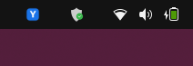
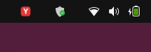
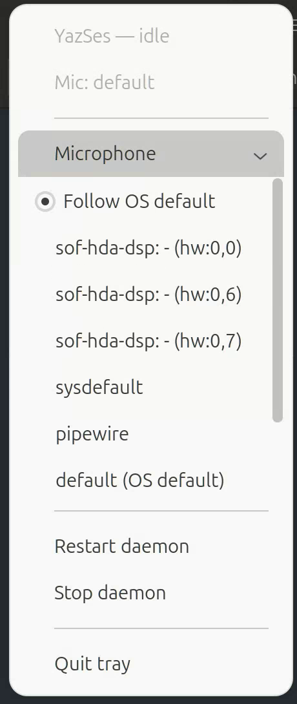
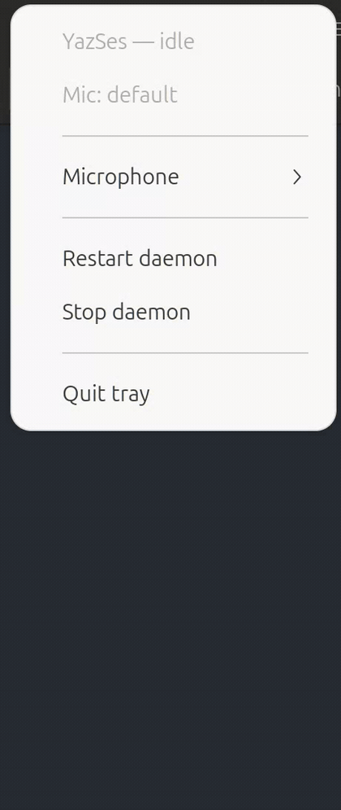
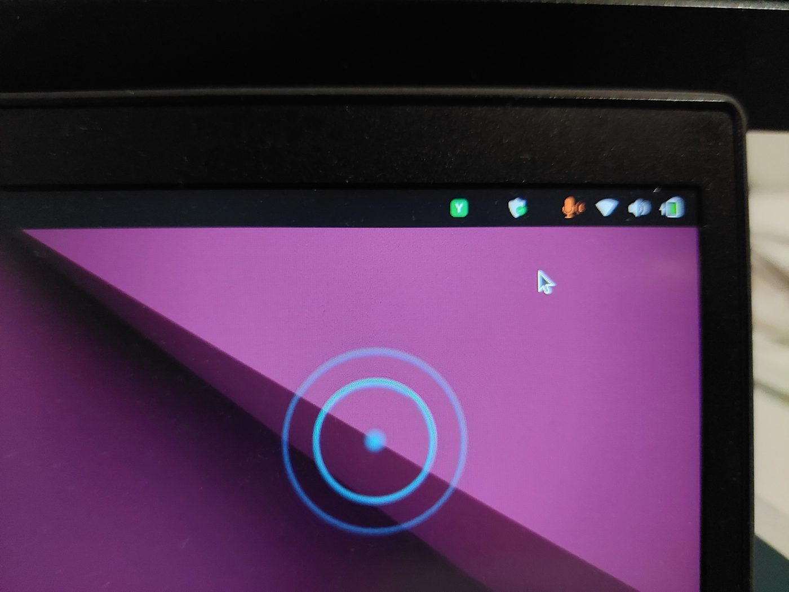
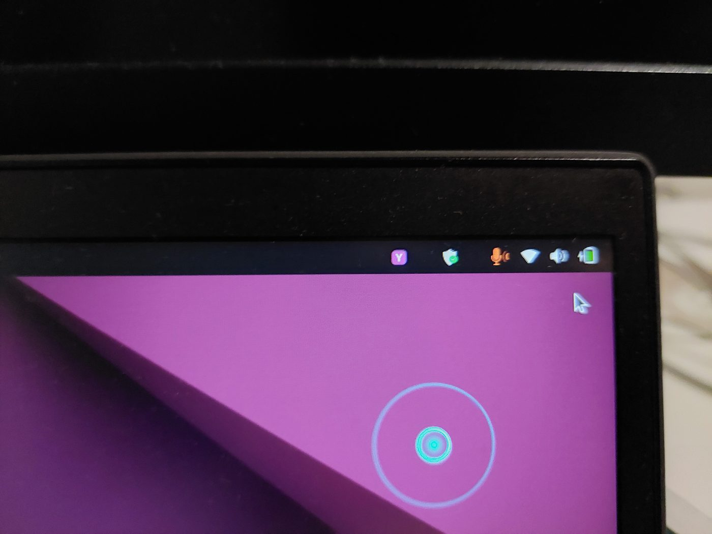
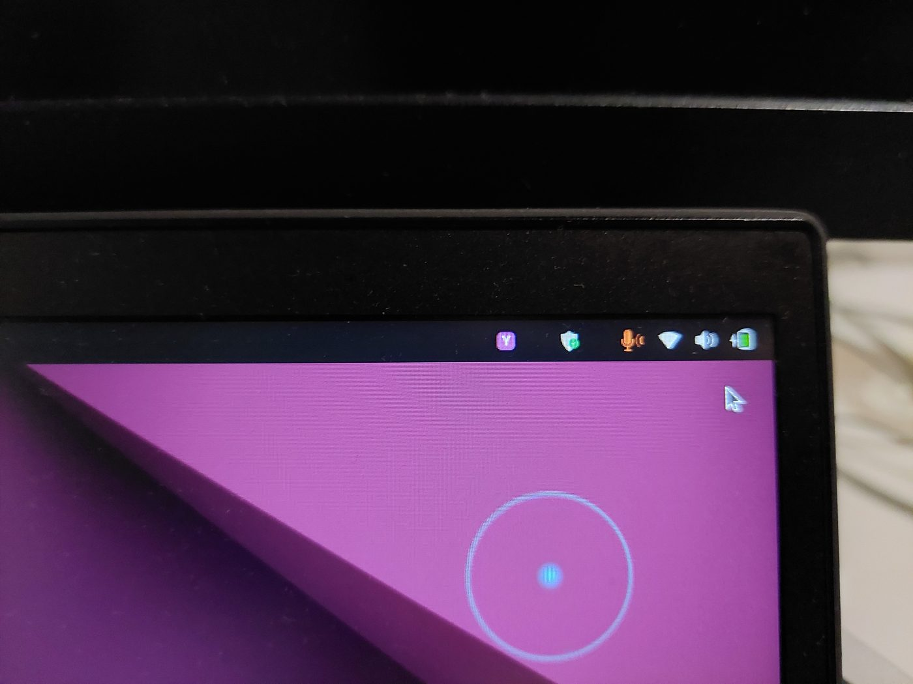
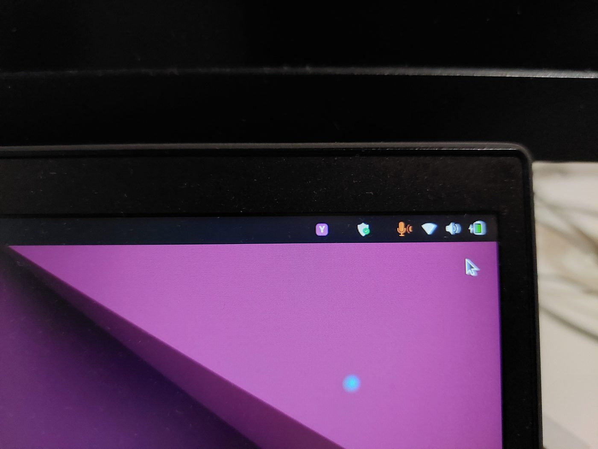

# Seeing YazSes work — tray icon & overlay

YazSes is hold-to-talk and mostly invisible, so it gives you **two at-a-glance visual signals** that tell you exactly what it's doing without switching windows:

1. A top-bar **tray icon** — a small **“Y” badge** whose **colour is a live state indicator**.
2. An optional **voice-activity overlay** — **sonar rings near your cursor** that pulse while YazSes is recording your voice.

---

## The tray icon “Y” — a 5-colour state indicator

The badge sits in your top bar (GNOME shown here) and changes colour as YazSes moves through its states. Click it for a menu to pick/pin your mic, re-calibrate, and restart/stop the daemon.

| Colour | State | What it means |
|:------:|-------|---------------|
| 🔵 **Blue** | Normal / idle | Daemon is up and ready. Nothing is being recorded. |
| 🟢 **Green** | Dictating into text | You're holding the hotkey and speaking; the words will be **typed into the focused text field**. |
| 🟡 **Yellow** | No text target | You're dictating but **nothing editable is focused** — the words are **saved to the clipboard** instead of being typed into the wrong place. |
| 🟣 **Purple** | Command mode | You're holding the **command key**, so speech is parsed as a **voice command** (e.g. *“undo that”*) rather than typed. |
| 🔴 **Red** | Problem | An error or a run of silent captures (e.g. the mic went silent / switched away). Open the menu or run `yazses doctor`. |

### Blue — ready / idle



### Red — a problem needs attention



> 🟡 **Yellow (no text target)** isn't pictured here — it looks like the blue/green badge but yellow, and it means *“I heard you, but there was no text box to type into, so I put your words on the clipboard.”* Paste with <kbd>Ctrl</kbd>+<kbd>V</kbd>.

---

## The click-menu — mic picker and daemon controls

The badge isn't only an indicator. Clicking it opens a menu, rebuilt fresh each time, that
carries the daemon's current state at the top and everything you need to fix the two things
that most often go wrong — the wrong microphone, and a daemon that needs a restart.



- **`YazSes — idle`** and **`Mic: default`** — the same state the badge colour encodes, in words.
- **Microphone** — every input device the system reports, with the active one marked. Picking
  one **pins** it, so a USB-C monitor or a headset that appears later can't quietly steal
  capture. `Follow OS default` hands control back. This takes effect live, over IPC — no restart.
- **Re-calibrate** — re-measures the room and writes a fitting silence threshold, for when
  dictation starts getting discarded as silence.
- **Settings…** — opens the graphical settings window (the same thing as `yazses settings`),
  where features, the hotkey, the microphone and the silence threshold are all editable without
  hand-writing TOML.
- **Restart daemon** / **Stop daemon** — and **Quit tray**, which closes only the icon and
  leaves dictation running.

The **Settings…** entry is in the menu on **Linux, macOS and Windows** — the menu means the same
thing wherever you run it. On Windows there is also a **YazSes Settings** shortcut in the Start
menu, for when you haven't found the tray icon yet.

Here it is being driven — the menu opening, the Microphone submenu expanding, and the daemon
controls underneath:



The same actions are available from the command line if you prefer it — `yazses audio devices`,
`yazses audio use <name>`, `yazses mic-level --set`, `yazses restart`.

---

## The voice-activity overlay — “YazSes is listening”

When the overlay is enabled, holding the hotkey draws **expanding sonar rings near your cursor** that react to your voice level, so you get instant feedback that YazSes is actually recording — no guessing whether it heard you.

Notice the tray badge colour and the overlay together tell the whole story:

### Recording into text (tray 🟢 green + rings pulsing)



### Command mode (tray 🟣 purple + rings pulsing)







The rings grow and fade with your speech level, then disappear the moment you release the key.

---

## Turn them on

Both are opt-in surfaces you can toggle with `yazses features` (no config-file editing):

```sh
yazses features                 # list capabilities and their on/off state
yazses features enable tray     # top-bar Y state indicator
yazses features enable overlay  # sonar voice-activity rings (needs the `overlay` extra: PySide6)
yazses restart                  # apply
```

- The **tray** icon is on by default when a desktop is present (`[tray] enabled = true`).
- The **overlay** needs the `overlay` extra (`pipx install 'yazses[overlay]'` or `yazses features enable overlay` auto-installs it).

See the [CLI reference](cli-reference.md) and [features guide](features.md) for the full list.
