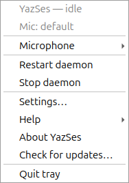
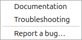
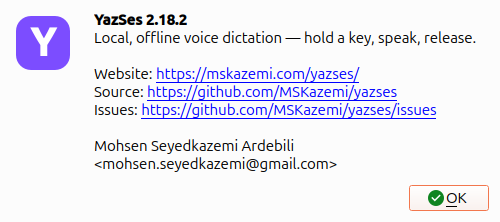
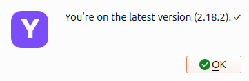

# Seeing YazSes work — tray icon & overlay

YazSes is hold-to-talk and mostly invisible, so it gives you **two at-a-glance visual signals** that tell you exactly what it's doing without switching windows:

1. A top-bar **tray icon** — a small **“Y” badge** whose **colour is a live state indicator**.
2. An optional **voice-activity overlay** — **sonar rings near your cursor** that pulse while YazSes is recording your voice.

---

## The tray icon “Y” — a 5-colour state indicator

The badge sits in your top bar (GNOME shown here) and changes colour as YazSes moves through its states. Click it for a menu to pick/pin your mic, re-calibrate, and restart/stop the daemon.

| Colour | State | What it means |
|:------:|-------|---------------|
| 🔵 **Blue** | Normal / idle | Daemon is up and ready. Nothing is being recorded. |
| 🟢 **Green** | Dictating into text | You're holding the hotkey and speaking; the words will be **typed into the focused text field**. |
| 🟡 **Yellow** | No text target | You're dictating but **nothing editable is focused** — the words are **saved to the clipboard** instead of being typed into the wrong place. |
| 🟣 **Purple** | Command mode | You're holding the **command key**, so speech is parsed as a **voice command** (e.g. *“undo that”*) rather than typed. |
| 🔴 **Red** | Problem | An error or a run of silent captures (e.g. the mic went silent / switched away). Open the menu or run `yazses doctor`. |

### Blue — ready / idle


### Red — a problem needs attention


> 🟡 **Yellow (no text target)** isn't pictured here — it looks like the blue/green badge but yellow, and it means *“I heard you, but there was no text box to type into, so I put your words on the clipboard.”* Paste with <kbd>Ctrl</kbd>+<kbd>V</kbd>.

### The level ring — is the mic actually hearing me?

Every colour above says what YazSes is **doing**. None of them says whether your
microphone is picking anything up, and that is a different question with the same
appearance: a muted mic, a monitor that quietly stole capture, or a silence threshold
set above your speaking voice all look exactly like 🟢 green — right up until nothing
is typed.

So while you hold the key, the badge draws a **live input-level ring** with a small
notch on it:

| What you see | What it means |
|---|---|
| Ring **past the notch**, bright | Your voice is above the silence gate — this **will** be transcribed |
| Ring **short of the notch**, dim | Too quiet — this burst **will be discarded** |
| Ring barely moving while you speak | The mic is not hearing you at all — wrong device, muted, or unplugged |

**The notch is always in the same place**, whatever your microphone or threshold — the
ring is scaled around your configured gate, not around raw signal level. So "did it pass
the notch" is the same judgement on every machine.

If the ring never reaches the notch, that is the same condition as
[Silent audio — discarding](how-to/silent-audio-discarding.md): run
`yazses mic-level --set` to retune the threshold to your voice, or use the click-menu to
pick a different mic.

---

## The click-menu — mic picker and daemon controls

The badge isn't only an indicator. Clicking it opens a menu, rebuilt fresh each time, that
carries the daemon's current state at the top and everything you need to fix the two things
that most often go wrong — the wrong microphone, and a daemon that needs a restart.



- **`YazSes — idle`** and **`Mic: default`** — the same state the badge colour encodes, in words.
- **Microphone** — every input device the system reports, with the active one marked. Picking
  one **pins** it, so a USB-C monitor or a headset that appears later can't quietly steal
  capture. `Follow OS default` hands control back. This takes effect live, over IPC — no restart.

  

- **Re-calibrate** — re-measures the room and writes a fitting silence threshold, for when
  dictation starts getting discarded as silence.
- **Settings…** — opens the graphical settings window (the same thing as `yazses settings`),
  where features, the hotkey, the microphone and the silence threshold are all editable without
  hand-writing TOML.
- **Help** — a submenu with **Documentation**, **Troubleshooting** and **Report a bug…**, each
  opening the right page in your browser. No terminal needed to find the docs from the icon.

  

- **About YazSes** — the version you are actually running, the tagline, and links to the
  website, the source and the issue tracker. This is the number to quote in a bug report.

  

- **Check for updates…** — asks the source you installed from (PyPI, or your snap channel)
  whether there is a newer release. If there is one and it can be installed without a
  password, the dialog offers **Install now**; snap installs are shown the
  `sudo snap refresh yazses` command to run in a terminal instead, because a tray click has
  nowhere to type a password. Either way, restart the daemon afterwards to run the new
  version. The check runs in the background — the menu never freezes waiting on the network.

  After installing, YazSes **re-reads the version on disk** and only reports success if it
  actually moved. If it didn't, the dialog says so instead — most often because the install
  is pinned to an exact version (`uv tool install yazses==2.19.0`), which makes
  `uv tool upgrade` exit successfully while doing nothing. The fix is to reinstall unpinned,
  keeping your extras: `uv tool install 'yazses[desktop]@latest'`. Dropping the `[desktop]`
  part installs base dependencies only and removes the tray and overlay with them.

  

- **Restart daemon** / **Stop daemon** — and **Quit tray**, which closes only the icon and
  leaves dictation running.

The **Settings…**, **Help**, **About** and **Check for updates…** entries are in the menu on
**Linux, macOS and Windows** — the menu means the same thing wherever you run it. (macOS and
Windows show About as an alert/notification rather than a dialog, since their menu toolkits
have no dialog of their own.) On Windows there is also a **YazSes Settings** shortcut in the
Start menu, for when you haven't found the tray icon yet.

Nothing here phones home on its own: the update check runs **only** when you click it, and it
asks for a version number and nothing else. See the [privacy statement](privacy-statement.md).

Here it is being driven — the menu opening, the Microphone submenu expanding, and the daemon
controls underneath. (This recording predates the Help / About / Check-for-updates entries,
so it stops at `Settings…`; everything it shows still works the same way.)


The same actions are available from the command line if you prefer it — `yazses audio devices`,
`yazses audio use <name>`, `yazses mic-level --set`, `yazses restart`.

---

## The voice-activity overlay — “YazSes is listening”

When the overlay is enabled, holding the hotkey draws **expanding sonar rings near your cursor** that react to your voice level, so you get instant feedback that YazSes is actually recording — no guessing whether it heard you.

Notice the tray badge colour and the overlay together tell the whole story:

### Recording into text (tray 🟢 green + rings pulsing)


### Command mode (tray 🟣 purple + rings pulsing)


The rings grow and fade with your speech level, then disappear the moment you release the key.

### If moving things on screen are a problem — reduced motion

Expanding rings travelling outward near the pointer, sixty times a second, are exactly the pattern people with vestibular disorders and motion sensitivity need software to stop doing. Your desktop already has a switch for this, and YazSes now reads it:

| Desktop | The setting it reads |
|---|---|
| GNOME | **Settings → Accessibility → Reduce Animation** |
| macOS | **System Settings → Accessibility → Display → Reduce motion** |
| Windows | **Settings → Accessibility → Visual effects → Animation effects** |

With reduced motion in effect the overlay **keeps the ring and drops the travel**: one steady circle while you hold the key, brightening in a few discrete steps as you get louder. You still see that YazSes is recording and roughly how loudly — nothing moves, and the brightness is stepped rather than continuous so it cannot flicker with microphone noise.

YazSes asks the **XDG desktop portal** first and falls back to GNOME's own key, so any desktop with a portal backend is covered without YazSes needing to know how that desktop stores the setting. That order also matters inside the **snap**: a confined process reading `gsettings` may be answering about the sandbox rather than about your session.

Where neither answers — a bare window manager, or a desktop with no portal — YazSes leaves the animation alone rather than guessing, and you say so yourself:

```toml
[overlay]
reduced_motion = "on"    # auto (follow the desktop, default) | on | off
```

`"off"` forces the full animation even if your desktop asks for less.

---

## Turn them on

Both are opt-in surfaces you can toggle with `yazses features` (no config-file editing):

```sh
yazses features                 # list capabilities and their on/off state
yazses features enable tray     # top-bar Y state indicator
yazses features enable overlay  # sonar voice-activity rings (needs the `overlay` extra: PySide6)
yazses restart                  # apply
```

- The **tray** icon is on by default when a desktop is present (`[tray] enabled = true`).
- The **overlay** needs the `overlay` extra (`pipx install 'yazses[overlay]'` or `yazses features enable overlay` auto-installs it).

See the [CLI reference](cli-reference.md) and [features guide](features.md) for the full list.
